---

title: Chap 8 | Main Memory

hide:
  #  - navigation # 显示右
  #  - toc #显示左
  #  - footer
  #  - feedback  
comments: true  #默认不开启评论

---

<h1 id="欢迎">Chap 8 | Main Memory</h1>

!!! note "章节启示录"
    <!-- === "Tab 1" -->
        <!-- Markdown **content**. -->
    <!-- === "Tab 2"
        More Markdown **content**. -->
    本章节是OS的第八章。

## 1. Background
* 内存管理的主要功能：
    1. 内存空间的分配与回收：由操作系统负责内存空间的分配和管理，记录内存的空闲时间、内存的分配情况，并回收已结束进程所占用的内存空间。
    2. 地址转换
    3. 内存空间的扩充
    4. 内存共享
    5. 存储保护

### 1.1 程序的链接与装入
* Multistep Processing of a User Program 
    1. 编译器 compiler 是一个计算机程序（或一组程序），它将用一种计算机语言（源语言）编写的源代码转换为另一种计算机语言（目标语言，通常具有二进制形式，称为目标代码）。
    2. 链接器 linker 或链接编辑器 linkage editor 是一种程序，它接受编译器生成的一个或多个对象，并将它们组合成一个可执行程序。
    3. 加载器 loader 将.exe文件加载到内存中以供执行。

在编译-链接-装入的过程中会涉及一些地址的转换，大部分是相对的地址（有一些名称来表示）。

* 编译-链接-装入
    1. 编译：从高级语言到目标模块的过程(实际是预处理、编译、汇编三个阶段的统称)，由编译程序将用户源代码编译成若干目标模块     
        本质是一些机器可以“看懂”的0/1指令和数据文件
    2. 链接：把编译后的目标模块与所需库函数链接在一起形成一个完整的装入模块       
        静态链接、装入时动态链接、运行时动态链接
    3. 装入：将虚拟地址映射为内存实际的物理地址，将装入模块装入内存运行     
        绝对装入、静态重定位(可重定位装入)、动态重定位(动态运行时装入)

* 不同的装入方式（不同地址）：
    1. Symbolic Address:源程序中的地址通常是象征性的（比如变量count）。
    2. Relocatable Addresses:编译器通常将这些符号地址绑定到可重定位的地址（例如“从这个模块开始的14个字节”）。
    3. Absolute Addresses:链接器或加载器将可重定位地址绑定到绝对地址（如74014）。绝对装入方式只适用于单道程序环境。在编译时，若知道程序将放到内存的哪个位置，则编译程序将产生绝对地址的目标代码。

* 在不同时刻进行物理地址绑定：
    1. Compile time：如果事先知道内存位置，则可以生成绝对代码；
        * 绝对代码：这段代码被编译成在一个在特定的地址工作的代码，并且只在加载到那个特定的地址时才工作。分支和跳转指令都包含一个固定的精确（绝对）地址。
    2. Load time：如果编译时内存位置未知，则必须生成可重新定位的代码。缺点：一旦确定，地址不可移动
        * 可重定位代码可以加载到内存中的任何位置，但通常在可执行之前即在加载时已经被重定位或修复。
    3. Execution time：如果进程在执行过程中可以从一个内存段移动到另一个内存段，则绑定延迟到运行时。需要硬件支持地址映射（例如，基数寄存器和限制寄存器）。实际中一般采用这种方式（windows等）

* Dynamic Loading：
    1. 例程在调用之前不加载；
    2. 更好的内存空间利用率；不加载未使用的例程
    3. 当需要大量代码来处理不经常发生的情况时非常有用
    4. 不需要通过程序设计实现操作系统的特殊支持

* Dynamic Linking：
    1. 链接延迟到执行时间
        1. 一小段代码stub：用于定位适当的内存驻留库例程
        2. Stub用例程的地址替换自己，并执行该例程
    2. 操作系统需要检查例程是否在进程的内存地址中
    3. 动态链接对库特别有用
        1. 节省主存空间
        2. 减少exe映像文件大小
        3. 重新链接不需要的新库
    4. 系统也称为共享库

!!! warning "Logical vs. Physical Address Space"
    * 逻辑地址：由CPU生成；也称为虚拟地址。
    * 物理地址：存储单元看到的地址。
    * 在编译时和加载时地址绑定方案中，逻辑地址和物理地址是相同的；因为代码里面存放的已经是物理地址了，所以即使CPU看到的是逻辑地址，但此时逻辑地址已经是物理地址了。
    * 在执行时地址绑定方案中，逻辑（虚拟）地址与物理地址不同。因为在执行时绑定，那么在执行之前存的是可重定位地址（是一个和物理地址不一样的逻辑地址），CPU看到的就是这个可重定位地址。

### 1.2 内存保护
内存分配前，需要保护操作系统不受用户进程的影响，同时保护用户进程不受其他用户进程的影响，内存保护可采取两种方法：Base and Limit Registers 以及上下限寄存器。

* 上下限寄存器：存放用户进程在主存中的下限和上限地址，每当CPU要访问一个地址时，分别和两个寄存器的值相比，判断有无越界。
* Base Registers （重定位寄存器/基地址寄存器）and Limit Registers（限长寄存器/界地址寄存器）：          
    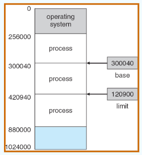       
    重定位寄存器中存放的是进程的起始物理地址，界地址寄存器中存放的是进程的最大逻辑地址。内存管理部件将逻辑地址与界地址寄存器进行比较，若未发生地址越界，则加上重定位寄存器的值后映射成物理地址，再送交内存单元，如下图所示：        
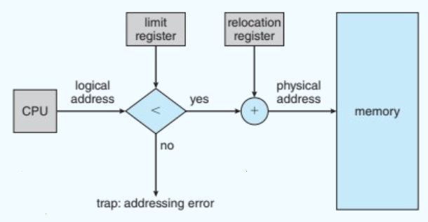{width="450"}      

* Memory-Management Unit (MMU)：实现地址计算
    1. 将虚拟地址映射到物理地址的硬件设备
    2. 在MMU方案中，重定位寄存器中的值在发送到内存时被添加到用户进程生成的每个地址中
    3. 用户程序处理逻辑地址，永远不会看到真正的物理地址

* 一个简单的MMU：       
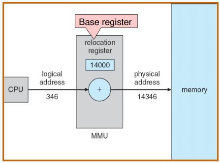{width="350"}   
图中只是做了一个简单的加法操作，那么为什么要通过硬件实现？  
因为地址转换出现频率高，硬件快速，计算时间可以忽略不计。

### 1.3 连续分配管理方式
连续分配方式是指为一个用户程序分配一个连续的内存空间，譬如某用户需要 100MB 的内存空间，连续分配方式就在内存空间中为用户分配一块连续的 100MB 空间。连续分配方式主要包括单一连续分配、固定分区分配和动态分区分配。    

* Contiguous Allocation(连续分配)：
    1. 主存通常分为两个分区：
        1. 常驻操作系统，通常保存在低内存中，带有中断向量
        2. 用户进程保存在高内存中，用于保护用户进程不受其他进程的影响，避免操作系统代码和数据发生变化；
    2. 重定位寄存器用于保护用户进程之间的相互影响，以及防止操作系统代码和数据的变化：
        1. 重定位寄存器(relocation register)包含最小物理地址的值
        2. 限制寄存器(limit register)包含一个逻辑地址范围：每个逻辑地址必须小于限制寄存器

* Single Continuous Allocation：单一连续分配
    1. 内存分为系统区和用户区，用户区每次只调入一道程序运行
        1. 一次只放一道程序，无并发

>Multiple-partition allocation (多分区分配)中包括：     
    1. Fixed Partitioning(固定分区)     
    2. Dynamic Partitions(动态分区)或 Variable Partitiom(可变分区)      

* Fixed Partitioning：固定分区分配：是最简单的一种多道程序存储管理方式，它将用户内存空间划分为若干固定大小的分区，每个分区只装入一道作业。当有空闲分区时，便可再从外存的后备作业队列中选择适当大小的作业装入该分区。

    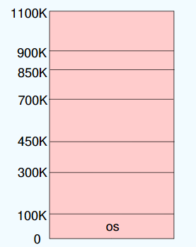{width="150"}

* Dynamic Partitions：动态分区分配
    1. Hole：可用内存块；
    2. 当一个进程到达时，它从一个足够大的洞中分配内存。
    3. 操作系统维护以下信息：
        1. 分配的分区
        2. 空闲分区（洞）

    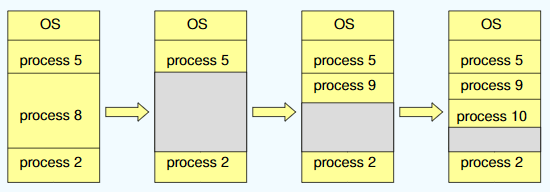{width="450"}

    动态分区在开始时是很好的，但是随着时间的推移，内存中产生越来越多的小内存块，内存的利用率也随之降低。这些小内存块被称为外部碎片，它存在于所有分区的外部，与固定分区中的内部碎片正好相对。外部碎片可通过紧凑技术来客服，即操作系统不时地对进程进行移动和整理。但是，这需要动态重定位寄存器的支持，且相对费时。紧凑过程实际上类似于Windows系统中地磁盘碎片整理程序，只不过后者是对外存空间地紧凑。

* 基于顺序搜索的分配方式：
    1. First-fit: 找第一个能满足大小的空闲分区
    2. Next Fit：从上次查找结束的位置考试继续查找第一个能满足大小的空闲分区
    3. Best-fit: 空闲分区按容量递增的次序派李娥。每次分配内存时，顺序查找到第一个能满足大小的空闲分区，即最小的空闲分区，分配给作业。      
        * 最佳适应算法虽然称为最佳，能更多地留下大空闲分区，但性能通常很差，因为每次分配会留下越来越多很小地难以利用地内存块，进而产生最多的外部碎片。
    4. Worst-fit: 空闲分区按容量递减的次序排列。每次分配内存时，顺序查找到第一个能满足要求的空闲分区，即最大的空闲分区，从中分割一部分空间给作业。
        * 不容易产生碎片，但是把最大的空闲分区划分开，会很快导致没有大空闲分区可用，因此性能页比较差。

* 基于索引搜索的分配算法：
    1. 快速适应算法：也称分类搜索算法，将空闲分区按客量大小进行分类，设置素引表项，每一个空闲分区类型对应一项，挂成链(把原来一根变成多根)
        * 根据进程长度，从素引表项中找到能容纳他的最小空闲区链表；从链表中取下第一块进行分配。
    2. 伙伴系统：每个空闲分区大小必须是2的n次幂字节；对进程占用空间n计算一个i值使得2^i>n，从剩余空闲分区找最适合的;若无则将分区逐层拆分;释放时则逐层合并
        * 初始内存空间为1024K，有一个进程请求150K空间。
    3. 哈希算法：根据空闲分区链表的分布规律，建立哈希函数，构建一张以空闲分区大小为关键字的哈希表，根据所需空间大小通过计算得到哈希表的位置。

### 1.4 基本分页存储管理
固定分区会产生内部碎片，动态分区会产生外部碎片，这两种技术对内存的利用率都比较低。

* 我们将内存空间分为若干固定大小（如4KB）的分区，称为页框、页帧或物理块。
* 进程的逻辑地址空间也分为与块大小相等的若干区域，称为页或页面。
* 操作系统以页框为单位为各个进程分配内存空间。

#### 分页存储的几个基本概念
* 页面和页面大小：进程的逻辑地址空间中的每个页面有一个编号，称为页号，从0开始；内存空间中的每个页框也有一个编号，称为页框号（或物理块号），也从0开始。进程在执行时需要申请内存空间，即要为每个页面分配内存中的可用页框，这就产生了页号和页框号的一一对应。

* 地址结构：
    1. Page number(p)：用作包含物理内存中每个页面的基址的页表的索引
    2. Page offset(d)：页内偏移量W
     
        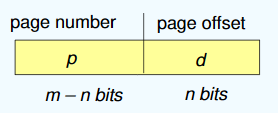{width="200"}  

* 页表：为了便于找到进程的每个页面在内存中的位置，系统为每一个进程建立一张页面映射表。page_table 里面包含了一个进程里面所有page的数量。同时，因为page_table放在内存当中，所以访问具体的页时需要访问两次内存：第一次访问page_table得到帧号，然后再根据得到的物理地址访问对应的页。   
  

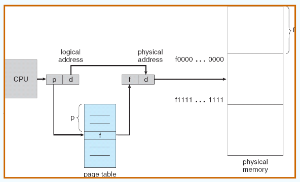{width="400"}

??? example "一个例子🌰"
    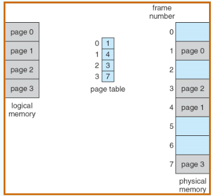{width="250"}
    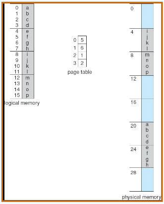{width="250"}

??? question "思考题"
    * 页面大小为4KB，虚地址2362H、1565H的物理地址分别是多少     
    

    * 因为页面大小为4KB,二进制中是12位，十六进制中是3位，因此偏移量是3位，总共4位，所以虚地址的第一位代表页号。     
        1. 虚地址为2362H的物理地址：254362H
        2. 虚地址为1565H的物理地址：102565H

#### 基本地址变换机构
其任务是将逻辑地址转换为内存中的物理地址。  

* Hardware Implementation of Page Table
    1. 页表保存在主存储器中
    2. 页表基寄存器（PTBR）指向页表
    3. 页表长度寄存器（PTLR）表示页表的大小
    4. 在这个方案中，每个数据/指令访问都需要两次内存访问。一个用于页表，一个用于数据/指令
    5. 双内存访问问题可以通过使用一种特殊的快速查找硬件缓存来解决，这种缓存称为关联内存或翻译暂存缓冲区（tlb转换旁视缓冲，一称快表）
    6. 一些TLB在每个TLB条目中存储地址空间标识符（asid）——唯一标识每个进程，为该进程提供地址空间保护

    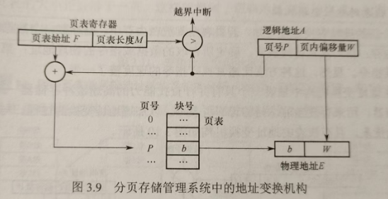{width="400"}
#### 具有快表的地址变换结构
快表也称相联存储器，用来存放当前访问的若干页表项，以加速地址变换的过程。

* TLB：与page_table不同，快表总共只有一张。

    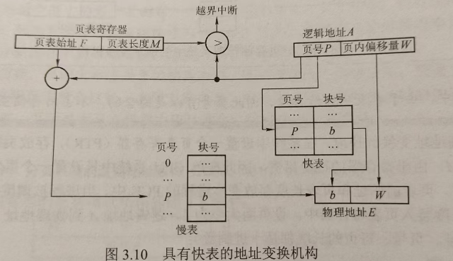{width="400"}      

    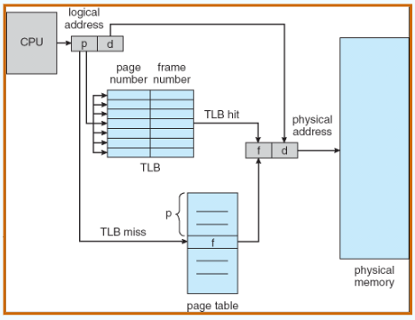{width="350"}

* Effective Access Time :     
    1. 关联查询： $\varepsilon$ 个时间单元
    2. 命中率 $\alpha$ ：页码在关联寄存器中被找到的次数百分比；与关联寄存器数相关的比率     
    3. $EAT = (1 + \varepsilon) \alpha + (2 + \varepsilon)(1 – \alpha)= 2 + \varepsilon – \alpha$

* Valid (v) or Invalid (i) Bit In A Page Table：
    因为页表是预先分配好的，但有些页表还没进来，还没进来的页表标志位设置成i：       
    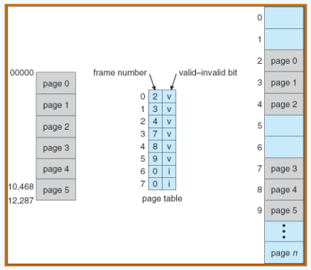{width="300"}

#### 其他页表结构
* Structure of the Page Table：
    1. Hierarchical Paging
    2. Hashed Page Tables
    3. Inverted Page Tables

* Hierarchical Page Tables:
    1. 将逻辑地址空间分解为多个页表,对页表进行分页
    2. 一个简单的技术是一个两级页表（Linux：四级页表;Windows：两级页表（x86,32个））

    !!! tip "Two-Level Paging Example"
        *  一个逻辑地址（在页面大小为1K的32位机器上）分为：
            1. 由22位组成的页码
            2. 由10位组成的页偏移量

        * 由于页表是分页的，所以页码进一步分为:
            1. 一个12位的页码
            2. 一个10位的页面偏移量
        * 因此，逻辑地址如下：      
            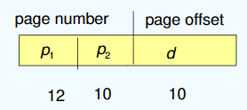{width="200"}

* Hashed Page Tables
    1. 通用于地址空间> 32位。虚拟页码被散列到页表中。此页表包含一个散列到同一位置的元素链。
    2. 每个元素包含虚拟页码、框架号。，指向下一元素的指针
    3. 在此链中比较虚拟页码以查找匹配项。如果找到匹配，则提取相应的物理帧。
    4. 64位地址的变化是集群页表，每个元素指的是几个页（比如16页）而不是一个页
    5. 对于内存引用分散且不连续的稀疏地址空间非常有用
    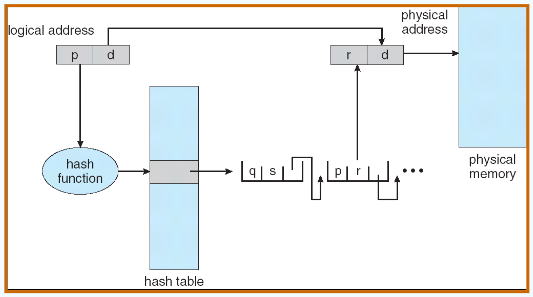{width="400"}

* Inverted Page Table：无论进程有多少都只有一个page_table，其实可以说是物理地址的“缩影”（相当于把所有页表合并在一起）。
    1. 条目由存储在真实内存位置的页面的虚拟地址组成，并包含有关拥有该页面的进程的信息
    2. 减少了存储每个页表所需的内存，但增加了页引用发生时查找表所需的时间
    3. 使用哈希表将搜索限制为一个或最多几个页表条目

    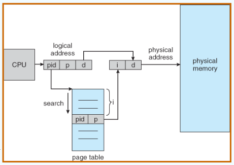{width="350"}

### 1.5 基本分段存储管理
分段系统将用户进程的逻辑地址空间划分为大小不等的段。例如，用户进程由主程序段、两个子程序段、栈段和数据段组成，于是可以将这个进程划分为5段，每段从0开始编址，并分配一段连续的地址空间（段内要求连续，段间不要求连续，进程的地址空间是二维的）。      

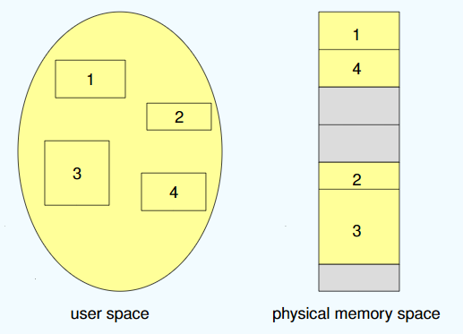{width="350"}

* Segmentation Architecture：
    1. 段表：映射二维物理地址；每个表项有
       1. base：包含起始物理地址，其中段驻留在内存中
       2. limit：指定段的长度
    2. 段表基寄存器（STBR）指向段表在内存中的位置
    3. 段表长度寄存器（STLR）表示程序使用的段数；

    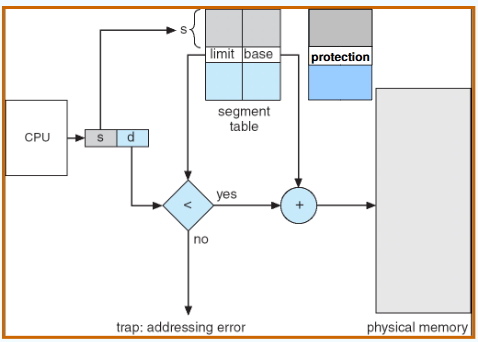{width="350"}      
    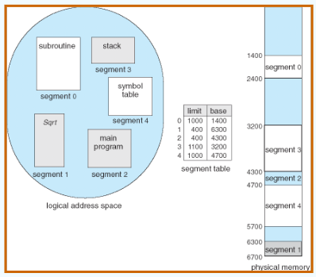{width="350"}

#### 分页和分段的对比
* 划分目的不同：
    1. 页是信息的物理单位，分页的主要目的是提高内存利用率，分页完全是系统的行为，对用户是不可见的；
    2. 段是信息的逻辑单位，分段的主要目的是更好地满足用户需求，用户按照逻辑关系将程序划分为若干段，分段对用户是可见的。
* 长度大小不同：
    1. 页的大小固定且由系统决定；
    2. 段的长度不固定，具体取决于用户所编写的程序。
* 划分地址对应关系不同：
    1. 分页管理的地址空间是一维的；
    2. 分段管理不能通过给出一个整数便确定对应的物理地址，因为每段的长度是不固定的，无法通过除法得出段号，无法通过求余得出段内偏移，所以一定要显式给出段号和段内偏移，因此分段管理的地址空间是二维的。

#### 分页/分段的共享与保护
* Shared Pages:
    1. Shared code：若被共享的代码占N个页框，则每个进程的页表中都要建立N个页表项，指向被共享的N个页框。
        1. 进程（即文本编辑器、编译器、窗口系统）之间共享的只读（可重入）代码的一个副本
        2. 共享代码必须出现在所有进程的逻辑地址空间的同一位置，因此在cache中可以少存很多地址。

    2. Private code and data：
        1. 每个进程保存一个单独的代码和数据拷贝。
        2. 私有代码和数据的页可以出现在逻辑地址空间的任何位置。

* Shared Segamentations：
    1. 不管该段多大，都只需为该段设置一个段表项，因此非常容易实现共享。只需在每个进程的段表中设置一个段表项，指向被共享的同一个物理段。
    2. 不能被任何进程修改的代码称为可重入代码或纯代码（不属于临界资源），它是一种允许多个进程同时访问的代码。为防止程序在执行时修改共享代码，在每个进程中都必须配以局部数据区，将在执行过程中可能改变的部分复制到数据区。

### 1.6 段页式存储管理
* 在段页式系统中，进程的地址空间首先被分成若干逻辑段，每段都有自己的短号，然后将每段分成若干大小固定的页。        

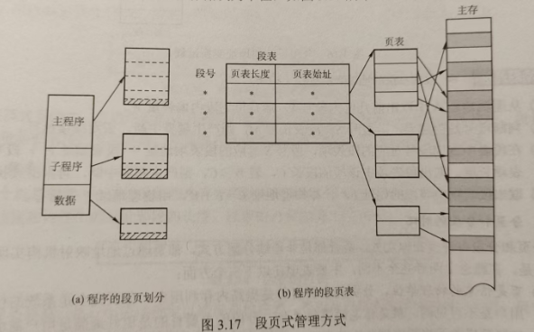{width="450"}

!!! warning "注意"
    在段页式存储管理中，每个进程的段表只有一个，而页表可能有多个。

* 在进行地址变换时，首先通过段表查到页表始址，然后通过页表找到物理块号，最后物理地址。进行一次访问实际需要三次访问主存，这里同样可以使用快表来加快查找速度，其关键字由段号、页号组成，值是对应的物理块号和保护码。  
