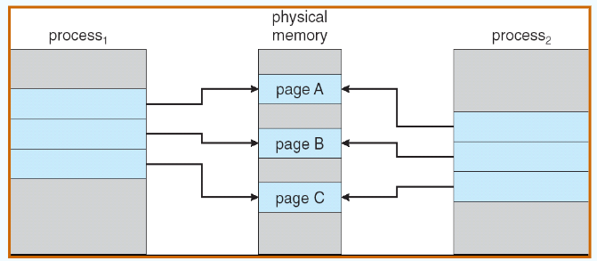
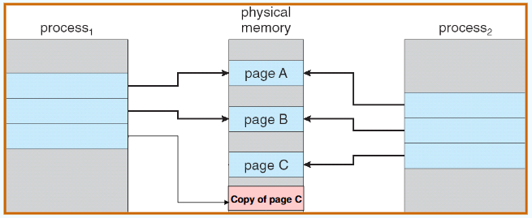
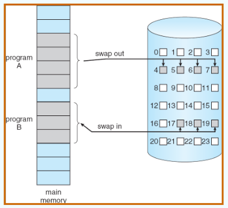
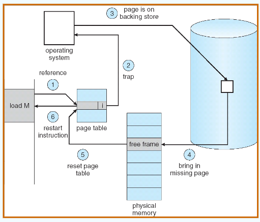
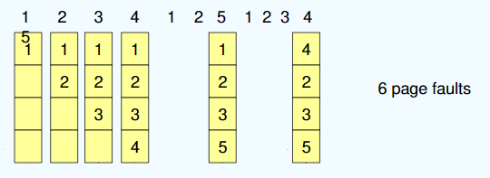
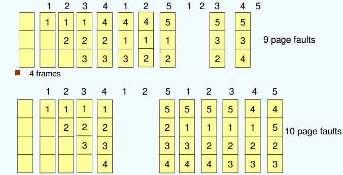
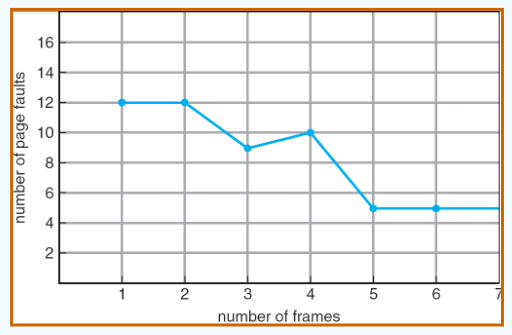
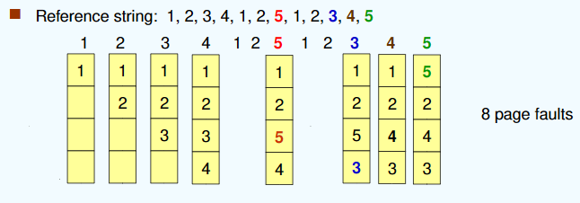
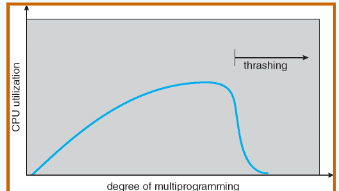
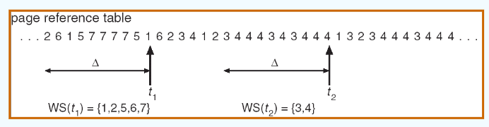

---

title: Chap 9 | Virtual Memory

hide:
  #  - navigation # 显示右
  #  - toc #显示左
  #  - footer
  #  - feedback  
comments: true  #默认不开启评论

---

<h1 id="欢迎">Chap 9 | Virtual Memory</h1>

!!! note "章节启示录"
    <!-- === "Tab 1" -->
        <!-- Markdown **content**. -->
    <!-- === "Tab 2"
        More Markdown **content**. -->
    本章节是OS的第九章。

## 1.Background
* principle of locality:指程序在执行过程中的一个较短时期所执行的指令地址和指令的操作数地址，分别局限于一定区域。
    1. 时间局部性: 一条指令的一次执行和下次执行，一个数据的一次访问和下次访问都集中在一个较短时期内;
    2. 空间局部性: 当前指令和邻近的几条指令，当前访问的数据和邻近的数据都集中在一个较小区域内。

    >

* 虚拟存储器的定义和特征：基于局部性原理，在程序装入时，仅需将程序当前运行要用到的少数页面装入内存，而将其余部分暂留在外村，便可启动程序执行。
* Process Creation：
    1. Copy-on-Write
    2. Memory-Mapped Files (later): 将文件内容映射到进程的地址空间的技术。通过内存映射文件，可以像访问内存一样访问文件内容，而无需显式地进行读写操作。这种技术在处理大文件、提高文件访问性能以及实现进程间通信等方面非常有用

## 2.Copy-on-Write

* Before Process 1 Modifies Page C：
    1. 当父进程调用 fork() 创建子进程时，操作系统并不会立即复制父进程的内存地址空间。
    2. 相反，子进程会共享父进程的内存页面，并标记这些页面为只读。
    3. 当父进程或子进程仅读取共享页面时，操作系统不会触发缺页中断，读操作可以直接访问共享页面的内容。

    {width="400"}

* After Process 1 Modifies Page C：
    1. 当父进程或子进程尝试写入某个共享页面时，操作系统会检测到写操作并触发一个缺页中断。
    2. 操作系统会处理这个缺页中断，为写入的进程分配一个新的物理页面，并将原始页面的内容复制到新的页面中。
    3. 新的页面会被标记为可写，而原始页面仍然保持只读状态，继续被其他进程共享。

    {width="400"}

## 3.Demand Paging（请求调页）

* 只在需要时才将页面放入内存
    1. 所需I/O更少
    2. 所需内存更少
    3. 更快的响应
    4. 更多的用户

* 需要页面 => reference to it：
    1. invalid reference => abort
    2. not-in-memory => bring to memory

* Lazy swapper：永远不会将页面交换到内存中，除非页面将被占用            
    Swapper that deals with pages is a pager

* Transfer of a Paged Memory to Contiguous Disk Space：     
    内存中可能是不连续分配的，但一般外存中是连续分配的，否则寻道时间会过长。        

    {width="350"}

* page_table中的其他位：

           

    * 状态位P(存在位): 用于指示该页是否已调入内存，供程序访问时参考。
    * 访问字段A: 用于记录本页在一段时间内被访问的次数，或最近已有多长时叠加间未被访问，提供给置换算法选择换出页时参考。
    * 标记修改位R/W: 表示该页在调入内存后是否被修改过。
    * 外存地址: 用于指出该页在外存上的地址，供调入该页时使用。

如果进程从不试图访问标记为无效的页面，那么并没有什么影响。因此，如果猜测正确并且只调入所有实际需要的页面，那么进程就如同所有页面都已调入内存一样正常运行。但是，如果进程试图访问那些尚未调入内存中的页面时，队标记为无效的页面访问会产生缺页错误。

* Page Fault：如果存在对某个页面的引用，那么对该页的第一个引用将trap to os：page fault
    1. 操作系统查看这个进程的内部表（通常与PCB一起保存）来决定：
        1. invalid reference => abort
        2. Just not in memory，那么现在就应调入
    2. 获取空frame
    3. 将页交换到frame
    4. 重置tables
    5. 设置验证位 bit = v
    6. 重新启动导致页面错误的指令

* Steps in Handling a Page Fault：      
    {width="350"}

* Performance of Demand Paging：请求调页的性能
    1. Page Fault Rate 0 ≤ p ≤ 1.0
        1. if p = 0 no page faults 
        2. if p = 1, every reference is a fault
    2. Effective Access Time (EAT)：有效访问时间        
        EAT = (1 – p) x memory access + p (page fault overhead + swap page out + swap page in + restart overhead)

## 4.页面替换算法
进程运行时，若其访问的页面不在内存而需将其调入，但内存已无空闲空间时，就需要从内存中调出一页，换出到外存。选择调出哪个页面的算法就称为页面置换算法。页面的换入、换出需要磁盘I/O，开销较大，因此好的页面置换算法应该追求更低的缺页率。

* 页面替换：在内存中找到一些页面，但没有真正使用，将其交换出来
    1. 通过修改页故障服务例程以包含页替换来防止内存的过度分配
    2. 使用修改（脏）位来减少页传输的开销：只有修改过的页才会被写入磁盘
    3. 页替换完成了逻辑内存和物理内存的分离：可以在较小的物理内存上提供较大的虚拟内存

* Basic Page Replacement：
    1. 在辅助存储中查找所需页面的位置。
    2. 找一个空闲的frame
        * 如果有空闲的frmae，就使用它。
        * 如果没有空闲frame，则使用页面替换算法来选择受害帧。
        * 将 victim frame 写入二级存储器（如果需要）；相应地更改页表和框架表。
    3. 将所需的页面读入新释放的帧；更改页表和框架表。
    4. 从发生页面错误的地方继续该流程。

### 几种算法
* Optimal Algorithm （最佳置换算法）:缺页次数产生最少的算法。替换最长时间不使用的页面。实际上后面用哪个页是不知道的（无法得到），因此这个算法不会在实际中使用，而是作为最优解和其他算法进行比较。   
    {width="450"}

* First-In-First-Out (FIFO) Algorithm             
    {width="450"}

!!! danger "Belady异常"
    对于1,2,3,4,1,2,5,1,2,3,4,5这串序列来说，使用4帧的缺页错误数（10次）比使用3帧的缺页错误数（9次）还要大！FIFO算法会产生当为进程分配的物理块增多，缺页次数不减反增的异常现象，称为Belady异常。        
    {width="340"}  

    * 只有FIFO算法可能出现Belady异常，LRU和OPT算法永远不会出现Belady异常

* Least Recently Used (LRU) Algorithm：选择内存中最久没有引用的页面被置换。这是局部性原理的合理近似，性能接近最佳算法。但由于需要记录页面使用时间，硬件开销太大。       
    {width="450"}      

    * 实现算法：
        1. 计数器实现：每个页面条目都有一个计数器；每次通过此条目引用页面时，将时钟复制到计数器中；当需要更改页面时，查看计数器决定哪些页面被替换
        2. 栈实现：用一个双链表维护栈，把被访问的页面移到栈顶，于是栈底的是最久未使用页面。
            * Page referenced:：
                1. 移动到顶部
                2. 有6个指针需要变化
        3. 移位寄存器: 被访问时左边最高位置1，定期右移并且最高位补0，于是寄存器数值最小的是最久未使用页面。 

* LRU Approximation Algorithms 近似LRU页面置换算法：很少有计算机系统能提供足够的硬件来支持真正的LRU页面置换算法。于是采用了以下两种方式来实现近似的LRU算法。
    * Reference bit 额外引用位算法
        1. With each page associate a bit, initially = 0
        2. When page is referenced bit set to 1
        3. Replace the one which is 0 (if one exists)
    * Second chance（clock algorithm）：采用循环队列，当需要一个帧时，指针向前移动直到找到一个引用位为0的页面。在向前移动时，它会清除引用位。
        1. If page to be replaced (in clock order) has reference bit = 1 then:
            1. set reference bit 0
            2. leave page in memory
            3. replace next page (in clock order), subject to same rules

    !!! warning "注意"
        在最坏的情况下，当所有位都已设置，指针会循环遍历整个队列，给每个页面第二次机会。在选择下一个页面进行置换之前，它将清除所有引用位。如果所有位都为1，第二次机会置换算法就退化成了FIFO替换算法。

* Enhanced Second Chance Algorithm 增强型第二次机会算法：使用引用位和修改位:引用过或修改过置成1  
    * (Reference bit, modified bit)    
        1. (0,0): best page to replace
        2. (0,1): not quite good for replacement最近没使用过但修改过（实际中不可能产生）
        3. (1,0): will be used soon 最近使用过没被修改过
        4. (1,1): worst page to replace 最近使用过也修改过
    * 淘汰次序:(0,0) > (0,1) > (1,0) > (1,1)
    * Basic idea：
        1. 第1轮扫描: 查找(0, 0) ，不做修改
        2. 第2轮扫描: 查找(0, 1)，修改访问位为0
        3. 第3轮扫描: 查找(0, 0)，不做修改
        4. 第4轮扫描: 查找(0, 1)

* Counting-based Algorithms：用一个计数器来跟踪引用数
    1. LFU Algorithm（Least Frequently Used）:  replaces page with smallest count
    2. MFU Algorithm（Most Frequently Used）: based on the argument that the page with the smallest count was probably just brought in and has yet to be used

* Page Buffering Algorithm 页面缓冲算法：       
    * 通过被置换页面的缓冲，有机会找回刚被置换的页面
    * 被置换页面的选择和处理
        1. 用FIFO算法选择被置换页，把被置换的页面放入两个链表之一: 如果页面未被修改，就将其归入到空闲页面链表的末尾，否则将其归入到已修改页面链表。
    * 需要调入新的页面时：将新页面内容读入到空闲页面链表的第一项所指的页面，然后将第一项删除。
    * 空闲页面和已修改页面，仍停留在内存中一段时间，如果这些页面被再次访问，这些页面还在内存中。
    * 当已修改页面达到一定数目后，再将它们一起调出到外存，然后将它们归入空闲页面链表。

## 5.Allocation of Frames 帧分配
接下来讨论分配问题。在各个进程之间，如何分配固定数量的可用内存？如果有93个空闲帧和2个进程，那么每个进程各有多少帧？

帧的最小数由计算机架构定义。     

* Fixed Allocation
    1. Equal allocation 平均分配：For example, if there are 100 frames and 5 processes, give each process 20 frames，如果不够整除，剩余的余数可以用作空闲帧缓冲池
    2. Proportional allocation 比例分配：Allocate according to the size of process：根据每个进程大小分配可用内存。假设进程 $p_i$ 的虚拟内存大小为 $s_i$ ，并且定义$S=\sum s_i$ ，这样，如果可用帧的总数为m，那么进程 $p_i$ 可以分配得到 $a_i$ 个帧，这里 $a_i$ 近似为 $a_i = s_i/S×m$，当然这里必须将 $a_i$ 调整为整数，并且 $a_i$ 大于指令集所需的最小帧数，其总和不超过m。

* Priority Allocation：用优先级替换比例分配中的内存大小。

* Global vs. Local Allocation：
    1. Global replacement：允许一个进程从所有帧的集合中选择一个置换帧，而不管该帧是否已分配给其他进程；也就是说，一个进程可以从另一个进程那里获取帧。
    2. Local replacement：每一个进程只从它自己分配的帧中进行选择。

!!! warning "一个问题：Thrashing （抖动 、颠簸 ）"
    * Thrashing：进程忙于交换页面。也就是刚刚换出的页面马上又要换入内存，刚刚换入的页面马上又要换出内存。             
        {width="350"}
    
    * 出现原因：分配给每个进程的物理块太少，不能满足进程正常运行的基本要求，致使每个进程在运行时频繁地出现缺页，必须请求系统将所缺页面调入内存。显然，对磁盘地访问时间也随之急剧增加，造成每个进程的大部分时间都用于页面的换入/换出，而几乎不能再去做任何有效的工作，进而导致发生CPU利用率急剧下降并趋于零的情况。

    * 解决方法:
        1. 增加物理内存
        2. 优化页面置换算法
        3. 在cpu调度中引入**工作集算法**
        4. 动态调整进程的内存分配
        5. 限制并发进程
        6. 内存压缩

* Working-Set Model：   
    工作集模型是基于局部性假设的。这个模型采用参数 $\Delta$ 定义工作集窗口。它的思想是检查最近 $\Delta$ 个页面引用。这最近 $\Delta$ 个页面引用的页面集合称为工作集。如果一个页面处于活动使用状态，那么它处在工作集中。如果它不再使用，那么它在最后以此引用的 $\Delta$ 时间单位后，会从工作集中删除。因此，工作集是程序局部的近似。      

    {width="400"}

    $D=\sum WSS_i$ 其中 $D$ 帧为帧的总需求量，进程 $i$ 需要 $WSS_i$ 帧。如果总需求大于可用帧的总数（$D>m$），则将发生抖动，因此有些进程得不到足够的帧数。

通过定期时钟中断和引用位，我们能够近似工作集模型。例如，假设 $\Delta$ 为 10000 个引用，而且每 5000 个引用引起定时器中断。当得到一个定时器中断时，复制并清除所有页面的引用位。因此，如果发生缺页错误，那么可以检查当前的引用位和位于内存的两个位（有效位，访问位），这两位可以确定在过去的10000~15000个引用之间该页面是否被使用过。如果使用过，那么这些位中至少有一位会被打开。如果没有使用过，那么这些位会被关闭。至少有一位打开的页面会被视为在工作集中。

!!! warning "注意"
    这种安排并不完全准确，因为并不知道在5000个引用内的什么位置出现了引用。通过着呢及该历史位的数量和中断的频率（例如10位和每1000个引用中断一次），可以降低这一不确定性。然而会带来额外的成本。

