---

title: Chap 10 | File-System Interface

hide:
  #  - navigation # 显示右
  #  - toc #显示左
  #  - footer
  #  - feedback  
comments: true  #默认不开启评论

---

<h1 id="欢迎">Chap 10 | File-System Interface</h1>

!!! note "章节启示录"
    <!-- === "Tab 1" -->
        <!-- Markdown **content**. -->
    <!-- === "Tab 2"
        More Markdown **content**. -->
    本章节是OS的第十章。这一章主要介绍文件结构的功能，以及一些暴露给用户的接口，也会涉及一些设计方面的内容。

## 1. File Concept

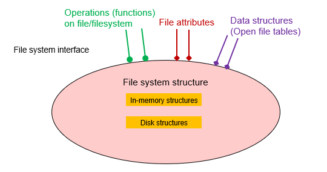{width="400"}

* What Is a File System？
    1. File naming
    2. Where files are placed 
    3. Metadata
    4. Access rules

* 文件的概念：连续的逻辑地址空间，可能是bits/bytes/lines/records的序列，由创建者和用户定义。文件是以硬盘为载体的存储在计算机上的信息集合。
    * 种类：
        1. Data：numeric、character、binary
        2. Program：Source、Object、Executable

* 文件的结构：
    1. None：sequence of words, bytes
    2. Simple record structure：Lines、Fixed length（方便寻址但overhead大）、Variable length
    3. Complex Structures：Formatted document、Relocatable load file	

* 文件的属性：Information about files are kept in the directory structure, which is maintained on the disk
    1. Name：only information kept in human-readable form （实际存储在目录中，并不是文件的内容）
    2. Identifier：unique tag (number) identifies file within file system 唯一的标识符
    3. Type：needed for systems that support different types
    4. Location：pointer to file location on device 文件实际在磁盘的位置
    5. Size：current file size
    6. Protection：controls who can do reading, writing, executing
    7. Time, date, and user identification：data for protection, security, and usage monitoring

* 文件的操作：
    1. Create
    2. Write：define a pointer
    3. Read：use the same pointer：Per-process current file-position pointer
    4. Reposition within file (file seek) 跳转到特定位置再开始读写
    5. Delete
    6. Truncate 把pointer移动到某一个特定的位置，插入一个EOF，截断后面的部分
    7. Open(Fi)：search the directory structure on disk for entry Fi, and move the content of entry to memory
    8. Close (Fi)：move the content of entry Fi in memory to directory structure on disk
    
* Open-file table：一个在内存中的数据结构，记录了打开的文件的状态，Open() system call returns a pointer to an entry in the open-file table      
    1. 每个进程在本地有一个打开文件表：Per-process table
        * Current file pointer
        * Access rights
    2. 全局的打开文件表 System-wide table 在kernel中
        * Open count 打开的当前文件的进程数量

    !!! question "为什么需要两种打开文件表？"
        每个进程对同一个文件的处理可能是不同（打开位置不同、权限不同等），如果只有一张全局的表，记录起来会比较麻烦，于是将其解耦，分到各个进程的表中，这样也会有更好的隔离性，同样的文件的id在不同进程的打开表中也可以不同。

    >

    * 每个打开文件都具有以下信息：   
        1. 文件指针：该指针对操作文件的每个进程是唯一的，因此必须与磁盘文件属性分开保存
        2. 文件打开计数
        3. 文件的磁盘位置：大多数文件操作要求系统修改文件数据。查找磁盘上的文件所需的信息保存在内存中，以便系统不必为每个操作从磁盘上读取该信息
        4. 访问权限：每个进程都需要一个访问模式（创建、只读、读写、添加等）打开文件，这种信息保存在进程的打开文件表中，以便操作系统能够允许或拒绝后续的I/O请求

* Open Files：
    1. File pointer: pointer to last read/write location, per process that has the file open
    2. File-open count: counter of number of times a file is open – to allow removal of data from open-file table when last processes closes it. 当这个值变成0时，代表最后一个使用这个文件的进程把这个文件关闭了，于是操作系统可以释放这个文件的资源。
    3. Disk location of the file: cache of data access information – system doesn’t need to read it from disk for every operation.
    4. Access rights: per-process access mode information
    
* Open File Locking：
    1. Mandatory：access is denied depending on locks held and requested 强制锁，很好的安全性，保持一致性
    2. Advisory：processes can find status of locks and decide what to do 建议锁，为了效率和灵活性的妥协

* 文件的类型：
    1. MS-DOS：文件类型主要是通过文件扩展名来识别的。例如，.TXT 表示文本文件，.EXE 表示可执行文件，.DOC 表示Word文档等。这种方式简单直观，但并不总是可靠，因为用户可以随意更改文件扩展名。
    2. MAC OS X：Each file has a creator attribute containing the name of the program that created it.在Mac OS X系统中，文件类型可以通过“creator code”或“creator attribute”来识别。这个属性包含了创建文件的程序的名称或标识符。例如，如果一个文件是使用TextEdit创建的，它的creator code可能是TTXT。
    3. UNIX：Magic number (executable, shell script, postscript, …) 在UNIX系统中，文件类型通常是通过文件的“magic number”来识别的。Magic number是文件开头的一系列字节，用于标识文件类型。例如，可执行文件通常以\x7fELF开头，shell脚本以#!开头，PostScript文件以%!PS-Adobe开头。
    
## 2.Access Methods
* Sequential Access 顺序访问
    ```c++
        read next
        write next 
        reset
        no read after last write
                (rewrite)
    ```
    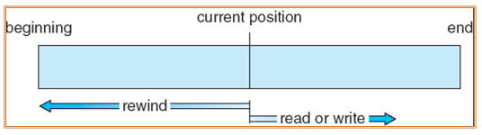{width="350"}
* Direct (Random) Access 直接访问：文件由固定长度的逻辑记录组成，以允许程序按任意顺序进行快速读取和写入记录。对于直接访问方法，必须修改文件操作以便包括块号作为参数。因此，有read(n)，其中n是块号，而不是read_next()。
    ```c++
        read n
        write n
        position to n
            read next
            write next 
        rewrite n
    ```
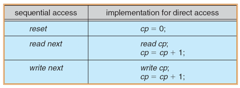{width="400"}

## 3.Directory Structure 

* 目录结构：Directory Structure
    1. 目录可以看作是一个符号表，它将文件名转换为文件控制块（FCB）。可以理解为独立于所有文件之外的“文件”，每一个entry告诉我们每一个文件的控制信息。
    2. 包含所有文件（管理）信息的节点集合       
   
    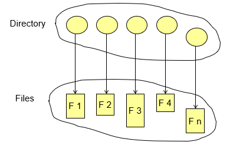{width="400"}

    图中上方其实就是表，每一个圆就是一个表项。

* 卷：Volume 是一个逻辑上的概念（物理上的概念叫partition（从磁盘上划分出来）），在每一个卷上放一个目录，剩余的空间放文件        
    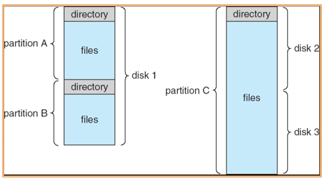{width="400"}

* 目录结构的作用：
    1. Efficiency：能够很快定位
    2. Naming：方便识读
    3. Grouping：使得操作系统在加载时更加方便。 

* 目录执行的操作：
    1. Search for a file ：find /path/to/search -name filename
    2. Create a file：touch filename
    3. Delete a file：rm filename
    4. List a directory：ls /path/to/directory
    5. Rename a file：mv oldname newname
    6. Traverse the file system：access every dir and file for backing up.
    

* Single-Level Directory：A single directory for all users
    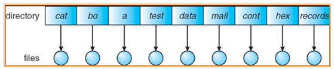{width="400"}

    1. Naming Problem 单级目录要求所有文件必须具有唯一的名称。
    2. Grouping Promblem

* Two-Level Directory：Separate directory for each user 每个用户都有自己的用户文件目录（UFD），当用户作业开始或用户登录时，搜索系统的主文件目录（MFD），通过用户名或账户可索引MFD，每个条目指向该用户的UFD。     
    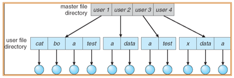{width="400"}

    1. Path name
    2. Can have the same file name for different user
    3. Efficient searching
    4. No grouping capability

* Tree-Structured Directories:      
    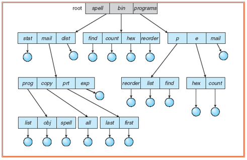{width="400"}

    * Each directory entry contains a bit defining the entry as file(0) or directory(1).
    * Efficient searching
    * Grouping Capability
    * Current directory (working directory) 存储当前目录，便于查询寻找
  
* Acyclic-Graph Directories 无环图，可以跨越层次，灵活性更好（同一个文件有多个路径），如果两个用户都希望平等地获取/修改某个文件，也就是都希望该子目录在自己的目录内。在这种情况下，公共子目录应该共享（在树中明显不可能，因为一个孩子不可能有两个父节点）。

    1. Requirement for file sharing
    2. Have shared subdirectories and files     
    
    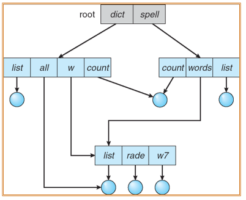{width="400"}

    * If dict deletes count => dangling pointer 可能会出现悬挂指针的问题，因为删除文件时可能只删除了其中一个指向它的指针，其他指向它的指针未被删除
        * Solutions：Backpointers (keep a list of references to a file), so we can delete all pointers.删除某个文件时，删除所有指向它的指针。

* General Graph Directory：采用无环图结构的一个严重问题是确保没有环（我的理解是需要额外的overhead），如果允许目录中有环，则无论从正确性或性能角度而言，同样需要避免多次搜索同一部分。设计不当的算法可能会无穷搜索环而无法终止（一种解决方案是可以限制在搜索时访问目录的数量）。  
    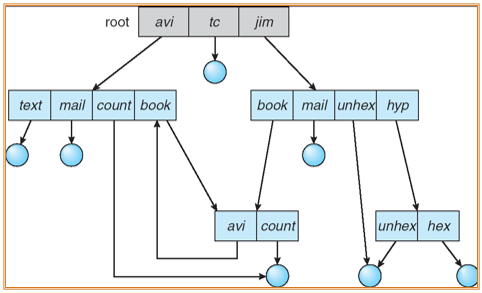{width="400"} 

    * If cycles allowed 
        1. Repeated search the same object
        2. File deletion problem (count <>0 even if unused)这种异常源自目录中可能存在自我引用。在这种情况下，通常需要使用Garbage collection方法
    * How do we guarantee no cycles?
        1. Allow only (soft) links to file not subdirectories 只允许创建指向文件的link，不允许指向子目录
        2. Garbage collection 垃圾回收的机制，确定何时最后引用已被删除并重新分配磁盘空间，也就是清理没有用的文件/目录，需要付出额外的扫描时间：
            * Garbage collection涉及遍历整个文件系统，并标记所有可访问的文件。然后，第二次遍历收集所有未标记的到空闲空间列表
        3. Every time a new link is added, use a cycle detection algorithm to determine whether it is OK 每次添加新链接时，循环检测是否存在循环。
     
!!! tip "Soft (Symbolic) Link vs. Hard Link"
    * Soft Link:
        1. 软链接是一个单独的文件，通过存储其路径指向原始文件。（也就是说这个文件其实就是一个“路径”（目的还是为了访问原始文件））原始文件可以被删除，而存储路径的文件还存在，这并没有任何影响，因为不存在空的指针，只是表明文件找不到。（可以类比为快捷方式）
        2. 软链接有自己的索引节点（FCB），它的数据包含链接文件的路径，而不是文件数据本身。
        3. 软链接可以跨越文件系统，因为它们只是通往其他文件的路径。
    * Hard Link：
        1. 硬链接是现有文件的附加名称。它增加了文件的链接计数，这是一个文件有多少个名称（链接）的计数。
        2. 硬链接原始文件和硬链接都指向同一个索引节点（FCB）。
        3. 硬链接不能跨文件系统；不能为目录创建硬链接，以防止循环的产生。

## 4.File-System Mounting
文件系统必须 mount 后才能被访问     
一个未 mount 的文件系统 is mounted 在一个 mount point 上        
从挂载点进入后，会进入某个文件系统的根目录      

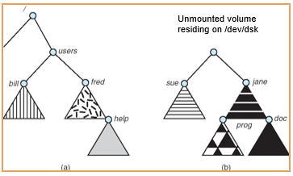

* 如果将图b中的项挂载到fred上，那么help将无法访问，而图b中的项都可以被访问


## 5.File Sharing

* Multiple Users:
    1. User IDs：identify users, allowing permissions and protections to be per-user
    2. Group IDs：allow users to be in groups, permitting group access rights

* Remote File Systems：Uses networking to allow file system access between systems


## 6.Protection

* Mode of access:  read, write, execute
* Three classes of users
    1. owner access：RWX
    2. group access：RW
    3. public access：X


    
    
        
    