---

title: Chap 11 | File System Implementation

hide:
  #  - navigation # 显示右
  #  - toc #显示左
  #  - footer
  #  - feedback  
comments: true  #默认不开启评论

---

<h1 id="欢迎">Chap 11 | File System Implementation</h1>

!!! note "章节启示录"
    <!-- === "Tab 1" -->
        <!-- Markdown **content**. -->
    <!-- === "Tab 2"
        More Markdown **content**. -->
    本章节是OS的第十一章。

## 1.File-System Structure and Implementation
* Layered File System：     
    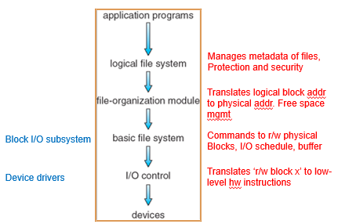

    1. I/O控制层：包括设备驱动程序和终端处理程序，以在主内存和磁盘系统之间传输信息。设备驱动程序可以作为翻译器。
    2. 基本文件系统：只需向适当设备驱动程序发送通用命令，以读取和写入磁盘的物理块。每个物理块由磁盘的数字地址来标识。
    3. 文件组织模块：知道文件及其逻辑块以及物理块。可以将逻辑块地址转成物理块地址，以供基本文件系统传输。
    4. 逻辑文件系统：管理元数据信息。元数据包括文件系统的所有结构，而不包括实际数据（或文件内容）。

    >

    * 分层是为了更好地模块化，把特定功能封装起来，使得用户只需要从逻辑层面关心操作。
    * i-node在logical这个层面进行管理

* Disk structures：
    1. Boot control block (per volume 每个卷的) 引导控制块，可以包含从该卷引导操作系统的所需信息。
    2. Volume control block per volume (superblock in Unix 每个卷的) 超级块，存整个卷的metadata，包括卷（或分区）的详细信息（如分区的块的数量、块的大小、空闲块的数量和指针、空闲的FCB数量和FCB指针等）
    3. Directory structure per file system（每个文件系统的） 
    4. Per-file FCB (inode in Unix)

* In-Memory File System Structures：    
    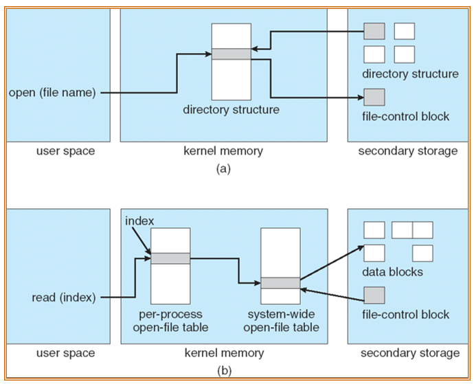{width="400"}

    * Figure 12-3(a) refers to opening a file.寻找到对应的文件，在内存中建立特定的结构
    
    * Figure 12-3(b) refers to reading a file.有两个打开文件表（上一章提到的），如果在系统层面的打开文件表已经打开，可以直接建立映射，并直接阅读到data block的特定位置。
    
    * 更直观的图：分两个阶段去做，通过FCB可以直接访问到文件A      
    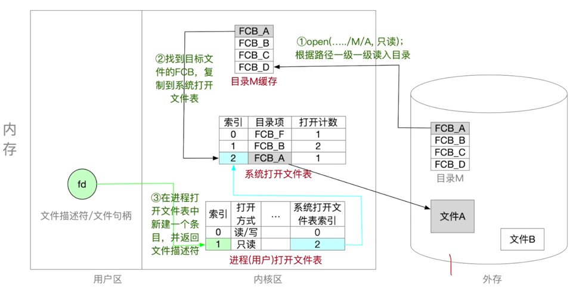{width="500"}

* Virtual File Systems：VFS提供两个重要功能：
    1. 通过定义一个清晰的VFS接口，它将文件系统的通用操作和实现分开。VFS接口的多个实现可以共存在同一台机器上，允许透明访问本地安装的不同类型的文件系统。
    2. 使用vnode唯一表示网络上的一个文件。这种网络的唯一性需要用来支持网络文件系统。内核为每个活动节点（文件或目录）保存一个vnode结构。
    

    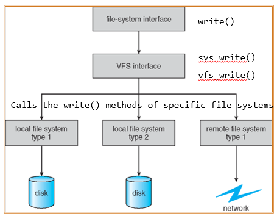{width="400"}

* In-Memory VFS Objects：
    1. superblock object: a specific mounted filesystem, corresponding to (but not equal) the superblock in the disk structure 表示整个文件系统
    2. inode object: a specific file, corresponding to (but not equal) FCB in the disk structure 表示一个单独的文件
    3. dentry object: an individual directory entry 表示单个目录条目 
    4. file object: an open file as associated with a process, existing as long as the file is opened 表示一个已打开的文件
    

## 2.Directory Implementation

* Linear list：实现简单，但执行时间长
* Hash Table：具有哈希数据结构的线性列表
    * 可以减少目录搜索时间
    * 冲突：两个文件名hash到同一位置
    * rehashing to 另一个更大的hash table

## 3.Allocation Methods

* Contiguous allocation
    1. 每个文件占用磁盘上一组连续的块
    2. 只需要起始位置和长度
    3. 支持随机访问
    4. 空间浪费（动态存  储分配问题）
    5. 文件不能扩展

    >

    * 映射  
        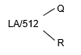
        * 要访问的块= Q + start_no （Q为商）
        * 块内偏移为 R （R为余数）

    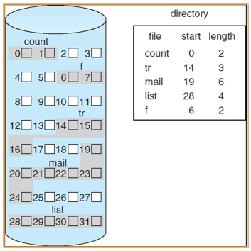{width="300"}

* 改进后的连续分配方案：Extent-Based Systems 解决了文件不能扩展的问题，但依然会出现过度分配
    * An extent is a contiguous block of disks
        1. Extents are allocated for file allocation
        2. A file consists of one or more extents.
    
如果将extent做的很小，就变成了如下的Linked allocation

* 隐式链接Linked allocation：每个文件都是磁盘块的链表：块可以分散在磁盘上的任何地方。
    1. 简单-只需要起始地址
    2. 自由空间管理系统-不浪费空间
    3. 不能随机访问，可靠性差
    
    >

    * 映射      
        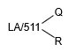    

        因为需要留一位指向下一个块，所以是511。

        * 要访问的块是表示文件的块链中的第Qth块。 
        * 块内偏移为 R + 1 (加一是因为pointer在第一位上)
    
    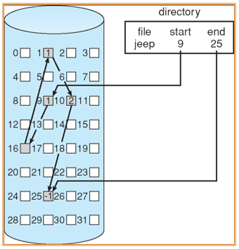{width="300"} 

* 显示链接File-Allocation Table：通过在内存当中的数据结构，提高了Linked allocation不能随机访问的效率。但同时也消耗了更多空间（且需要持久化，每一次系统启动时都要把FAT表加载到磁盘中）
    * FAT的表项与全部磁盘块一一对应，并且可以用-1表示文件的最后一块。
    * 支持顺序访问，也支持直接访问（要访问第i块，无须依次访问前i-1块）
    * FAT在系统启动时就被读入内存，检索记录是在内存中进行的，因此不仅显著提高了检索速度，而且明显减少了访问磁盘的次数。
    * FAT需要占用一定内存空间

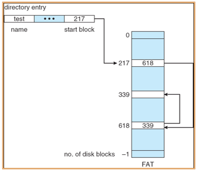{width="300"} 

* Indexed allocation：将所有指针聚集到索引块中。
    1. 需要索引表（类似于页表）
    2. 支持随机访问
    3. 动态访问没有外部碎片，但有索引块的开销。
    4. 一个最大256K字、块大小为512字的文件中从逻辑映射到物理时，只需要1块索引表。

    >

    * 映射      
              
        * Q = displacement into index table
        * R = displacement into block

    * 索引块的主要问题是，每个文件必须有一个索引块，当文件很小时（比如只有数个盘块），该方式仍为之分配一个索引块，此时索引块的利用率很低；而当文件很大时，需要更多的指针：
    * 链式解决办法：Linked scheme：索引表的链接块（没有大小限制）。       
        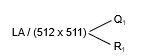      

        因为需要留一位指向下一个index table，所以是511。
        * Q1 = block of index table
        * R1 is used as follows:        
        
        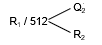          

        * Q2 = displacement into block of index table
        * R2 displacement into block of file:
        
    * 两级level解决方式：   
        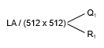      

        * Q1 = displacement into outer-index
        * R1 is used as follows:
        
          
        
        * Q2 = displacement into block of index table
        * R2 displacement into block of file:
        
    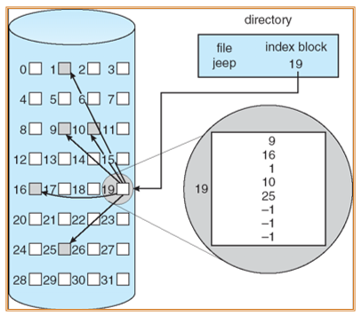{width="300"} 

??? example "一个例子🌰"
    * Linked scheme：       
        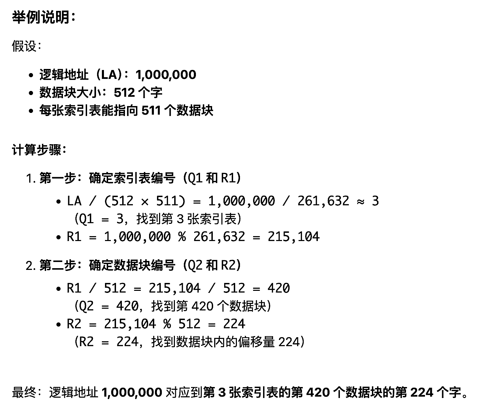{width="400"}

    * Two-Level index：     
        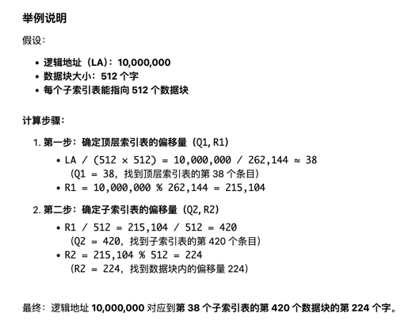{width="500"}

!!! tip "Two-level VS. Linked Schema"
    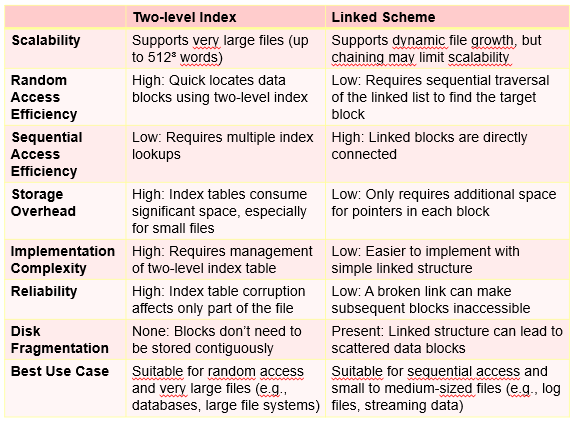{width="400"}
* Combined Scheme：UNIX (4K bytes per block)       
    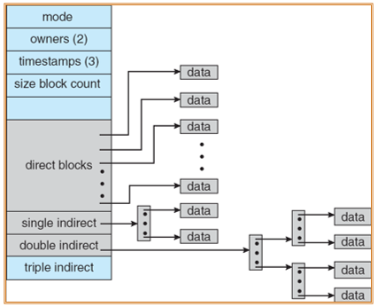

    1. 前几个指针存在文件的inode中
    2. 指针的签12个指向直接块（direct block），它们包含存储文件数据的块的地址。因此，小的文件（不超过12块）不需要单独的索引块。
    3. 接下来3个指针指向间接块：第一个指向一级间接块（一级间接块为索引块，它包含的不是数据，而是真正包含数据的块的地址）；第二个指向二级间接块（它包含了一个块的地址，而这个块内的地址指向了一些块，这些块中又包含了指向真实数据块的指针）；最后一个指针为三级间接块。

### 总结    

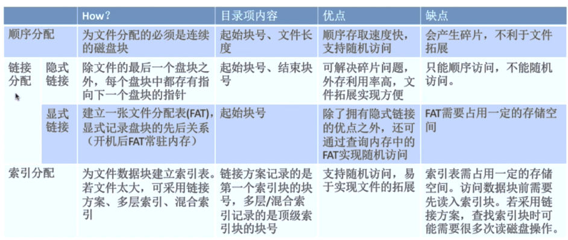

## 4.Free-Space Management 

* 使用Bit vector：放在超级块中
    1. 1代表block[i]空闲
    2. 0代表block[i]被占用

    >

    * 寻找第一个空闲块：        
        (number of bits per word) * (number of 0-value words) + offset of first 1 bit
        
* Bit map requires extra space
    * Example:      
        block size = 2^12 bytes      
        disk size = 2^30 bytes (1 gigabyte)      
        n = 2^30/2^12 = 2^18 bits (or 32K bytes)       
    * Easy to get contiguous files 

* Linked list (free list) – see figure
    1. Cannot get contiguous space easily
    2. But basically can work (FAT)
    3. No waste of space

    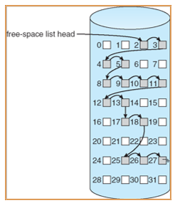

* Grouping – a modification of the Linked List
    1. Addresses of the n free blocks are stored in the first block. 
    2. The first n-1 blocks are actually free. The last block contains addresses of another n free blocks

* Counting 计数的方式比较适合连续的分配方式
    * Address of the first free block and number n contiguous blocks 

在管理空闲空间时，有两个值非常重要（需要保护）：指针to free list 和 Bit map（必须持久化到磁盘，确保在内存中的位图和磁盘中的位图定期同步）

* bit map 同步方式如下：
    1. Set bit[i] = 1 in disk
    2. deallocate block[i]
    3. Set bit[i] = 1 in memory
    

## 5.Efficiency and Performance

* Efficiency dependent on:
    1. disk allocation and directory algorithms
    2. types of data kept in file’s directory entry (for example “last write date” is recorded in directory) 
    3. Generally, every data item has to be considered for its effect.
    
* Performance
    1. disk cache – separate section of main memory for frequently used blocks
    2. free-behind and read-ahead – techniques to optimize sequential access
    3. improve PC performance by dedicating section of memory as virtual disk, or RAM disk

* Page Cache：可以使用虚拟内存对memory-mapped访问，更加高效，同时减少I/O     

* I/O Without a Unified Buffer Cache    
    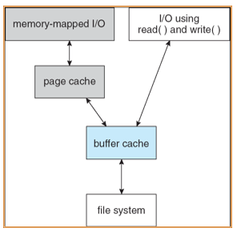

* Unified Buffer Cache 统一的buffer cache：使用同样的page cache 缓存 Unified Buffer Cache，避免了二次缓存       
    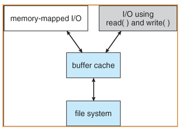