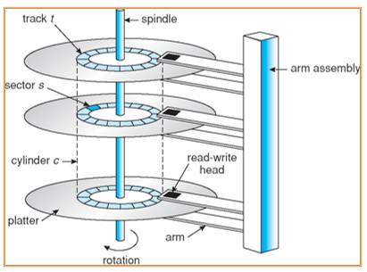
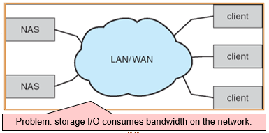
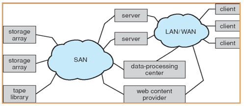

---

title: Chap 12 | Mass-Storage Systems

hide:
  #  - navigation # 显示右
  #  - toc #显示左
  #  - footer
  #  - feedback  
comments: true  #默认不开启评论

---

<h1 id="欢迎">Chap 12 | Mass-Storage Systems</h1>

!!! note "章节启示录"
    <!-- === "Tab 1" -->
        <!-- Markdown **content**. -->
    <!-- === "Tab 2"
        More Markdown **content**. -->
    本章节是OS的第十二章。

## 1.概述
### 1.1 磁盘
{width="400"}     

* 盘片platter：每个盘片为平的圆状。表面逻辑地分成圆形磁道track，再细分为扇区sector。同一磁臂位置地磁道集合下形成了柱面cylinder。每个磁盘驱动器有数千个同心柱面，每个磁道可能包括数百个扇区。

* 读写磁头read-write header附着在磁臂disk arm上：磁臂将所有磁头作为一个整体而一起移动

### 1.2 磁盘连接
计算机访问磁盘存储有两种方式：通过I/O端口（或主机连接存储host-attached storage）;通过分布式文件系统的远程主机（网络连接存储network-attached storage）

* 主机连接存储：
    1. 台式机PC采用：I/O总线架构（SCSI），SCSI本身是一个总线，一条电缆上多达16个设备，SCSI启动器请求操作和SCSI目标执行任务
    2. 工作站和服务器：光纤通道FC
        1. 大的交换结构，具有24位地址空间：是存储域网SAN的基础
        2. FC仲裁环路FC-AL：可以寻址126个设备

* 网络连接存储：
    1. 网络连接存储NAS设备是一种专用存储系统，可以通过数据网络来远程访问。客户通过远程过程调用（RPC），如UNIX系统的NFS或Windows机器的CIFS，访问网络连接存储。
    2. Internet小型计算机系统接口iSCSI：是最新的网络连接存储协议。在本质上，它采用IP网络协议来执行SCSI协议。从而，主机与存储之间的互连可能是网络，而不是SCSI电缆。

    

网络连接存储的缺点是，存储I/O操作消耗数据网络的带宽，从而增加网络通信的延迟。

* 存储区域网络：SAN为专用网络，采用存储协议而不是网络协议连接服务器和存储单元。
    1. 在大型存储环境中很常见（并且变得越来越普遍）
    2. Flexible：多个主机绑定多个存储阵列

    

## 2.Disk Scheduling
* Time to access (read/write) a disk block:
    1. seek time (moving arms to position disk head on track) 1 to 20msec 磁臂移动磁头到包含目标扇区的柱面的时间
    2. rotational delay (waiting for block to rotate under head) 0 to 10msec 磁盘旋转目标扇区到磁头下的额外时间
    3. transfer time (actually moving data to/from disk surface) about 1msec per 4KB page 

* Disk bandwidth：传输字节的总数除以从服务请求开始到最后传递结束时的总时间。
