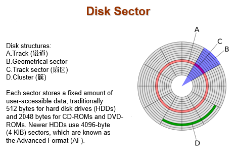
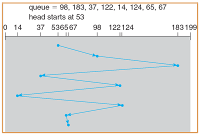
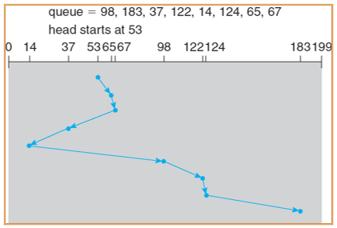
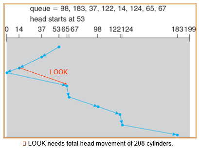
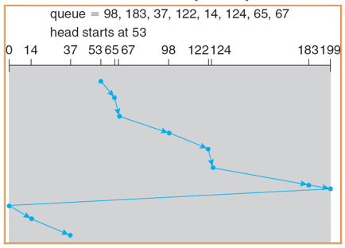
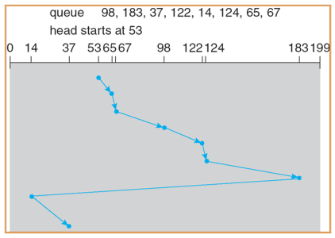
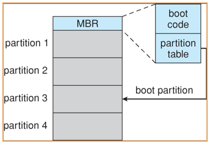
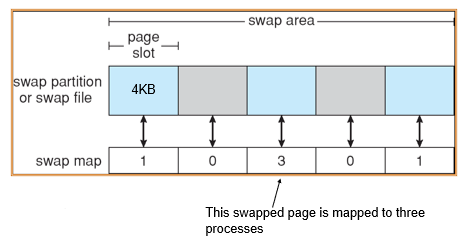
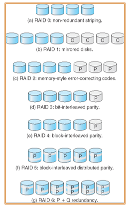
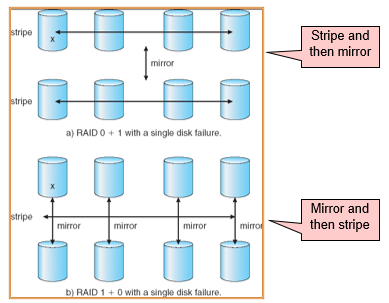

---

title: Chap 12 | Mass-Storage Systems

hide:
  #  - navigation # 显示右
  #  - toc #显示左
  #  - footer
  #  - feedback  
comments: true  #默认不开启评论

---

<h1 id="欢迎">Chap 12 | Mass-Storage Systems</h1>

!!! note "章节启示录"
    <!-- === "Tab 1" -->
        <!-- Markdown **content**. -->
    <!-- === "Tab 2"
        More Markdown **content**. -->
    本章节是OS的第十二章。

## 1.概述
### 1.1 磁盘
{width="400"}     

* 盘片platter：每个盘片为平的圆状。表面逻辑地分成圆形磁道track，再细分为扇区sector。同一磁臂位置地磁道集合下形成了柱面cylinder。每个磁盘驱动器有数千个同心柱面，每个磁道可能包括数百个扇区。

* 读写磁头read-write header附着在磁臂disk arm上：磁臂将所有磁头作为一个整体而一起移动

{width="400"}
### 1.2 磁盘连接
计算机访问磁盘存储有两种方式：通过I/O端口（或主机连接存储host-attached storage）;通过分布式文件系统的远程主机（网络连接存储network-attached storage）

* 主机连接存储：
    1. 台式机PC采用：I/O总线架构（SCSI），SCSI本身是一个总线，一条电缆上多达16个设备，SCSI启动器请求操作和SCSI目标执行任务
    2. 工作站和服务器：光纤通道FC
        1. 大的交换结构，具有24位地址空间：是存储域网SAN的基础
        2. FC仲裁环路FC-AL：可以寻址126个设备

* 网络连接存储：
    1. 网络连接存储NAS设备是一种专用存储系统，可以通过数据网络来远程访问。客户通过远程过程调用（RPC），如UNIX系统的NFS或Windows机器的CIFS，访问网络连接存储。
    2. Internet小型计算机系统接口iSCSI：是最新的网络连接存储协议。在本质上，它采用IP网络协议来执行SCSI协议。从而，主机与存储之间的互连可能是网络，而不是SCSI电缆。

    

网络连接存储的缺点是，存储I/O操作消耗数据网络的带宽，从而增加网络通信的延迟。

* 存储区域网络：SAN为专用网络，采用存储协议而不是网络协议连接服务器和存储单元。
    1. 在大型存储环境中很常见（并且变得越来越普遍）
    2. Flexible：多个主机绑定多个存储阵列

    

## 2.Disk Scheduling
* Time to access (read/write) a disk block:
    1. seek time (moving arms to position disk head on track) 1 to 20msec 磁臂移动磁头到包含目标扇区的柱面的时间
    2. rotational delay (waiting for block to rotate under head) 0 to 10msec 磁盘旋转目标扇区到磁头下的额外时间
    3. transfer time (actually moving data to/from disk surface) about 1msec per 4KB page 

* Disk bandwidth：传输字节的总数除以从服务请求开始到最后传递结束时的总时间。

* FCFS：    
    {width="350"}

* Shortest-seek-time-first (SSTF)：从当前头部位置选择具有最小寻道时间的请求。不过这种贪婪的做法可能会导致饥饿。         
    {width="350"}

* SCAN：
    * 磁盘臂从磁盘的一端开始，向另一端移动，为请求提供服务，直到它到达磁盘的另一端，在那里磁头的运动被逆转，服务继续。
    * 有时被称为电梯算法。      
    {width="350"}

* C-SCAN：
    * 提供比SCAN更统一的等待时间。
    * 磁头从磁盘的一端移动到另一端，一边移动一边处理请求。但是，当它到达另一端时，它立即返回到磁盘的起点，在返回过程中不处理任何请求。
    * 将柱面视为从最后一个柱面环绕到第一个柱面的圆形列表。      
    {width="350"}

* C-LOOK：
    * 到达最大就直接reset到最小的地方重新开始（而不是到了199再reset到0）        
    {width="350"}

!!! tip "总结各个算法"
    * SSTF是最常见的
    * SCAN和C-SCAN对于 heavy load on the disk 的系统性能更好。
    * 对于默认算法，SSTF或LOOK都是合理的选择。

    性能取决于请求的数量和类型，对磁盘服务的请求可能受到文件分配方法的影响。因此磁盘调度算法应该作为操作系统的一个独立模块编写，允许在必要时用不同的算法替换它。
    
    问：什么样的调度算法适合SSD？

    答：SSD没有机械部件。对于随机和顺序访问的性能差异较小，因为SSD的访问速度不受物理磁头寻道的限制。因此选择FCFS（先进先处理）就是最合适的。

## 3.Disk Management
* 低级格式化或物理格式化：将磁盘划分为磁盘控制器可以读写的扇区。

* 要使用磁盘保存文件，操作系统仍然需要在磁盘上记录自己的数据结构。
    1. 将磁盘划分为一组或多组柱面。
    2. 逻辑格式化或“创建文件系统”。

* 引导块初始化系统。
    1. 引导程序存储在ROM中。
    2. 引导加载程序。

* 扇区节省等方法用于处理坏块。

{width="350"}

## 4.Swap-Space Management
* Swap-Space Management：
    1. Swap-Space：虚拟内存使用磁盘空间作为主内存的扩展。

    {width="350"}

## 5.RAID Structure
* 独立磁盘冗余阵列
* RAID：多个磁盘驱动器通过冗余提供可靠性。
* RAID分为六个不同的级别。

磁盘使用技术的一些改进涉及到使用多个磁盘协同工作。

* Disk striping uses a group of disks as one storage unit.提高读写性能
    1. Bit-level Striping
    2. Block-level Striping：different blocks of a file are striped

   

* RAID 0 ：读写效率最高，因为没有冗余       
* RAID 1 ：使用了double的冗余，每一个bit都要做一个mirror，数据不容易丢失
* RAID 2 ：数据在准备写入磁盘时，计算纠错码，如果数据发生了丢失，可以通过纠错码和剩下的数据进行纠错。存的parity数量较多，冗余和读写开销都较大。
* RAID 3 ：及以后采取了更加简单的纠错码（奇偶校验）
* RAID 5 ：把parity的信息交错到放到了每一个盘中（避免了只有一个盘存parity，而失效后无法纠错的问题），不过依然最多只能允许一个盘坏。        
* RAID 6 ：安全性更高，允许有两个盘可以坏

* RAID (0 + 1) and (1 + 0)：可以先strip后mirror，也可以反过来    
    

    1. (0 + 1)：不可以两边RAID0中各坏一块硬盘，但可以在单边同时坏掉单边的两块硬盘。
    2. (1 + 0)：可以两边RAID1中各坏一块硬盘，但不能同时坏掉单边的两个硬盘。