---

title: Note

hide:
  #  - navigation # 显示右
  #  - toc #显示左
  #  - footer
  #  - feedback  
comments: true  #默认不开启评论

---

<h1 id="欢迎">Note</h1>

## 1.基础知识
### 1.1 货币
* 货币的价值：
    1. 使用价值
    2. 交换价值

* 货币的形式：
    1. 贵金属：金、银、铜
    2. 纸币
    3. 数字货币

* 纸币的本质：信用
    1. 金本位
    2. 国家信用
    3. 布雷顿森林体系

* 纸币的全球化：    
    国际货币基金组织特别特别提款权：补充国际储备资产的不足，一开始相当于1美元，后背重新定义为一篮子货币

* 货币理论：
    1. 马克思政治经济学：商品的使用价值与交换价值
    2. 凯恩斯经济学：市场这只“看不见的手”有时候会失灵，需要政府干预
    3. 哈耶克经济学：自由市场、自由经营、自由竞争、自动 调节、自动均衡   
    货币非国有化
    4. 现代货币理论MMT：货币的本质就是欠条，即IOU(I Owe You)

??? tip "SWIFT环球银行间金融电讯协会"
    服务于金融业的全球通信网络，主要位金融机构提供跨境信息传送服务。
### 1.2 Hash算法
把任意长度的输入通过hash算法变换成固定长度的输出，该输出就是hash值。    

* hash算法的特征： 
    1. 输入空间任意，输出空间有限
    2. 可能发生碰撞
    3. 从输出不可能推导出输入  

* 最简单的hash算法  
    x mod y = z 整数取模运算、

* hash算法的应用：
    1. 快速定位（数据库中散列表）
    2. 错误校验
    3. 唯一性验证

* hash算法的安全性：
    1. 逆向困难，难以从输出推导出输入。
    MD、SHA算法都不可逆
    2. 抗碰撞：很难找到两个不同的输入，可以产生相同的输出。

* 安全哈希算法SHA256：
    输出为256位，输出空间是 $2^{256}$ 。目前尚未有破解方法

### 1.3加密算法

* 最简单的加密算法：凯撒密码

* 非对称加密算法

* 数字签名

## 2.区块链技术原理

* 数字货币面临的2个问题：
    1. 虚假货币：解决方案：数字签名（非对称加密技术）
    2. 多重支付：解决方案：分布式账本

### 2.1 概述：分布式账本技术原理    
将交易向全网所有节点进行广播    
➢众多记账节点对记账权达成共识，由共识确认的记账节点把记账区块发布给全网   
➢所有账本数据完整存储于区块链网络的每个节点  
➢所有节点都对账本数据的合法性和完整性进行验证

* 两个核心技术：   
    ➢以链式区块组织账本数据实现账本数据的不可篡改   
    ➢分布式的可信记账机制   

### 2.2 以链式区块组织账本数据实现账本数据的不可篡改（区块链的结构） 

#### 区块链的宏观结构
* 特点:
    1. 区块链中数据无法篡改或删除
    2. 区块链越长可信度越高

每一个区块保存了前一个区块的哈希值。   
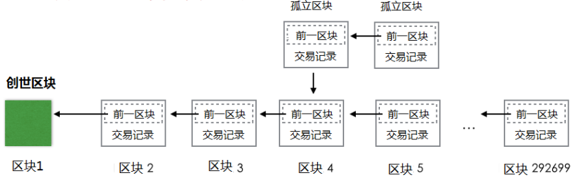{width="400"}

#### 区块的微观结构
每个区块包括区块头和交易数据两个部分
1. 区块头由当前区块的元数据和前一区块的Hash值构成
2. Merkle树用于对交易数据列表进行快速寻址

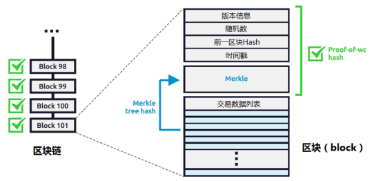{width="400"}


* 区块的结构：  
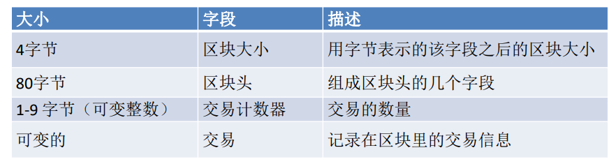{width="550"}

* 区块头的结构：   
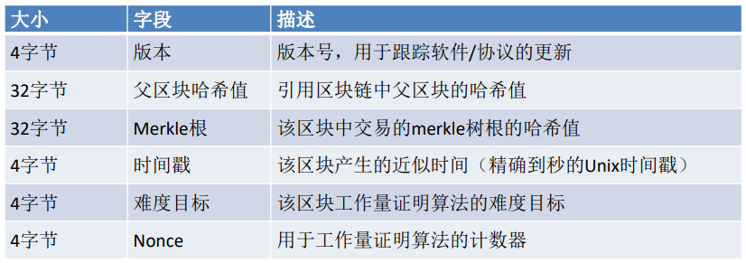{width="500"}

* 区块标识符：区块头哈希值和区块高度    
    1.**区块主标识符是它的加密哈希值**，一个通过SHA256算法对区块头进行二次哈希计算而得到的数字指纹。
    
    >例如:000000000019d6689c085ae165831e934ff763ae46a2a6c172b3f1b60a8ce26f是第一个比特币区块的区块哈希值。

    2.区块哈希值实际上并不包含在区块的数据结构
    3.第二种识别区块的方式是通过该区块在区块链中的位置，即“区块高度（block height）”。
    
    >例如：高度为0的区块就是创世区块。

    4.和区块哈希值不同的是，区块高度并不是唯一的标识符，因为有可能出现区块链分叉。

* Merkle树:一种哈希二叉树(这种二叉树包含加密哈希值)。
    1. 叶节点是数据块的哈希值。
    2. 非叶节点的哈希值是根据它下面子节点的值哈希计算得到。
    
    在比特币网络中，Merkle树被用来归纳一个区块中的所有交易，同时生成整个交易集合的数字指纹，且提供了一种校验区块是否存在某交易的高效途径。       

    Merkle树中使用两次SHA256算法计算结点的哈希值。
    
    ??? question "检查次数"   
        当N个数据元素经过加密后插入Merkle树时，至多计算 $log_2(N)$ 次就能检查出任意某数据元素是否在该树中，这使得该数据结构非常高效。

    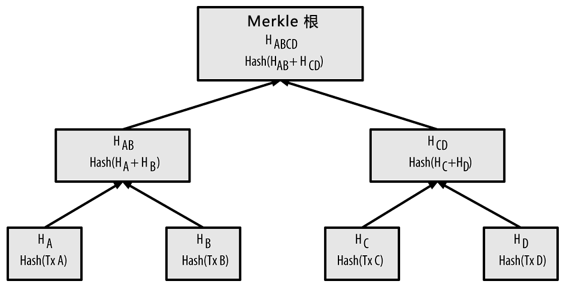{width="500"}   

    如果是奇数，就将叶子复制一份再做hash作为非叶子节点的值。

    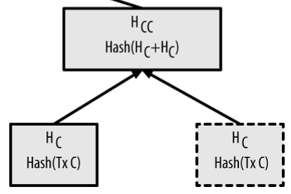{width="300"}

    * 价值：
        1. 快速比较大量数据：当两个Merkle树的根哈希值相同时，说明所代表的的数据都相同。
        2. 快速定位修改：如果其中某个交易（数据）发生修改，从根向下可以快速定位被修改的数据。
        3. 快速验证其中数据：要验证某个交易（数据）是否在Merkle树中，只需要提供一条从该交易的叶节点开始的路径，经过hash计算比对后即可验证。

    若已知HK，只需要再获取4个节点的值就可以得到根节点。
    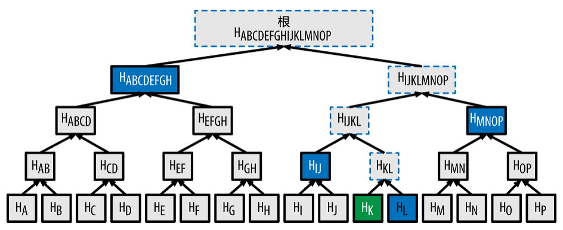{width="500"}
#### 比特币区块链中的节点
* 全节点 full client：    
    存储着整个区块链，承但对交易请求进行验证和执行，可以通过挖矿争取发布区块，还承担着应别的节点之请向其发送区块和相关交易信息的义务，同时也承担转发交易请求和区块的义务。   
    1. 矿工节点
    2. 非矿工节点
* 轻节点 light client：   
    1. 简单支付验证（SPV）节点:只存储区块头，不存储区块块体，仍可以对到来的交易请求进行验证。
    2. 钱包:一个连接区块链的应用软件(app)，记录与所有者有关的信息：区块链地址、私钥、账户余额、UTXO等，不存储账本。

!!! tip "SPV（钱包）验证过程"
    针对某个支付到自己比特币地址的交易建立布隆过滤器，限制只接收含有目标比特币地址的交易。    
    
    其他全节点探测到某个交易符合SPV节点设置的布隆过滤器条件时，以Merkleblock消息的形式发送该区块，Merkleblock消息包含区块头和一条连接目标交易与Merkle根的Merkle路径。

    * **交易的存在性验证**：SPV节点通过该Merkle路径找到跟该交易相关的区块，并验证对应区块中是否存在目标交易<font color = "red">（Merkle Path Proof）</font>。
    * **交易是否双化验证**：SPV节点检查这笔交易所在区块之后的区块个数，区块个数越多说明该区块被全网更多节点共识，一般来说，一笔交易所属区块之后的区块个数达到<font color = "red">6</font>个时，说明这笔交易是可信的。

十分高效，需要验证的哈希数量很少。    
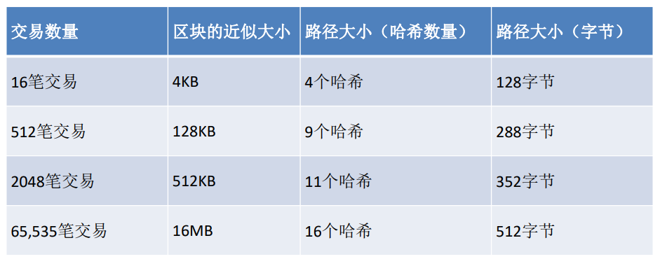{width="500"}


### 2.3 分布式的可信记账机制

* 共识机制：由谁记账      
    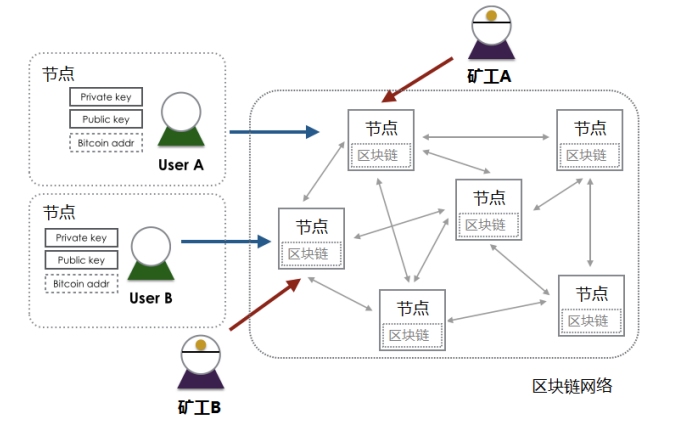{width="400"}   

    1. 目的：解决记账权
    2. 场景：开放系统，动态增减，海量节点
    3. 解决方案：工作量证明（proof of work）：高强度哈希计算
    (SHA256)进行算力竞争解决记账权，达成共识      
    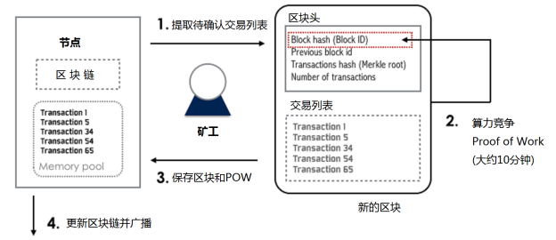{width="450"}

    * 工作量证明PoW共识：
      1. 划定固定时间段（10分钟）
      2. 相同或相似输入数据（组装的区块）
      3. 算力竞争选出获胜节点，其它节点验证结果后不再发送消息
      4. 最长链原则，从短期共识扩展到长期共识
??? example "拜占庭将军问题（分布式一致性）"
    | **将军**      | **节点** |
    | ----------- | ----------- | 
    | 每个将军控制自己的军队  | 每个分布式节点独立运行      | 
    | 通过信使给其他将军传递消息   | 相互间可通过网络通信  | 
    |将军中可能有叛徒|可能存在恶意节点|
    |信使是可靠的，但可能被截获|信道是可靠的，但可能中断|


    * 拜占庭将军问题算法的目标：   
        1. 一致性：所有忠诚的将军按照相同的计划行动
        2. 正确性：少数叛徒不能导致忠诚将军采取错误的行动计划

* 时序模型：
    1. 同步：分布式节点进程执行时间有确定的上限
    2. 异步：进程执行时间没有上限
* 故障模型:  
    1. 崩溃故障
    2. 拜占庭故障：节点崩溃、联系不上、恶意行为
* 容错模型：
    1. 崩溃容错 CFT(Crash Fault Tolerance)：指系统能够在部分节点崩溃或失效的情况下继续正常工作。
    2. 拜占庭容错 BFT(Byzantine Fault Tolerance)：指系统能够在部分节点表现出不可靠或恶意行为（如发送错误信息或故意破坏系统）时仍然能够正常工作。

### 2.4 区块的生成和组装    
竞争胜出的节点创建区块并广播    
其他独立节点校验新区块   

* 区块链的组装和选择（根据父区块hash值查找父区块），有三种情况：
    1. 连接到主链上
    2. 分叉（备用链）
    3. 孤立区块

* 区块链分叉解决方案:
    1. 把当前同一个父区块下的若干有效子区块都记录，形成兄弟区块（产生分叉）
    2. 后续区块（第3代、第4代……）到达后，依次加在前序区块后，若没有其他竞争性区块，这一分支最长，成为主链。

* 挖矿：比特币的产生
    1. 挖矿节点必须有钱包功能:有自己的160位密码地址、私钥
    2. 打包生成区块时，区块中额外加一个交易coinbase(生成给自己的奖励)
        1. 生成一个UTXO，包含当前奖励数量的比特币(现在是6.25)
        2. 这个UTXO的招领地址是自己的地址
        3. 如果记账成功，这个coinbase交易就生效，否则不在链上。


!!! tip "共识记账机制小结"
    1. 每个全节点依据综合标准对每个交易进行独立验证    
    2. 通过完成工作量证明算法的验算，挖矿节点将交易记录独立打包进新区块       
    3. 每个节点独立地对新区块进行校验并组装进区块链     
    4. 每个节点对区块链进行独立选择，在工作量证明机制下选择累计工作量最大的区块链


### 2.5 UTXO模型
不存于现实世界，现实世界中只有两种模型：纸币（现金）模型、账户模型。    
1. 纸币模型：每张纸对应不同的面额。       
2. 账户模型：账户下面的余额。
   

UTXO (Unspent Transaction Output)：未花费的交易输出

* 比特币中有两类交易：
    1. 常规交易，有交易输入（支付者地址和金额）、交易输出（收入者地址和金额）
    2. 挖矿交易（Coinbase），产生比特币，只有交易输出（挖矿者地址和金额）

每个地址的资金余额就是散布在账本中所有UTXO的总和，使用时把自己名下的UTXO作为交易输入，可能需要拼凑找零。
??? example "一个例子🌰"
    类似于古代的金银交易，金银时代中，有时候需要称量银子的重量来进行价值的确定，并进行拼凑找零。

    UTXO与金银不同的是，不存在于“你的口袋”中，而更像是“贴在墙上”，需要通过特定的密码来取下来。也就是说，比特币不存在于个人的地址中，而是都存在一个特定的地址。

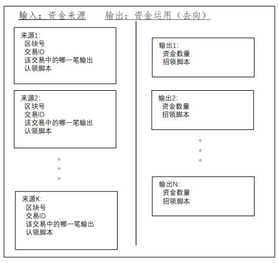{width="350"}

* 交易的数据结构：  
```c++
class CTransaction {} //一个交易请求或交易记录
const std::vector<CTxIn> vin //本Tx的输入UTXO序列，即资金来源。
const std::vector<CTxOut> vout //本Tx的输出UTXO序列，即资金去向。
const int32_t nVersion // CURRENT_VERSION=2
const uint32_t nLockTime //锁定时间，时间未到点之前本交易不入块

const uint256 hash //本Tx的Hash值，只存储在内存中，
//不作永久存储也不发送。
```

* CTxOut的结构：    
```c++
class CTxOut {}
CAmount nValue //本项输出即该UTXO所承载的（比特币）价值,以聪（中本聪）为计量单位
CScript scriptPubKey //招领脚本，虽然名为scriptPubKey，
//却未必只是以公钥为条件的脚本
```
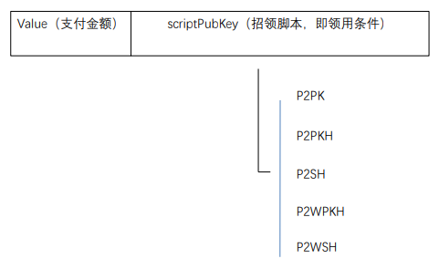{width="400"}


* CTxIn的结构:  
```c++
class CTxIn {}
COutPoint prevout //Previews Output。指向具体的资金来源，
//说明来自那一项交易的第几项输出，展开如下：
uint256 hash //资金来源所在Tx的Hash值，唯一地确定了一个Tx。
uint32_t n //本项资金来源是该Tx中的第几项输出。
CScript scriptSig //为认领该项资金而提供的“签名脚本”（认领脚本）。
uint32_t nSequence //具有特殊作用。
CScriptWitness scriptWitness; //见证脚本的数据，0x00表示无
```
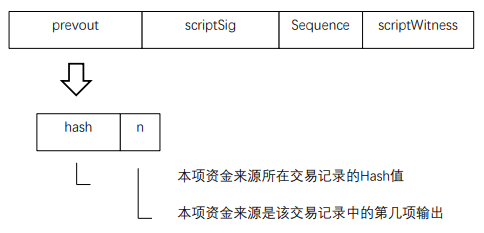{width="400"}

* Coinbase交易:  
    1. 每一区块的第一笔交易必须是 Coinbase 交易，也称为生成交易，由挖矿节点生成。
        1. 交易输入为0
        2. 产生的UTXO = 挖矿奖励（目前6.25BTC）+ 区块交易费用
        3. 区块交易费用 = 所有输入的UTXO - 所有输出的UTXO
    2. Coinbase 交易的 UTXO 具有特殊条件，即至少 100 个区块内它不能花费（用作输入）。防止分叉产生导致的各种各样的矛盾纠纷。


### 2.6 比特币虚拟机
比特币节点软件的一个模块   
堆栈结构，可以运行有限的指令

* 运行的程序：
    1. 认领脚本 scriptSig
    2. 招领脚本 scriptPubKey

指令集：能力有限，主要验证签名是否正确
>OP_CHECHSIG,OP_DUP,OP_HASH160,OP_EQUALVERIFY……


#### 招领脚本scriptPubKey
* P2PK(Pay to Public Key):付给公钥。付给给定256位公钥的主人。
* P2PKH(Pay to Public Key Hash):付给公钥的Hash值。这里所谓的Hash，是特指对于
256位公钥的160位Hash，也就是对方的“地址”。
* P2SH(Pay to Script Hash):付给脚本的Hash值。给定一个脚本的Hash值，付给能提供这个脚本的对象，所提供脚本的Hash值必须与给定的Hash值相同。这个脚本是收付双方预先约定的，是双方在“链外” 约定的。


* 需要多方签名并采用SegWitness脚本的支付，具体又有两种：
    1. P2WPKH(Pay to SegWitness Public Key Hash):付给SegWitness形式的多个公钥Hash值。
    2. P2WSH(Pay to SegWitness script Hash):付给SegWitness形式的脚本Hash值。


#### 支付通道

比特币交易需要在10分钟之后被验证，（甚至挖矿得到的钱需要100个区块之后才能到），因此在实际生活中，没法用来做现实的支付（延迟太高）。所以出现了“支付通道”，不需要在链上进行支付。   

* 支付通道：所有交易在链外进行，等到结束后再到链上确认
    1. 用于链外支付或其他交易
    2. 面向性能要求高、交易数量大等场景

    >第一个支付通道应用场景：阿根廷有线电视比特币付费，按秒计费，如果
    每秒计费交易上链，比特币区块链无法满足性能要求，也会面对海量交易压力。(每秒都要计算，计算量过大)

* 涉及的链上交易：
    1. 注资交易（Funding Transaction）
    2. 应承交易（Commitment Transaction）
    3. 决算交易（Settlement Transaction）
    4. 退款交易（Refund Transaction）

* 支付通道过程：
    1. Funding transaction，建立支付通道
        A、B双方建立一个2-of-2多签名的联合地址，由拟议中的付方发布一个交易将一笔钱打到这个地址中；但这是P2SH支付，即支付给能够正确提供清算脚本Hash值的收款方，因为是2-of-2就必须有双方的签名才能花，。这是后面链外支付的资金来源。

        * 1个付款方：单向通道;2个付款方：双向通道
  
    2. Commitment transaction
        A、B双方的链下交易，可以有很多个，不上链。每次支付的资金都来自同一个UTXO，每次交易的输出分成两部分，一是给收方的UTXO，其数值是付方至此为止承诺支付的总和，二是给付方自己的找零。
    3. Settlement transaction
        收款方把手中由付款方开具并签名的最后那个应承交易上签上自己的名并把它发送到比特币网上，从当初注资阶段生成的那个UTXO中把钱划给自己，同时把剩余的钱（如果还有的话）找还给付款方。这个操作也可以由付款方发起，因为收款方每次收到应承交易都会签上自己的名并发还给付款方。

* 闪电网络（ Lightning Network ）:是一种支付通道，除了支付通道上述交易外，还有：   
    1. 转存交易（Delivery Transaction），任何一方都可以从联合地址认领属于自己的资金，把它转到一个自己更方便花费的地址中。
    2. 可撤转存交易（Revocable Delivery Transaction），可以撤销。
    3. 补救交易（Breach Remedy），这是在对方违约情况下加以补救并使对方受惩罚的交易。


!!! tip "总结：区块链技术"
    区块链技术是一种以<font color = "red">非对称加密技术对交易进行数字签名</font>，通过<font color = "red">工作量证明等共识机制进行记账节点协调</font>，数据以<font color = "red">链式区块形式组织存储</font>的分布式账本技术。
    
    * 区块链支撑技术：
        1. 非对称加密与数字签名
        2. 哈希计算：SHA256算法
        3. 链式区块结构
        4. Merkle树
        5. 共识机制：
            1. 拜占庭将军问题（Byzantine Generals Problem）
            2. PoW,PoS,DPoS
            3. PBFT、Raft
    * 优点：    
        1. 去中心化：避免垄断，点对点交易，去代理
        2. 数据公开：无暗箱操作，平等性，开放生态体系
        3. 可信：数据永久可靠，记录可信
   
    * 比特币区块链的问题：
        1. 隐私问题：匿名地址如何监管
        2. 性能问题：
            1. 交易确认时间长
            2. 区块容量有限 
        3. 系统性风险：区块链分叉和51%攻击（某人或者某人组织掌握了51%个节点，就可以发起攻击）

        !!! tip "比特币分叉"
            * 硬分叉、软分叉：主要看协议变化的程度
                 1. 硬分叉：新协议不兼容老区块
                 2. 软分叉：新协议兼容老区块

            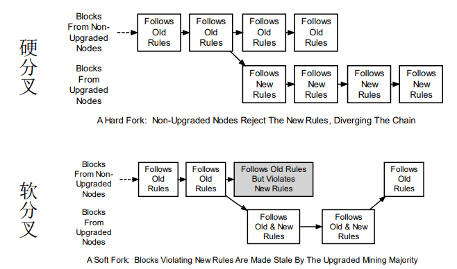{width="500"}


## 3.数字货币与区块链生态
比特币之后的数字货币与区块链发展    
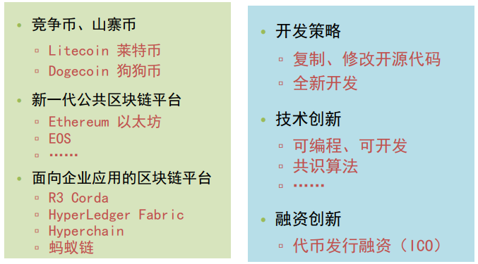{width="400"}


* 区块链形态:
    1. 无许可区块链 permissionless blockchain:用户无需许可即可加入区块链网络
    2. 许可区块链 permissioned blockchain:用户需经许可才能加入区块链网络
    3. 用户 <> 共识节点
    4. 无许可区块链不一定是公链

* 莱特币 Litecoin:
    1. 出块速度：2分半
    2. 货币总量：到2140年达到8,400万
    3. 工作量证明算法：scrypt

* 狗狗币 Dogecoin:   
    1. 出块速度：60秒
    2. 货币总量：到2015年达到100,000,000,000（1,000亿）
    3. 共识算法：scrypt


* Ethereum（以太坊）：    
    Ethereum（以太坊）是一个平台和一种编程语言，使开发人员能够建立和发布下一代分布式应用。Ethereum可以用来编程，分散，担保和交易任何事物：投票，域名，金融交易所，众筹，公司管理， 合同和大部分的协议，知识产权，还有得益于硬件集成的智能资产。


* 数字货币钱包：    
    1. “钱包”是指用于存储和管理用户密钥的容器，钱包里没有“钱”，钱包软件一般还控制用户访问权限，管理密钥和地址，跟踪余额以及创建和签署交易。
    2. 全节点：Bitcoin Core
    3. SPV轻钱包，只维护与自己相关的区块链数据
    4. 中心化钱包（在线钱包），依赖自己的中心化服务器，如blockchain.info
    5. 硬件钱包、冷钱包

## 4.以太坊技术分析

### 4.1 基本概念
以太坊由大量的节点组成，节点有账户与之对应，两个账户之间通过发送消息进行一笔交易。交易里携带的信息和实现特定功能的代码叫做智能合约，运行智能合约的环境是以太坊虚拟机（EVM），EVM类似于Java虚拟机JVM，编译后基于字节码运行，开发时则可以使用高级语言实现，编译器会自动转化为字节码。基于以上的智能合约代码和以太坊平台的应用叫做去中心化应用（DApp，Decentralized Application）。

* 节点：以太坊是由网络上的许多节点组成的，每一个节点都运行着以太坊虚拟机，通过节点可以进行区块链数据的读写。节点之间使用共识机制来确保数据交互的可靠性和正确性。
* 账户：以太坊中包含两类账户，包括外部账户和合约账户。外部账户由公私钥对控制，合约账户则在区块链上唯一的标识了某个智能合约。
* 交易：包括转账交易和合约交易，通过状态转移来标记。状态由账户之间的转移价值和信息状态转换沟通。
* 智能合约：是代码和数据的集合，存在于以太坊区块链的指定地址。合约方法支持回滚操作，如果在执行某个方法时发生异常（如gas消耗完），则该方法已经执行的操作都会被回滚。但是如果交易一旦执行完毕，是没有办法篡改的。
* EVM： 以太坊虚拟机是以太坊中智能合约的运行环境，并且是一个沙盒，与外界隔离。智能合约代码在EVM内部运行时，是不能进行网络操作、文件I/O或执行其它进程的。智能合约之间也只能进行有限的调用。
* 验证节点：指以太坊网络中的共识节点，负责记账。
* gas：以太坊上的每一笔交易都有矿工的参与，且都需要支付一定的费用，这个费用在以太坊中称为gas。gas的目的是限制执行交易所需的工作量，同时为执行交易支付费用。


!!! tip "外部账户 VS. 合约账户"
    * 外部账户：由区块链外部主体创建，拥有一对公私钥，账户地址没有合约代码。
    * 合约账户：由合约交易创建，账户拥有合约代码，地址是代码的hash值。
  
    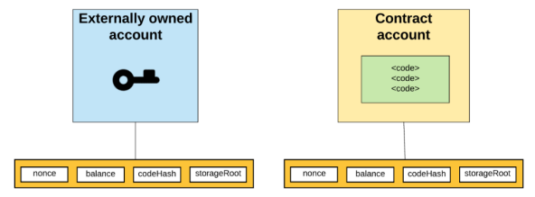{width="500"}  
    1. nonce: 对外部账户，代表该账户发出的交易数，对合约账户，表示该账户创建的合约数量。    
    2. balance: 该账户地址的Wei，1018 Wei = 1 Ether     
    3. storageRoot: Merkle Patricia树的根节点hash值 ，该树是该账户下存储信息的hash值，缺省为0.      
    4. codeHash: 该账户的EVM代码hash值，对于合约账户，是合约代码存储的hash值，对外部账户，是空字符串的hash值。  

    !!! note "外部账户"
        * 创建外部账户没有成本
        * 可以启动交易
        * 两个外部账户间的交易只能是以太币转账交易
        * 由公私钥对控制
    
    !!! note "合约账户"
        * 创建合约账户需要成本，因为使用了网络存储
        * 只能在收到一个交易作出响应而发出一个交易
        * 从一个外部账户到一个合约账户的交易可以触发合约账户上的代码，执行代码中的各种动作，例如代币转账、创建新合约等
        * 合约帐户没有私钥，相反，它们由智能合约代码的逻辑控制

### 4.2 账户间的消息与交易
* 外部账户可以向其他外部账户发送消息，或向其他合约账户发起一个合约交易。
* 两个外部账户间的消息就是一个简单的转账交易。
* 从一个外部账户到一个合约账户的消息可以触发合约账户上的合约代码执行。
* 合约地址自身不能发起一个新的交易，只能在接收到其他外部账户或合约账户发起的交易后作出反应而产生内部交易。


!!! tip "世界状态"
    * 世界状态 world state：所有账户（包括外部账户和合约账户）的状态合集。每一个账户都有一个唯一的地址，地址的产生规则分为两类：由账户对应的公钥计算所得；由部署者的信息计算所得。      
        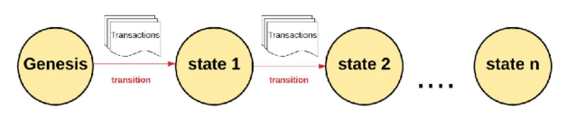{width="550"}      
        1. 以太坊本质上是一个基于交易的状态机
        2. 以太坊有一个初始状态我们称为“Genesis”
        3. 状态转换的最小单元是交易（原子性、一致性）
        4. 每次执行一条或者多条交易后发生状态转移
   
!!! example "以太坊交易举例🌰"
    从A账户转x个以太币到B账户,发布智能合约代码,用参数Y调用在地址X上的智能合约   

    * 外部账户 A 发布2个合约:
        1. Function PlaySong()，参数是调用者网名
        2. Function Song1Here(),播放链上歌曲SongEth
    * 某程序员开发一个DApp，输入账户地址、签名后可播放链上歌曲SongEth，每次听歌费用0.000001ETH
    * 用户C运行DApp时，DApp发起一个合约调用交易
        1. 由用户C的账户发起，先确定是否有足够余额支付听歌费用和合约运行gas
        2. 合约调用交易：
            1. Function PlaySong()的codehash，参数（用户网名）
            2. 再触发合约调用交易 调用Function Song1Here 

### 4.3 Gas
Gas 是用来计算以太坊系统资源使用情况的最小计量单位。

一次交易执行过程，累计消耗 Gas 超过发送者预付的总量，交易执行失败。  

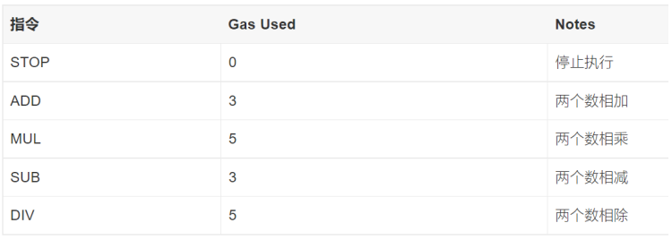{width="500"}

不仅仅计算需要付费，存储也需要付费。存储费用是32字节的最小倍数。因为以太坊状态数据库在每个节点均有存储，为鼓励较少的存储数据量，如果一个交易清除存储中的一项，这项操作的执行费用被免除，并有奖励费用。

### 4.4 交易的类型
* 简单支付交易：以太币的账户间转账，从知己账户转到对方账户，不涉及智能合约，无需动用以太坊虚拟机，“耗油”也最少。
* 存证交易：在简单支付交易中把支付额设置成0，需要存证的内容写在data字段中，就成了存证交易。当然，也可以为存证机制专门部署一个智能合约，以后要存证时就调用这个合约，这样可以为存证增添一些附加的操作。因为是0支付，对方账户就无关紧要，但不能是0。
* 合约部署交易 - 将对方地址设置成0，就可以将智能合约的程序部署到以太坊网络中，实际上是所有的验证节点上。一旦交易记录进入区块链即部署生效，以太坊网络会在交易“收据”中返回新建合约账户的地址。
* 合约调用交易 - 对智能合约的调用，依具体智能合约的不同，又可以分为以下几种：
    1. 复杂支付交易，更确切地说是数字资产转移交易，这是对智能合约中代表着数字资产的Token的转移。如果用Token实现各种虚拟货币，这样的转移就成了采用某种自定义虚拟货币的支付。
    2. 查询交易，查询是区块链网络中常用的操作。以太坊网络中提供了若干“系统合约”，即由系统提供、无需用户部署的合约，其中之一就是用于查询。


* 数据组成：
    1. from – 将签署交易的发送方的地址，一个外部账户（因为合约账户无法发送交易）
    2. to – 接收者地址 (如果是外部账户，就转币值，如果是合约账户，就执行该地址上的合约)
    3. signature – 发送者签名
    4. nonce - 该账户发起的交易计数器
    5. value – 转账的币值(in WEI) （1 WEI = 10-18 Ether）
    6. data – 可放置任意数据
    7. gasLimit – 本交易可消耗的gas上限
    8. maxPriorityFeePerGas - 给验证节点的最大小费单价
    9. maxFeePerGas - 支付交易的最大费用单价（包括baseFeePerGas 和 maxPriorityFeePerGas）
   
    ```solidity
    { 
    from:"0xEA674fdDe714fd979de3EdF0F56AA9716B898ec8", 
    to: "0xac03bb73b6a9e108530aff4df5077c2b3d481e5a", 
    gasLimit: "21000", 
    maxFeePerGas: "300", 
    maxPriorityFeePerGas: "10", 
    nonce: "0", 
    value: "10000000000" 
    }
    ```

* 数据结构——data字段作用：
    1. 在支付交易中，可以用这个字段作付款说明。
    2， 如果把支付额设置成0（收款方地址不能为0），就可以用来存证。
    3. 在合约部署交易中（以0作为对方地址），这个字段的内容就是所要部署到以太坊网络中的合约。
    4. 在合约调用交易中，用这个字段传递调用函数名和参数。

!!! tip "以太币的铸造 VS. 以太币的注销"
    * 以太币的铸造：
        1. 铸币是在以太坊账本上创建新以太币的过程。底层Ethereum 协议创建新的以太币，用户无法创建以太币。
    * 以太币的注销：
        1. 除了通过区块奖励创建以太币外，以太币还可以通过称为“燃烧”的过程来销毁。当以太币被燃烧时，它会永久地从流通中消失。
        2. 以太币销毁发生在以太坊上的每笔交易中。当用户为他们的交易付款时，网络根据交易需求设置的基本 gas 费用将被销毁。再加上可变的区块大小和最高 gas 费用，简化了以太坊上的交易费用估算。

### 以太坊虚拟机（EVM）
运行智能合约的环境，运行在每一个节点上，类似于一个独立的沙盒，严格控制了访问权限，合约代码在EVM中运行时，是不能接触网络、文件或者其他进程的。

* EVM模块主要分为以下三大模块：
    1. 编译合约模块 ： 主要是对底层Solc编译器进行一层封装，提供RPC接口给外部服务，对用Solidity编写的智能合约进行编译。编译后将会返回二进制码和相应的合约abi，abi可以理解为合约的手册，通过ABI可以知道合约的方法名、参数、返回值等信息。
    2. Ledger模块：主要是对区块链账户系统进行修改和更新，账户一共分为两种，分别是普通账户和智能合约账户，调用方如果知道合约账户地址则可以调用该合约，账户的每一次修改都会被持久化到区块链中。
    3. EVM执行模块（核心模块）：主要功能是对交易中的智能合约代码进行解析和执行，一般分为创建合约和调用合约两部分。同时为了提高效率，EVM执行模块除了支持普通的字节码执行外还支持JIT模式的指令执行，普通的字节码执行主要是对编译后的二进制码直接执行其指令，而JIT模式会对执行过程中的指令进行优化，如把连续的push指令打包成一个切片，方便程序高效执行。

* EVM执行模块流程
    1. EVM 接收到 Transaction 信息 ， 然后判断Transaction类型是部署合约还是执行合约
        1. 如果是部署合约，则新建一个账户来存储合约地址和编译后的代码；
        2. 如果是执行合约或是调用合约，则使用EVM来执行输入指令集。
    2. 执行上一条指令集之后，判断EVM是否停机
        1. 如果停机则判断是否正常停机，正常停机则更新合约状态到区块链否则回滚合约状态。
        2. 如果不停机则继续执行下一条指令集，重复b；
    3. 执行完的合约会返回一个执行结果，EVM会将结果存储在 Receipt 回执中，调用者可以通过Transaction的hash来查询其结果。

* 以太坊区块链结构：    
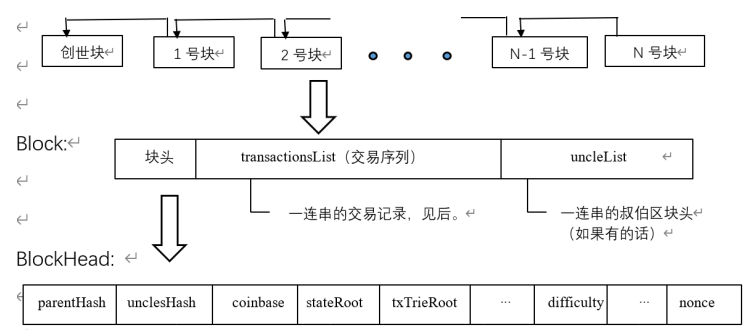{width="500"}

```c++
class Block {} //Block类是一个数据结构，内含下面这些结构成分：
BlockHeader header; //块头
List<Transaction> transactionsList //交易记录序列
List<BlockHeader> uncleList //叔伯块的块头序列
class BlockHeader {} //最长可达800字节
byte[] parentHash; //前导块（父块）的块头Hash值
byte[] unclesHash; //块身中uncleList的Hash值
byte[] coinbase; //表示本区块的Coinbase和手续费应该给谁，其160位地址。
byte[] stateRoot; //执行完本块所含全部交易后的状态树Hash值。
byte[] txTrieRoot; //块身中所有交易记录的树根Hash值。
byte[] receiptTrieRoot; //各个交易收据所构成树根的Hash值。
byte[] difficulty; //挖矿难度，用以调整发块周期长度
long timestamp; //时戳
long number; //本块在区块链中的高度，即区块链中处于本块之前的区块个数。
byte[] gasLimit; //本块所含所有交易所提供“汽油”量即手续费的上限总和。
long gasUsed; //本块所含所有交易实际消耗“汽油”量的总和。
byte[] extraData; //有关本区块的任意额外数据，不超过32字节。
byte[] nonce; 
```
!!! tip "区块大小和出块速度"
    * 区块大小:可变，每个区块的目标大小是容纳至少消费 15M gas的交易，但区块的大小将根据网络需求增加或减少，上限是消费30M gas的交易（目标区块大小的2倍）。
    * PoW共识时的出块时间平均为15秒     
        Hash函数会产生较多的碰撞，产生较多的区块链分叉
    * PoS共识出块时间固定为12秒（slot）


### 以太坊的数据存储：Merkle Patricia Trie
在执行插入、修改或者删除操作后能快速计算新的树根，而无需重新计算整颗树。

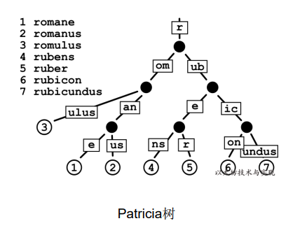{width="400"}

自上往下构建，选取前缀相同的进行分类。  

再自底向上构建 Merkle tree，因此每个节点至少有两个字段，本身的值以及 hash 的值。

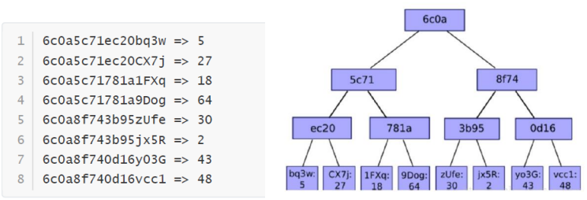{width="400"}


* MPT树更新：
    1. 将根节点传入作为当前处理节点，传入目标节点的Key作为路径path
    2. 传入新的Value值并更新

    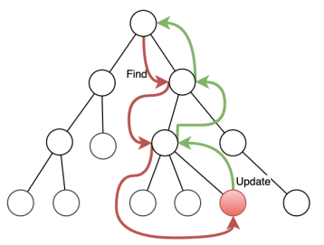{width="300"}


### 以太坊的共识机制
* PBFT共识算法
    1. Quorum组成（3f+1个节点）
        1. Client
        2. Replica
    2. 每个共识阶段称为一个view 
        1. 一个primary(leader)
        2. 其他replica都是backup(后备力量，如果leader似了，其他会替代)
    3. 共识过程
        1. Request: client发起共识请求
        2. pre-prepare: primary验证请求、打包消息、发给其他节点
        3. Prepare: 其他节点验证消息、投票
        4. Commit：primary收到2f+1个节点赞成票后，完成共识，通知所有节点，反馈client

    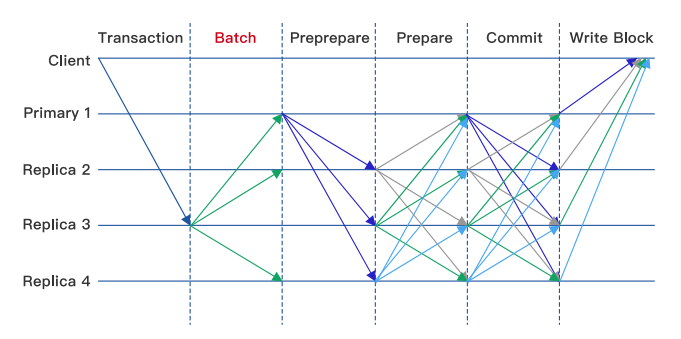{width="500"}


* Pos 共识：
    1. 验证者（validator）以ETH的形式将资本抵押给以太坊上的一个智能合约。抵押的ETH充当抵押品，如果验证者行为不诚实或懒惰，可被销毁。然后，验证者负责检查通过网络传播的新块是否有效，并偶尔创建和传播新块。
    2. 要成为validator，用户必须将32 ETH存入存款合约并运行三个软件：<font color = "red">执行客户端，共识客户端和验证器</font>。在存入ETH时，用户加入一个激活队列。一个用户可以发起多个验证者，目前全球验证者数量超80万个。
    3. 一旦激活，验证者就会从以太坊网络上的对等方接收新的区块。重新执行区块中交付的交易，并检查区块签名以确保区块有效。然后验证者在网络上发送支持该块的投票（称为证明 attestation）。

* 以太坊信标链 Beacon Chain
    1. 每12秒为一个时段slot
    2. 每32个slot为一个纪元 epoch （6.4分钟）
    3. 每个slot产生一个新区块，但有可能没有
    4. 信标链的Genesis区块在slot 0
    5. 每个时段slot有一组验证者组成委员会（每个validator在每个epoch只能属于一个委员会）
    6. 其中一个验证者被随机选中成为区块的proposer，发出区块
    7. 委员会的其他成员（从80万个成员里面随机抽一定数量）投票attestation，如2/3支持则该区块发布

* 检查点 checkpoint：
    * 检查点是epoch的第一个slot中的一个区块。 如果没有这样的区块，则检查点是前面最近的区块。 每个epoch始终有一个检查点区块。一个区块可以是多个纪元的检查点。
    * 当验证者提交LMD GHOST 投票时, 他投票当前epoch的checkpoint, 称为 target.
    * 这个投票称为Casper FFG 投票, 还需要包含前一个checkpoint, 称为source.
    * 图中Epoch 1 的验证者投票的source checkpoint 是genesis 区块, target checkpoint 在Slot 64的区块. Epoch 3中, 验证者投票的source checkpoint是slot 64区块，target checkpoint是180区块

    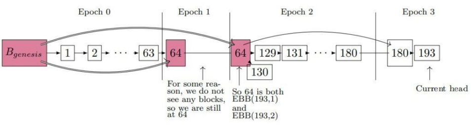

    * 一个epoch结束时，如果它的checkpoint获2/3验证者投票支持，其状态改为justified
    * 一个justified的checkpoint如果其后续的checkpoint状态改为justified，则它的状态升级为finalized
    * 一般情况下一个checkpoint经过2个epoch后（12.8分钟）变为finalized

* Gasper共识:
    1. Casper-FFG (Friendly Finality Gadget)：一种改进的PBFT算法
    2. LMD-GHOST (Latest Message-Driven Greedy Heaviest Observed Sub-tree)：分叉选择算法

    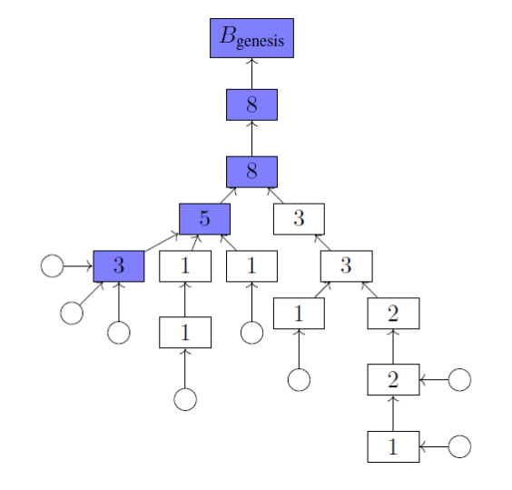{width="400"}

## 5.超级账本技术分析

* Fabric 架构：
    1. 成员服务（Membership Service）：会员注册、身份保护、内容保护、交易审计功能
    2. 区块链服务（Blockchain Service）：节点的共识管理、账本的分布式计算、账本的存储以及节点间的P2P协议功能的实现
    3. 合约代码服务（Chaincode Service）：提供智能合约的服务

PKI 由向各方（如服务的用户、服务提供者）发布数字证书的证书授权中心组成，各方使用证书在与其环境交换的消息中对自己进行身份验证。

* Fabric的节点
    1. Client：最终用户，至少连接的一个peer节点或一个Orderer节点，一般只保存与自己有关的账户数据
    2. Orderer： 编排节点，接收包含背书签名的交易，对未打包的交易进行排序生成区块，并广播给Peer节点
    3. Peer：对等节点，负责通过执行链码（chaincode）实现对账本的读写操作，所有的Peer节点都是提交节点（Committer），负责维护状态数据和账本的副本
    4. Endorser：背书节点，部分Peer节点根据背书策略的设定会执行交易并对结果进行签名背书，充当了背书节点（Endorser）的角色。背书节点是动态的角色，每个链码在实例化的时候都会设置背书策略，指定哪些节点对交易背书后才是有效的。只有在应用程序向节点发起交易背书请求的时候该Peer节点才是背书节点，否则它就是普通的记账节点。

* 链码：
    1. Fabric没有像以太坊那样有一个自己的虚拟机EVM，而是利用Docker容器，在宿主机上创建一个虚拟环境来运行链上代码，因此链上代码可以是宿主机可以编译执行的各种语言代码。
    2. 链上代码是图灵完备的，为了防止链上代码执行陷入死循环，为代码执行设置一个计时器，如果运行时间超过预定时间，就杀掉该进程。

* 链码的部署
    1. 打包链码：可以由一个组织完成，也可以由每个组织完成。
    2. 在peer节点上安装链码：每个将使用链码来背书交易或查询账本的组织都需要完成此步骤。
    3. 批准组织的链码定义：每个将使用链码的组织都需要完成此步骤。链码定义需要得到足够数量的组织的批准，以满足通道的生命周期终止策略（默认情况下为大多数），然后才能在通道上启动链码。
    4. 将链码定义提交到通道：一旦通道上所需数量的组织获得批准，提交事务需要由一个组织提交。提交者首先从已批准的组织中足够多的对等方收集背书，然后提交事务以提交链码定义。

* Fabric的共识
    1. 共识不仅仅是就交易顺序达成一致。
    2. 共识被定义为组成区块的一组交易的正确性的闭环验证。当区块中交易的顺序和结果满足明确的策略标准检查时，最终会达成共识。
* Fabric 共识组成：
    1. 提案和背书（proposal and endorsement）
    2. 排序（ordering）
    3. 验证和提交 （validation and commit）

Fabric 的设计依赖于确定性的共识算法，账本不会像其他分布式的以及无需许可的区块链中那样产生分叉。


