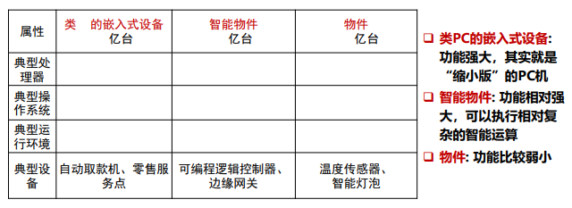
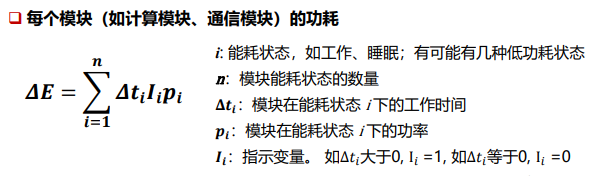
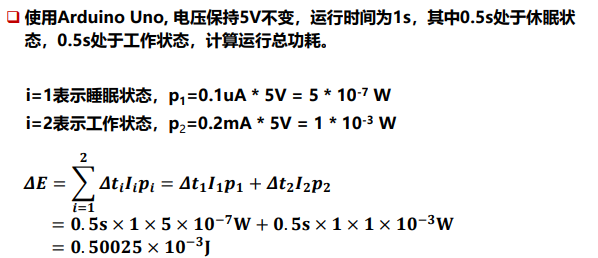
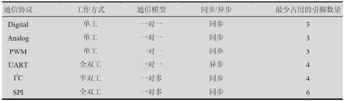
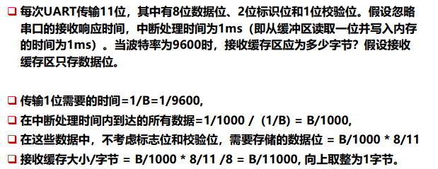
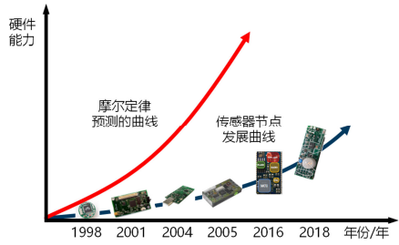
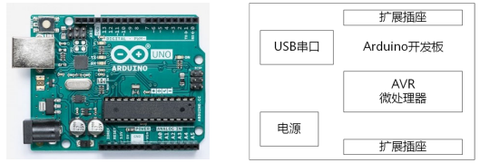

---

title: Chap 2 | 物联网硬件平台

hide:
  #  - navigation # 显示右
  #  - toc #显示左
  #  - footer
  #  - feedback  
comments: true  #默认不开启评论

---

<h1 id="欢迎">Chap 2 | 物联网硬件平台</h1>

## 1.概述
{width="400"}
## 2.关键特性
1. 低成本与微型化:可以达到更高的部署密度
2. 功耗/能耗  
{width="400"}   
{width="400"}
3. 运算速度和内存大小:
    1. 运算速度一般用CPU主频来描述   
        能耗与主频之间的关系：$P=CV^2FT$
    2. 内存：
        1. RAM：存数据，易失性
        2. Flash：存放程序，非易失性，断电后Flash上的程序依然存在
4. 接口类型
    1. 物理接口：
        1. 引脚：通过杜邦线连接 ，过程复杂且易出错，引脚接错可能会导致程序无法工作，甚至烧坏外设和主板
        2. 连接套接口/Grove port：通过Grove port线连接，外设接入容易、快速且不易出错
    2. 通信协议(6种)：
        1. 模拟信号(Analog): 使用模拟量表示数据的信号, 需要ADC转化
        2. 数字信号(Digital)：使用序列离散值表示数据的信号
        3. PWM(Pulse-width modulation): 基于数字信号的脉冲调制技术
        4. UART(Universal Async Rx/Tx): 用于异步逐位传输数据的全双工通信接口标准
        5. I2C(Inter Integrated Circuit): Phillips公司推出的高性能串行总线
        6. SPI(Serial Peripheral Interface): 高速、全双工、同步的通信总线

        

      3. UART缓存与波特率：   
        {width="400"}
      4. 可扩展性：
        开发板对接入外接设备种类和数量的支持程度   
        接口数量和接口类型是评估开发板可扩展性的重要指

## 3.常见的硬件平台
1. 传感节点平台   
    {width="300"}   
    发展缓慢的三个原因：技术发展不均衡、功耗的制约、成本的制约
    * 主要特点：
        1. 低功耗
        2. 体积小
        3. 集成度高
        4. 低成本
2. STM32    
    STM32系列是由意法半导体公司推出的ARM Cortex-M内核单片机
    1. CPU:作为计算机系统的运算和控制核心，是信息处理、程序运行的最终执行单元。
    2. MCI:作为计算机系统的运算和控制核心，是信息处理、程序运行的最终执行单元。
    3. MPU:相比MCU，更侧重于高性能计算和复杂的任务处理，具有更高的时钟速度、更大的内存和更强大的计算能力。
    
    * 能耗：以STM32F103为例，三种低功耗模式
        1. 睡眠模式：内核停止运行，外设保持运行状态。一般适用于等待外设的中断时降低功耗。
        2. 停机模式：所有时钟都停止，此模式功耗较低，大概在 20μA 左右。
        3. 待机模式：功耗最低，在2μA左右。关闭所有的时钟，还把1.2V区域的电源也完全关闭了。
    * 主要特点：
        1. 开发方便
        2. 丰富的通信接口
        3. 调试简单
        4. 低功耗
   
3. ESP32:Wi-Fi和蓝牙双模的单芯片方案。  
    * 能耗：
        1. Active模式：射频处于工作状态
        2. Modem-sleep模式：CPU运行。Wi-Fi/蓝牙基带和射频关闭。
        3. Light-sleep模式：CPU暂停运行。RTC存储器、外设、ULP协处理器运行。唤醒事件（如 定时器或外部中断）会唤醒芯片。
        4. Deep-sleep模式：CPU和大部分外设都会掉电。   
        5. Hibernation模式：内置的8 MHz振荡器和ULP协处理器均被禁用。
    * 主要特点：
        1. 性能稳定
        2. 高度集中
        3. 超低功耗
        4. 双模解决方案
4. Arduino
    * 开发板组成: MCU、USB串口、扩展插座、电源   
      {width="500"}
    * MCU:采用AVR体系结构的Atmega系列处理。    
      AVR的存储体系结构是哈佛结构，具有分离的数据寻址空间和程序寻址空间。
    * 扩展接口和盾板：为Arduino提供了非常强大的扩展能力
    * 主要特点：
        1. 上手容易
        2. 开发简单
        3. 可扩展性强
        4. 低功耗
        5. 开源创新
5. 树莓派
6. Jetson

