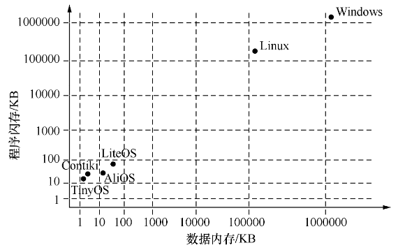
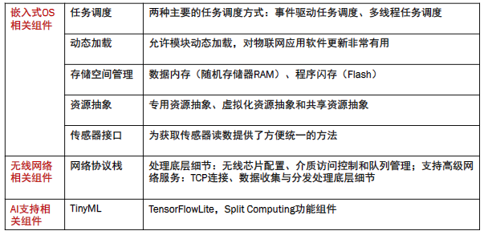
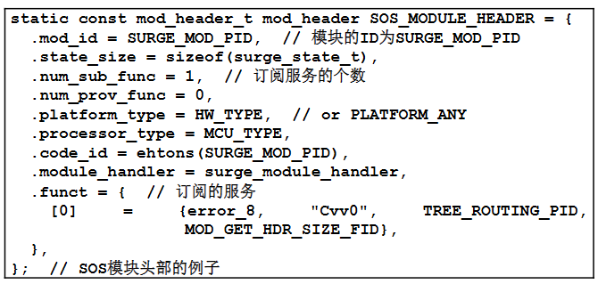
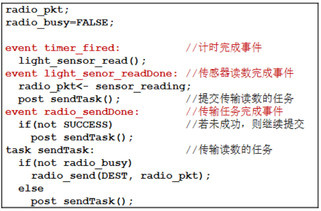
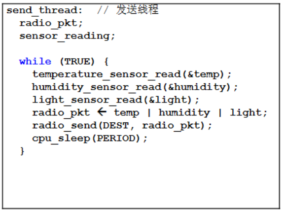
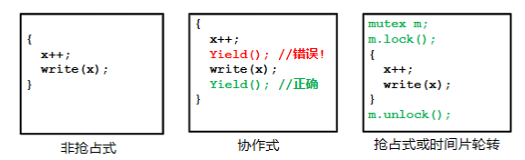

---

title: Chap 3 | 物联网操作系统

hide:
  #  - navigation # 显示右
  #  - toc #显示左
  #  - footer
  #  - feedback  
comments: true  #默认不开启评论

---

<h1 id="欢迎">Chap 3 | 物联网操作系统</h1>
!!! note "章节启示录"
    <!-- === "Tab 1" -->
        <!-- Markdown **content**. -->
    <!-- === "Tab 2"
        More Markdown **content**. -->
    本章节是物联网基础的第三章。复习的时候应该会标注哪些是非重点。

## 1.概述
物联网操作系统：      
1. 支撑物联网大规模发展的核心软件。    
2. 屏蔽了物联网硬件开发的差异性，提供了统一的编程接口，为多个应用的执行提供了运行时环境，降低了物联网应用开发的成本和时间    
3. 硬件抽象是操作系统核心功能之一

!!! question "与传统操作系统的区别"
    1. 存储空间占用不同: 物联网操作系统内存占用较小，一般只有几十KB
    2. 内存管理方式不同: 有MMU vs. 无MMU
    3. OS特权模式不同: 很多物联网芯片不具有CPU特权模式，所有的指令都能访问任何硬件资源     
        -> 有Bug的程序可以在不受操作系统的控制下轻松地占用CPU周期   

    {width="400"}

### 系统构成
{width="600"}

### 两个重要概念
* Library OS：
    在操作系统研究中，"library OS"（库操作系统）指的是将操作系统的某些功能作为库而不是作为一个单独的内核运行。这种设计允许应用程序直接调用操作系统服务，而不是通过系统调用接口。这种方法可以提高性能，因为减少了用户态和内核态之间的上下文切换，并且可以为特定应用程序定制操作系统功能。
* 微内核：
    是一种操作系统内核的设计哲学，它提供了操作系统最基本的核心功能，如任务/线程管理、内存管理和进程间通信（IPC）。其他服务，如文件系统、设备驱动和网络协议等，通常作为用户态的进程运行，并通过消息传递与微内核通信。这种设计使得操作系统具有高度的模块化和灵活性，因为服务和驱动可以独立地添加、更新或替换，而不需要对整个内核进行修改。
* 宏内核：
    是另一种设计哲学，它将操作系统的许多功能集成在一个大型的内核态进程中。例如Linux。

## 2.关键特性
### 2.1 编程模型
* 依据程序结构分类：   
    1. 非模块化编程：在非模块化编程中，应用程序作为一个整体来进行设计、测试和调试
    2. 模块化编程：模块化编程强调将程序的功能分离为独立的、可互换的模块，使得每个模块执行某一具体功能
        1. 编码层面的模块化，如TinyOS组件化编程
        2. 二进制层面的模块化，如SOS模块化编程

* 依据执行逻辑分类：    
    1. 基于事件驱动的编程：应用程序会实时地处理或响应系统中的事件；应用程序由多个事件处理函数构成
    2. 基于多线程的编程：一个线程对应一个逻辑上的任务

!!! example "一个例子🌰：TinyOS & SOS"
    1. TinyOS组件化编程: 应用由多个组件组合而成, 编译后的应用程序是单个二进制程序映像，不再保留组件化的信息
    2. SOS模块化编程: 应用由多个模块组成, 编译后仍有模块信息，可动态加载

    {width="450"}

!!! example "一个例子🌰：事件 & 线程"
    1. 事件驱动的编程：基于事件的编程模型可以较好地保证系统的实时性和响应性
        周期性地采集传感器的读数，并通过无线通信芯片发送，应用程序实时地处理或响应系统中的事件的编程示例。     
        {width="400"}
        
    2. 多线程的编程：一个线程对应逻辑上的一个任务，减少由代码分片带来的额外代码量。阻塞式的，但如果当前数据没来，CPU就被调度出去干别的事情。        
        {width="400"}
### 2.2 调度方式
* 抢占式：高优先级线程会抢占低优先级线程的执行
* 非抢占式：系统一旦把处理器分配给就绪队列中的某线程后，该线程便一直执行下去，直至完成或阻塞
* 协作式：在协作式调度中，只有在线程主动交出CPU的控制权(yield())后，才可以让其他的线程得到CPU的控制权
* 时间片轮转：系统默认给每个线程分配了相同时间片的CPU资源，当某个线程的CPU时间片用完时，即使该线程的任务尚未执行完，也必须交出CPU的控制权，让其他线程执行

??? question "调度方式对原子操作的影响"
    在多个线程同时对共享变量x有操作权限的情况下，如何进行原子操作，才能使变量x的数值在RAM与外存之间始终保持一致？   
    