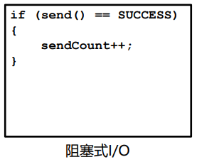
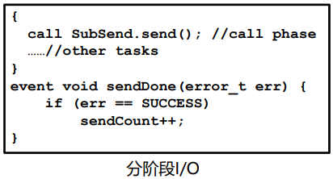
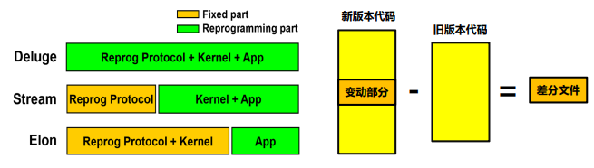
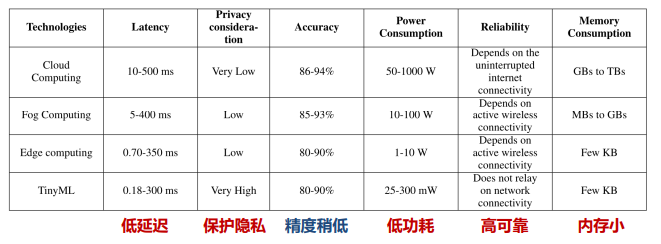
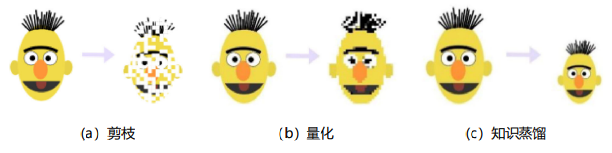
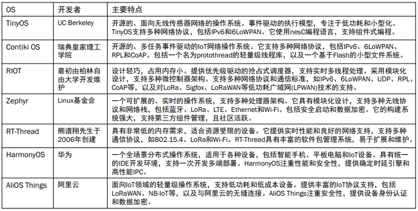
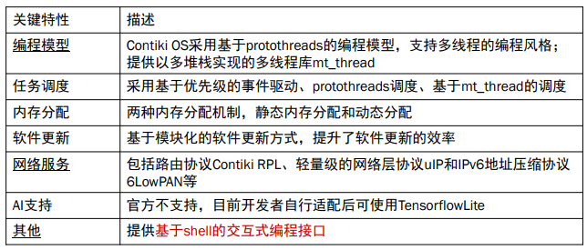

---

title: Chap 3 | 物联网操作系统

hide:
  #  - navigation # 显示右
  #  - toc #显示左
  #  - footer
  #  - feedback  
comments: true  #默认不开启评论

---

<h1 id="欢迎">Chap 3 | 物联网操作系统</h1>
!!! note "章节启示录"
    <!-- === "Tab 1" -->
        <!-- Markdown **content**. -->
    <!-- === "Tab 2"
        More Markdown **content**. -->
    本章节是物联网基础的第三章。复习的时候应该会标注哪些是非重点。

## 1.概述
物联网操作系统：      
1. 支撑物联网大规模发展的核心软件。    
2. 屏蔽了物联网硬件开发的差异性，提供了统一的编程接口，为多个应用的执行提供了运行时环境，降低了物联网应用开发的成本和时间    
3. 硬件抽象是操作系统核心功能之一

!!! question "与传统操作系统的区别"
    1. 存储空间占用不同: 物联网操作系统内存占用较小，一般只有几十KB
    2. 内存管理方式不同: 有MMU vs. 无MMU
    3. OS特权模式不同: 很多物联网芯片不具有CPU特权模式，所有的指令都能访问任何硬件资源     
        -> 有Bug的程序可以在不受操作系统的控制下轻松地占用CPU周期   

    {width="400"}

### 系统构成
{width="600"}

### 两个重要概念
* Library OS：
    在操作系统研究中，"library OS"（库操作系统）指的是将操作系统的某些功能作为库而不是作为一个单独的内核运行。这种设计允许应用程序直接调用操作系统服务，而不是通过系统调用接口。这种方法可以提高性能，因为减少了用户态和内核态之间的上下文切换，并且可以为特定应用程序定制操作系统功能。
* 微内核：
    是一种操作系统内核的设计哲学，它提供了操作系统最基本的核心功能，如任务/线程管理、内存管理和进程间通信（IPC）。其他服务，如文件系统、设备驱动和网络协议等，通常作为用户态的进程运行，并通过消息传递与微内核通信。这种设计使得操作系统具有高度的模块化和灵活性，因为服务和驱动可以独立地添加、更新或替换，而不需要对整个内核进行修改。
* 宏内核：
    是另一种设计哲学，它将操作系统的许多功能集成在一个大型的内核态进程中。例如Linux。

## 2.关键特性
### 2.1 编程模型
* 依据程序结构分类：   
    1. 非模块化编程：在非模块化编程中，应用程序作为一个整体来进行设计、测试和调试
    2. 模块化编程：模块化编程强调将程序的功能分离为独立的、可互换的模块，使得每个模块执行某一具体功能
        1. 编码层面的模块化，如TinyOS组件化编程
        2. 二进制层面的模块化，如SOS模块化编程

* 依据执行逻辑分类：    
    1. 基于事件驱动的编程：应用程序会实时地处理或响应系统中的事件；应用程序由多个事件处理函数构成
    2. 基于多线程的编程：一个线程对应一个逻辑上的任务

!!! example "一个例子🌰：TinyOS & SOS"
    1. TinyOS组件化编程: 应用由多个组件组合而成, 编译后的应用程序是单个二进制程序映像，不再保留组件化的信息
    2. SOS模块化编程: 应用由多个模块组成, 编译后仍有模块信息，可动态加载

    {width="450"}

!!! example "一个例子🌰：事件 & 线程"
    1. 事件驱动的编程：基于事件的编程模型可以较好地保证系统的实时性和响应性
        周期性地采集传感器的读数，并通过无线通信芯片发送，应用程序实时地处理或响应系统中的事件的编程示例。     
        {width="400"}
        
    2. 多线程的编程：一个线程对应逻辑上的一个任务，减少由代码分片带来的额外代码量。阻塞式的，但如果当前数据没来，CPU就被调度出去干别的事情。        
        {width="400"}
### 2.2 调度方式
* 抢占式：高优先级线程会抢占低优先级线程的执行
* 非抢占式：系统一旦把处理器分配给就绪队列中的某线程后，该线程便一直执行下去，直至完成或阻塞
* 协作式：在协作式调度中，只有在线程主动交出CPU的控制权(yield())后，才可以让其他的线程得到CPU的控制权
* 时间片轮转：系统默认给每个线程分配了相同时间片的CPU资源，当某个线程的CPU时间片用完时，即使该线程的任务尚未执行完，也必须交出CPU的控制权，让其他线程执行

??? question "调度方式对原子操作的影响"
    在多个线程同时对共享变量x有操作权限的情况下，如何进行原子操作，才能使变量x的数值在RAM与外存之间始终保持一致？   
    

### 2.3 I/O操作方式

1. 阻塞式I/O:  
    当程序调用一个I/O操作时，直到该I/O操作完成，这个调用才会返回；易于编程
    {width="200"}   

2. 分阶段I/O:  
    1. 把I/O操作的调用和I/O操作的完成分成了两个独立的阶段
    2. 代码冗长，但可以保持系统的高响应性   
    3. 更灵活，更好控制并发   
    {width="350"}

### 2.4 内存分配
1. 静态内存分配（如TinyOS）：
    1. 静态内存区域在编译时确定，通常由未初始化数据段(.bss)和初始化数据段(.data)构成
    2. 静态内存分配可以通过静态数组的方式来实现
    3. 优点：效率高、内存池中无碎片
    4. 缺点：不能按需申请
2. 动态内存分配（如SOS）：
    1. 动态内存区域在运行时确定
    2. 通过malloc申请，通过free释放
    3. 优点：可以按需分配
    4. 缺点：内存池中容易出现碎片、可能造成安全隐患

### 2.5 软件更新

* 软件更新方式：
    1. 有线更新：例如通过串口、以太网等
    2. 无线更新（OTA, over the air）：例如通过WiFi
* Bootloader：BootLoader是设备在加电后执行的第一段代码。BootLoader在完成CPU和相关硬件的初始化之后，会将操作系统或固化的应用程序装载到内存中，然后跳转到操作系统所在的空间，启动操作系统运行。
* 具体更新步骤如下：
    1. 在操作系统启动前，通过 BootLoader 查找升级文件。
    2. 找到文件后，擦除 Flash 中存储的旧文件。
    3. 在 Flash 中写入升级的文件。
    4. 检查新写入的文件是否正确，若正确则重启设备以加载新的文件执行，反之则重新烧写文件，有些设备也可以回滚到原来的版本。

!!! tip "不同的更新方法"
    1. 基于整个镜像的软件更新：对软件系统的所有部分进行更新    
    2. 基于模块化的软件更新：将软件镜像细分为各个模块，根据需求选择其中的某些模块进行更新   
    3. 基于差分的软件更新：将旧版本与新版本的代码做差分，得到升级部分的补丁即差分文件；可以对整个镜像进行差分，也可以对模块进行差分   
    {width="450"}

!!! tip "软件更新——差分"
    * 差分文件的两种指令：   
        1. COPY指令: COPY1 <n>2 <old addr>2  (5 Byte)
        2. ADD指令: ADD1 <BYTE1, BYTE2, …, BYTEm>m  (3+m Byte)
    
    >例子：   
        旧文件： A B C D E A C B C (9 Byte)    
        新文件： W A B C D E A C B C (10 Byte)    
        差分文件：ADD<W> COPY 9 0 (7 Byte)

    * 影响差分文件大小的两个重要因素:      
        1. 差分算法：给定两个文件，计算最小差分文件   
        2. 相似性保持技术：保持代码功能前提下，增加新旧代码之间的相似性。   
    
    >常见的差分算法：bsdiff、xdelta3、HDiffPatc

### 2.6 网络服务
* 传统传感网的网络协议及服务：   
    1. 主要关注多跳自组织的问题，大多是基于IEEE 802.15.4标准的低功耗局域网协议
    2. 典型的传感网网络协议包括数据收集协议，数据分发协议，时间同步协议等。
* 物联网的网络协议及服务：   
    1. 通信技术与协议增多：BLE、ZigBee、WiFi HaLow、LoRaWAN、NB-IoT等
    2. 学术关注点：干扰共存、异构互联

### 2.7 AI支持能力-TinyML
TinyML:（微型机器学习）是机器学习的一个分支，旨在将模型部署到微控制
器和其他低功耗边缘设备。    

#### 常见优化技术
* 模型压缩：通过权重剪枝、量化和知识蒸馏等方法，减少模型大小   
    1. 剪枝：设定阈值判断训练好的模型权重的重要性； 剪掉小于阈值的权重连接； 微调剪枝后的模型
    2. 量化：将模型参数从 32 bit 或 64 bit 浮点数变为使用 8 bit或更低的定点数表示。
    3. 知识蒸馏：把一个大模型或者多个模型(教师模型)学到的知识迁移到另一个轻量级模型(学生模型)

    {width="550"}

* 高效架构：设计紧凑高效的模型结构，如 MobileNetV2
* 硬件加速：充分利用微控制器的硬件特性进行优化，如DS

## 3. 典型物联网操作系统

### 3.1 Contiki OS
Contiki OS 是一款开源、高度便携、多任务的操作系统
适用于资源有限的无限传感器网络    
Contiki OS 专为具有少量内存的微控制器(MCU)而设计    

* 关键特性：   
    支持多线程的编程“风格”，而不是支持多线程的编程，有很多限制     
    主要特点：基于协作式的调度模式、使用单个堆栈实现、不能使用局部变量     
    {width="600"}

