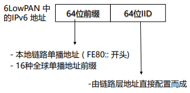

---

title: Chap 4 | 低功耗短距离通信协议

hide:
  #  - navigation # 显示右
  #  - toc #显示左
  #  - footer
  #  - feedback  
comments: true  #默认不开启评论

---

<h1 id="欢迎">Chap 4 | 低功耗短距离通信协议</h1>
!!! note "章节启示录"
    <!-- === "Tab 1" -->
        <!-- Markdown **content**. -->
    <!-- === "Tab 2"
        More Markdown **content**. -->
    本章节是物联网基础的第四章。复习的时候应该会标注哪些是非重点。

## 1.概述
### 典型协议

* ZigBee技术:具有低功耗、低速率、低成本、组网灵活等优点
* 传感网协议:由大量低功耗节点组成的无线自组织多跳网络，实时感知、处理和传输网络覆盖区域内监测对象的信息
    1. 传感网协议是传感网应用的基础，自2002年以来大量研究围绕低功耗与组网技术展开

    
* BLE:    
    随着功能的逐步增加，在2017年7月18日，蓝牙 SIG 正式发布了蓝牙多跳的功能定义和多跳模型定义，并增加到了蓝牙5.0中。在家居物联网中，蓝牙多跳标准的确定使得多设备和多设备之间的通信成为可能

* RFID：射频识别, 无线电的信号是通过调成无线电频率的电磁场，把数据从附着在物品上的标签上传送出去，以自动辨识与追踪该物品。

* NFC:是一种短距高频的无线电技术，在13.56 MHz频率运行于20厘米距离内，由RFID演变而来。

* THREAD:   
    THREAD网络中的节点可分为两种角色：路由节点（router）和端节点（end device）

## 2.关键特性

### 2.1 功耗
D(dBm)与P(mW)换算 D= 10lgP  
{width="270"}

嵌入式设备的功耗很大部分来源于通信功耗  

>例如，对于TelosB节点，CC2420能耗占其总能耗的81%

* 降低无线收发器占空比:
    1. 无线收发器占空比=活跃时间/总运行时间

    >示例：设备活跃时的能耗为10𝐦𝐦𝑾𝑾, 休眠时的能耗为10𝝁𝝁𝑾𝑾,若占空比为0.1%, 则平均功耗为19.99𝝁W

### 2.2 通信距离
* 常用的路径损耗模型：  
    

    n大概在2-3之间

* 最远通信距离（节点接收信号强度等于接收器灵敏度）:
    

> 例子:不考虑天线增益与随机误差，假设发射功率为0dBm，接收灵敏度-85 dBm, PL0为28.5dBm, 衰减指数3：最远通信距离为76.4m
    
* 多跳网络：获得更大的通信距离

### 2.3 频带和数据率
* 授权频段与ISM频段
    1. 授权频段:使用授权频段需要许可证, 例如AM,FM广播频段
    2. ISM频段(Industrial Scientific Medical Band),主要开放给工业，科学和医学机构使用，无需许可证或费用

*  不同协议频带与数据率:    
    {width="400"}

* 实际数据率与最大数据率:
    1. 最大数据率:实际中通常不能最高数据率
        1. 802.15.4 物理层最大数据率是250kbps
        2. BLE 最大数据率为2Mbps
    802.15.4 数据包发送前会主动退避一段时间$(initial_{backoff} ∈ [𝟎, 𝑪W_{init})$ $CW_{init} ≈ 10ms$ ，实际数据率一般为最大数据率的1/3,

    2. 实际传输效率为： 
        {width="350"}

## 3.基于IEEE802.15.4的传感网协议
传感网协议的典型使用场景: 自组织无线多跳网络

>传感网应用场景         
    1. Great Duck Island，生态环境监测  
    2. Volcano monitoring，火山监测     
    3. 绿野千传，森林火灾监测   

* 传感器协议架构：  
    {width="300"}

### 3.1 IEEE 802.15.4技术物理层
物理层功能：从比特流到RF信号

* 工作流程
    1. DSSS扩频
    2. O-QPSK调制
    3. 脉冲成形
    4. 数模转换及信号发送

{width="300"}

简单来说，I是cos，Q是sin。把一个数据拆成I路和Q路，间接地实现了调相，因为随着cos和sin的改变，合成的向量振幅不变，但相位改变。

* DSSS 扩频：
    1. 每4bit数据转化为32位码片(chips)
    2. Chip rate：2M chip/s， data rate: 250kb/s

    如果不改变，左侧的数据若是错了任意一个bit，则会转换成另一个正确合法的数据，这不是我们希望看到的。
    而改变之后，由于数据间的海明距离很大，因此不容易把一个数据错误变成另一个数据，提高了抗干扰能力。

    {width="400"}

* O-QPSK调制:
    1. 将32位码元序列调制到信号的I和Q相位上
        1. 每个相位的chip rate = C/2 = 1M chip/s
        2. 每个码元的发送时间：1s/(1Mchip/s )= 1us
    2. O表示offset，表示相位偏移，offset=0.5 us

    {width="400"}

* 帧结构（只需要知道各个名称的含义即可）
    1. 物理层数据单元(PPDU)=物理层头部+MAC层数据单元(MPDU)
    2. 物理层头部
        1. SHR (4B) – 用于实现码元和位同步
        2. SFD (1B) –帧定界符，固定的特殊值，用于标志SHR的结束和实际数据报文的开始
        3. PSDU(0~127B): 实际数据报文，从MAC层传过来的数据单元
        4. PHR (1B) – PSDU的长度
    3. MAC层数据单元(MPDU)
        1. MHR: MAC头部
        2. Preamble Control (2B) – 帧控制字段
        3. Data Seq. No. (1B)-序列号字段
        4. Address Information (4~20B) –地址信息字段
        5. MSDU: MAC载荷, 长度可变
        6. MFR(2B) – PSDU的长度

### 3.2 低功耗MAC

* 无线通信中造成能源浪费的原因
    1. 空闲侦听：能源浪费的主要来源
    2. 冲突：可能会造成接收方无法解码所涉及的任何数据包
    3. 偷听：传感器节点接收不是发给自己的数据包
    4. 控制开销：包头和其他类型的数据包开销

* 无线传感器网络中，降低功耗：使节点实现低占空比
    1. 通过让节点在活动状态和睡眠状态之间交替来实现的
* 问题：需要在发送节点和接收节点之间找到同处于活动状态的“汇合点”
* 解决
    1. 基于同步机制的MAC
        1. 节点协同活动和睡眠状态以便对齐其活动时间
        2. 会带来额外的同步开销
    2. 基于异步机制的MAC    
        1. 发送方发起MAC（Sender-initiated MAC）    
            基本技术：前导码采样
        2. 接收方发起MAC（Receiver-initiated MAC）  
            持续监听信道，等待接收方发送信标
#### 同步MAC：S-MAC
因为需要同步，所以会有额外的开销    

* 冲突避免机制（用来解决竞争问题）
    1. 虚拟载波侦听（猜一下别人会听多久，不需要记住具体细节）
    2. 物理载波侦听
    3. RTS/CTS机制（会产生额外开销）    
        RTS是清场信号，收到RTS之后别发消息，request to send     
        CTS也是清场，clear to send
          1. 隐藏/暴露终端问题
          2. 减少空闲侦听

#### 发送方发起异步MAC：LPL MAC
Receiver 睡觉，醒来时查看并接收。   
CCA：简单地看一下有没有人在发包，不关注包的内容，功耗更低。
CS发现则退避       
CCA发现则进入唤醒   
* 阈值设置(默认-77dBm)
    1. 偏高
        1. CS可能无法感知潜在的传输，引起冲突   
        2. CCA可能无法检测潜在的传输，错过接收
    2. 偏小
        1. CS：环境噪音也可能引起不必要的退避
        2. CCA: 环境噪音也可能唤醒节点

!!! tip "单播vs.广播"
    * 单播(UNICAST)：ACK包可以缩短数据包列
    * 广播(BROADCAST)：发送的数据包列持续时间必须大于等于接收者的睡眠时间（Ttrain>=Tsleep）
    
    >在这个例子里，广播的开销是单播的两倍

* 自适应机制
    接收方回复完ACK之后持续监听一段时间(delay after receive)来接收发送者接下来可能会连续发送的数据包

1. 比同步MAC更节能，无需所有节点一开始都醒着    
2. 然而发送方需要持续发送探测包直到接收方醒来，这个过程中将持续占用信道，影响了发送方通信范围内其他节点的通信

!!! question "思考题"
    * 在 LPLMAC中,发送节点持续发送探测包来唤醒接收节点。已知,LPLMAC采用数据包作为探测包，接收节点在周期性醒来进行CCA，在每次CA期采样 400次，只有当采样得到的信号强度平均值超过-77dBm才醒来。假设每次CCA的时间长度是11ms，探测包长度是2ms，接收的信号强度-56dbm，环境声-100dbm。那么，为了使接收方正确收到包，探测包间隔最大为多少?

    CCA期间采样400次，平均值大于 -77dBm

    n * -56dBm +(400-n)*-100dBm>-77dBm*400
    n>210
    传输时间 = n/n_总 * 11ms = 210/400 * 11ms = 5.8ms

    在CCA期间有三个数据包，那么有两个间隔，时间最大为 
    11ms-5.8ms = 5.2ms
    所以探测包最大间隔为5.2ms/2=2.6ms

    

#### 接收方发起异步MAC：RI-MAC
* RI-MAC 工作机制
    1. 发送者如果有数据需要发送，一直处于侦听状态，直到收到接收者的探测包才可以发送数据
    2. 接收者周期性醒来，并发送探测包

    接收方醒来告诉发送方，你可以发了^^  
    {width="450"}

* 数据冲突问题:
    1. 冲突避免
    2. 二进制指数退避

### 3.3 链路质量估计
* 链路质量的评估指标
    1. 物理层指标
        1. 接收信号强度RSSI
        2. 信噪比SNR
        3. 链路质量指示LQI
    2. 链路层指标
        1. 数据包接收率PRR

* RSSI 与PRR之间的关系
    1. 当RSSI>-87dBm时, PRR>85%, 链路质量好
    2. 当RSSI<-92dBm时, PRR<50%, 链路质量差
    3. 当RSSI低于-87dBm时，进入灰色区域，PRR非常不稳定，难以预测
    * RSSI问题
        1. 灰色区域测不准
        2. 和接收器灵敏度有关

* SNR (Signal to Noise Ratio)
    1. 信号功率与噪声功率的比率, 单位dB
    2. SNR=10log(S/N), S为信号功率，N为噪声功率

* LQI (Link Quality Indicator)
    1. 计算方法
        1. 帧定界符（SFD）之后8个symbol的码元错误率(CER)
        2. LQI=(CORR-a)*b   
            CORR为数据包SFD后8个symbol的平均correlation value，在0~255之间，a 和 b 为经验参数
    2. LQI经验值：50(最差)~110(最好)
    3. 在CTP中，认为LQI高于105的链路为高质量链路

* PRR (Packet Reception Ratio) 
    1. 数据包成功接收率 （不考虑重传）
    2. 衡量链路质量的最终指标
    3. PRR估计方法：一段时间内，成功接收的包数与发送的总数的比率

### 3.4 6LoWPAN
* 两种主要技术
    1. 分段重组
    2. 头部压缩

* 分段重组
    1. Size: 每一个分段的大小(bytes)，所有分段中都包含
    2. Tag: 属于同一个IPv6报文的，Tag相同
    3. Offset: 表示在原来IPv6报文中的位置，用于重组 
        在第一个分段中省略，其它分段需要包含该字段

{width="450"}

* IPv6头部（40B）压缩:  
    IPv6数据报头部40B，UDP头部8B    
    1. 源节点与目的节点的IPv6 地址（共32B）压缩非常关键
    2. 基本思想：利用链路层地址与IPv6 地址之间的直接映射关系

    

### 3.5 CTP&RPL

#### CTP
1. 多对一的路由模式
2. 基于距离向量路由协议, 选择距离最短的路径
3. 建立在CSMA MAC或LPL MAC，及链路质量估计器上
* 路由指标：ETX(expected number of transmissions)
    1. 链路ETX：在一条链路上成功发送一个数据包所需的传输次数
        1. ETXf = 1 / (df X dr) ≈ 1/df
        2. df: 数据包成功到达接收者的概率
        3. dr : 接收者回复的ACK包成功到达发送者的概率
    2. 路径ETX：在一条路径上成功发送一个数据包所需的传输次数

* CTP 路由帧(beacon)格式
    1. P: 路由信息请求标志位。置位, 则收到该包的节点将发送路由帧更新路由信息
    2. C: 拥塞标志位。置位，表示上一个CTP包丢失，发生拥塞
    3. Parent: beacon发送节点的parent
    4. ETX: 发送节点的path ETX

    

!!! warning "CTP路由回路问题"
    * 发生原因：路由信息陈旧, 没有及时更新
    * 如何发现
        1. 数据包中的节点ETX应该逐跳减小
        2. 当节点收到的数据包ETX比自己的ETX低时, 说明发生回路
    * 两种解决机制
        1. 通过广播beacon包来解决不一致性
        2. 当数据包ETX高于设定的阈值时，不再发送该数据包

#### RPL

### 3.6 Thread
THREAD 针对IEEE 802.15.4设备设计的IPv6网络协议栈    

1. THREAD网络协议使用IEEE 802.15.4通信标准无线网络技术，支持低功耗和网络自组织等特性，能够为物联网设备提供可靠的、安全
的、可扩展的通信连接。
2. THREAD网络中的节点可分为两种角色：路由节点（router）和端
节点（end device）

### 3.7 Matter
Matter 一个统一的、基于ip的应用层连接协议       
Matter协议是一个高层协议(应用层协议)，工作在OSI七层模型的传输层以上，依
赖IPv6协议。

#### 组网模式
* 单一网络拓扑
* 星形网络拓扑

## 4.蓝牙低功耗协议（BLE）

!!! tip "BLE的协议栈"
    * 低功耗物理层
        1. 40个跳频信道：37个数据传输信道，3个广播信道
    * 低功耗链路层
        1. 周期性醒睡
    * L2CAP
        1. 数据包融合/分割
        2. 控制数据包重传
    * GATT，ATT
        1. 服务交换的数据结构
    * SMP
        1. 密钥生成与分发
    

### 4.1 物理层协议
* 信道分配
    1. 从2.4GHz到2.480GHz，
    2. 每个信道2MHz，总共40个信道（0~39）
    3. 37,38,39为广播信道，其他为数据传输信道
* 为了减少数据传输阶段的干扰，使用跳频技术
    1. 基础信道的跳频
        1. 每一对master和slave以同一种伪随机序列的方式切换信道
        2. 下一次跳频的信道由gMap、c和hop决定
    2. 自适应跳频
        1. master和slave会维护一系列的信道质量数组ChM
        2. gMap根据ChM对每个信道的标记情况进行可用信道的更新

* 物理帧结构：  
    1. preamble: 0,1交替，首位bit和Access Address的首位bit相同
        10101010 ，8位(1Mbps模式)
    2. Access Address (AA)
        1. 广播包：固定的值0x8E89BED6
        2. 数据包：在建立连接过程中确定，每一对链路唯一的AA
    3. PDU
        1. 广播包：最多37字节，最少6字节
        2. 数据包：最多257字节，最少2字节
   
    

### 4.2 链路层协议
{width="450"}

* BLE链路层状态机
    1. 扫描状态:对广播信道37，38，39轮流扫描
    2. 准备状态：可以向其他状态切换的中间状态
    3. 广播状态：纯广播或者可以被连接
    4. 初始化状态：监听指定的device信道，等待发送连接反馈
    5. 连接状态：从广播状态或者初始化状态通过发送连接广播包CONNECT_REQ切换。

    

* 广播包帧结构  
    {width="350"}

* 连接请求广播包结构(CONNECT_REQ)

!!! tip "连接建立过程"
    1. Master发起连接请求
    2. 等待1.25ms+winoffset时间间隔（BLE处理多个连接的schedule时间）
    3. Master发送数据包，slave成功反馈，则连接成功，且连接事件间隔确认
    4. 连接失败
        1. slave没有在winsize时间内收到master数据包，失败
        2. master没有在timeout时间内收到salve反馈，失败

    

* 数据包帧结构  
    {width="200"}

* 数据包传输:7.5ms 到 4s之间, 1.25ms的倍数
    1. Master发起每次通信事件，slave反馈
        1. 即使没有实际数据发送，也会周期性发送/反馈空数据包
        2. Slave可以设定latency，表示经过多少连接事件再反馈（节约能量）
        3. Slave在一个连接事件间隔中，可以连续发送多个数据包
    2. 通信完成，立刻进入休眠

* BLE的邻居发现:
    1. 在BLE设备建立连接组成piconet星型网络之前，BLE设备需要首先扫描周围的设备以发现潜在的可连接设备
    2. 设备A在扫描信道38的时候，发现了设备B，向设备B发送了扫描反馈数据包。其后，设备A和设备B即可进入连接建立过程

### 4.3 L2CAP协议
* 数据包的分割和重组
    1. L2CAP帧格式
    2. Length: 数据帧长度
    3. Channel ID: 用于唯一表示当前通信链路的标识
    4. L2CAP SDU length: 传输数据帧总长度（子数据帧重组后的长度）。 
    5. 每个子数据帧最大251字节。
    

* 差错控制和重传

### 4.4 ATT属性检索协议和GATT通用属性框架
ATT(Attribute Protocol)：提供对服务的检索功能   

GATT(Generic Attribute Profile)：定义了服务存储的数据结构

**每个特征的句柄是唯一确定的**，用于区分不同的特征和服务

### 4.5 BLE mesh
* 组网：四种链路类型
    1. ADV(Not Relayed)：非转发节点的广播包收发
    2. ADV(Low power)：用于低功耗节点与朋友节点之间收发数据包，
    3. ADV Bearer：两个节点之间可以基于mesh协议收发广播消息，并且可以作为中继转发；
    4. GATT Bearer：用于没有mesh能力的传统节点也能参与MESH网络

    

### 4.6 蓝牙 5.x规范
针对BLE，蓝牙 5.0相比于4.2版本有三点重大更新

1. 2M PHY
2. BLE远距离编码信道
3. 扩展广播
4. 室内定位辅助功能