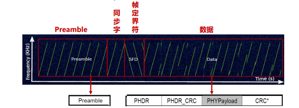

---

title: Chap 5 | 低功耗广域网

hide:
  #  - navigation # 显示右
  #  - toc #显示左
  #  - footer
  #  - feedback  
comments: true  #默认不开启评论

---

<h1 id="欢迎">Chap 5 | 广域网</h1>
!!! note "章节启示录"
    <!-- === "Tab 1" -->
        <!-- Markdown **content**. -->
    <!-- === "Tab 2"
        More Markdown **content**. -->
    本章节是物联网基础的第五章。复习的时候应该会标注哪些是非重点。

## 1.概述
* 低功耗短距离通信：多跳 -> 长距离传输
    1. 问题：通信不可靠、能量黑洞（energy hole）
    2. Ex：GreenOrbs、CitySee

* 低功耗广域网技术LPWAN：可以实现低功耗长距离通信
    1. low-power wide-area networks，包括NB-IoT、LoRaWAN等技术
    2. e.g. NB-IoT单跳通信距离可以达到10km~30k

* 典型协议：
    1. NB-IoT
    2. LoRaWAN
    3. Sigfox
    4. eMTC
    5. EC-GSM
    6. LTE Cat 1

## 2.关键特性

### 2.1 通信距离
* 增加距离的关键技术
    1. 增加功率谱密度(Power Spectrum Density)：单位频谱内的发送能量强度。密度越高，传输距离越远。
    2. 重传：连续重传，融合多次接收的数据进行解码，提升解码率
    3. 多接收天线：多根天线接收的信号融合，提升解码概率
    4. 扩频：通过增加发送数据的冗余，提高数据解调的成功率

* NB-IoT使用的技术：增加功率谱密度、重传、多接收天线

* LoRa使用的技术：扩频

* 增加功率谱密度(7dB):
    1. NB-IoT上行传输有两种带宽3.75KHz和15KHz可供选择，带宽越小，功率谱密度越大，覆盖增益越大
    2. 相比GSM，LoRaWAN并没有在PSD上有增益，相反，有所下降——0.96dB

* 重传(12dB):
    1. 重传次数越多，速率降低，误码率降低。上行最大重复传输128次，理论上增益20dB，即10*lg(N)，N是次数
    2. 而考虑到传输效率，系统不会无限制重传，一般取重传增益为12dB

* 多天线增益(0~3dB):
    1. 理论来说，1TmR的系统比1T1R有10lg(m)的增益
        1. 1T：1 根发送天线
        2. mR：m 根接收天线

* 扩频:CSS扩频
    1. 线性调频脉冲（Chirp）：是频率随时间增加或减少的正弦信号，up-chirp指频率逐渐增加的过程，down-chirp则相反，不同起始频率的chirp表示不同数据。
    2. 码片（Chips）：通过扩频技术，将一个数据位用很多码片来表示，即2^SF/SF个码片来表示一个实际的位，SF为扩频因子。
    3. 解调：实质就是求出chirp符号的起始频率， chirp点乘down-chirp 再FFT，即可在频域获得对应于频率起始频率的峰值。**其强度相当于信号强度的累积，难以被噪声淹没，抗干扰性强。**

### 2.2 功耗
* NB-IoT低功耗技术
    1. PSM(Power Saving Mode)机制
    2. eDRX(extended Discontinuous Reception)增长的休眠时间
* LoRaWAN低功耗技术
    1. 低功耗MAC协议(Class A, Class B)

* PSM机制：
    1. PSM: 深度睡眠状态，UE 不能被访问
    2. Idle: 做周期性寻呼，UE 可以被访问，因为UE会周期性醒
   
    

    1. 红色：发送状态 (120mA)
    2. 黑色：空闲状态 (1mA) 
    3. 灰色：PSM状态 (睡眠状态)(5μA)
    4. 蓝色：接收状态 (50mA)

* NB-IoT低功耗技术：eDRX机制
    1. DRX = Discontinuous Reception，非连续接收
    2. eDRX = extended Discontinuous Reception，增长的非连续接收
    3. DRX默认寻呼周期为1.28s, eDRX最长可达2.92h:在下行数据发送频率小时，通过核心网和终端的协商配合，终端跳过大部分的寻呼监听，从而达到省电的目的

* 低功耗MAC技术:(A,B,C功耗依次增加)
    * LoRaWAN定义了三种MAC类型（A,B,C），其中两种是低功耗的MAC（A，B）
        1. Class A,设备初始化. (RxDelay1>= 1s, RxDelay2=1s)
        2. Class B,设备初始化 + 监听窗口
    * 严格的duty cycle控制      
        比如，LoRa设备在某个信道上发送了0.5s 长的数据后，由于该信道1% duty cycle的限制，该设备需等待49.5s之后才能再次在同一个信道上发送数据

### 2.3 数据率
LPWAN适用于数据传输延迟不敏感的场景，比如远程抄表，因此，其数据率相对较低。
* 最大的物理层数据率
    1. NB-IoT上行为250kbps, 下行为 226.7kbps
    2. LoRaWAN上行和下行一样，最高为5.470kbps
* 实际的数据率将会更低
    1. NB-IoT规定了上行和下行的不同类型数据包的传输间隔，比如，基站发完下行数据后，UE至少间隔12ms才能反馈ACK/NACK数据包。因此，实际使用中，NB-IoT的下行一般为27.2kbps，而上行一般为62.5kbps
    2. LoRaWAN 对信道使用有严格的duty cycle限制。比如, 1%的信道使用限制，数据率则只能达到54.7bps

### 2.4 频段分配与使用
* LPWAN中使用了不同的频段类型 (授权与非授权)
    1. LoRaWAN使用了非授权频段, 分配给中国的是上行470.3 ~ 489.3MHz (共30个)，下行500.3~509.7MHz(48个信道), 带宽都是200kHz。实际上LoRa调制使用的带宽为125kHz，存在保护带
    2. NB-IoT使用了授权频段：系统带宽为200kHz, 传输带宽为180kHz

* NB-IoT的带宽部署方式
    1. 独立部署：利用LTE系统未使用的200kHz带宽。通常使用GSM的一个信道(一个GSM 200KHz带宽>NB-IoT 180KHz带宽)
    2. 保护带部署：利用LTE边缘保护频带中未使用的180KHz带宽的资源块
    3. 带内部署：占用LTE的1个PRB资源

### 2.5 基站部署/公私网的使用
* 基站
    1. 是LPWAN终端实现互通互联的关键
    2. 应用层服务访问、控制LPWAN终端的关键
* 两种基站部署方式
    1. 复用现有的基站，比如LTE基站：部署效率高；但覆盖深度存在盲区，公网传输数据面临数据暴露给第三方的危险
    2. 自行搭建基站：部署成本高效率低，可以根据需求做到深度覆盖
    3. **NB-IoT的部署方式**：复用LTE基站，使用公网
    4. **LoRaWAN的部署方式**：自行搭建基站，使用私网

## 3.代表性协议

### 3.1 NB-IoT

#### 物理层
* 下行
    1. 带宽180kHz, 分为12个子载波（subcarrier），子载波间隔（subcarrier spacing）为15kHz
    2. OFDM技术
* 上行
    1. 带宽180kHz, 子载波间隔有15kHz, 3.75kHz两种
    2. SC-FDMA技术

* 下行资源分配：
    1. 频域上：下行带宽180kHz, 分为12个子载波（subcarrier），子载波间隔（subcarrier spacing）为15kHz
    2. 时域上：一个时隙（slot）长度为0.5ms，每个时隙中有7个符号（symbol）
    3. 子帧(subframe)：基本调度单元, = 1 ms/2 slots (每个slot上有7个symbol)
    4. 无线帧(frame)：包含 10个子帧 = 10ms

!!! warning "下行物理信号 VS. 下行物理信道"
    信号不承载具体的信息bit，而信道是要传data的

* 上行资源分配
    1. 频域上：上行带宽180kHz, 支持两种子载波间隔：
        1. 12个subcarrier, 每个宽15kHz
        2. 48个subcarrier, 每个宽3.75kHz
    2. 两种模式：
        1. single tone: 1 user用1个carrier; 支持15kHz, 3.75kHz
        2. multi tone: 1 user用多个carrier; 支持15kHz
    3. 时域上：基本资源单位为一个时隙（slot）
        1. 对于15kHz子载波间隔：1 slot = 0.5ms
        2. 对于3.75kHz子载波间隔：1 slot = 2ms，记为NB-slot，以示区别
        
        >注：频域上子载波间隔3.75K是15K的1/4，而时域上时隙2ms正好是0.5ms的4倍，两者其实是等效的。
    4. 无线帧(frame) = 10ms = 5 NB-slot
    5. RU (resource unit)：时域、频域两个域的资源组合，是资源分配的基本单位 (smallest unit to map a TB)
    
    >例如当子载波间隔为15kHz时，定义了以下4种RU：   
        ①频域12个子载波，时域1ms; ②频域6个，时域2ms;    
        ③频域3个，时域4ms; ④频域1个，时域8m 

#### 链路层
* Trellis diagram

### 3.2 LoRaWAN
#### 物理层
* 信道分配（选择CN470～510频段进行说明）
    1. 上行信道：96个，470.3～489.3频段
    2. 下行信道：48个，500.3～509.7频段，编号0~47

* 扫码序列扩频（Chirp）调制（非常重点啊）：
    1. Chirp信号：频率随时间线性变化的一种信号   
        
    2. Chirp调制关键参数:
        1. BW：带宽，中国取125KHz
        2. SF：spreading factor，一个chirp表示SF个bits，7-12
        3. $𝑇𝑠$ : 一个chirp发送时间，$𝑇𝑠 = \frac{2^{SF}}{BW}$

        SF增加一个，Ts变成2倍，数据率随之减少（因为时间变成2倍，但是SF只增加了一位）。 
        

!!! example "调制数据案例"
    * SF=8，BW=125KHz发送数据[0, 0, 50] 
    * Chirp频率随时间线性变化   
        * 频率偏移等价于时间偏移    

    

* 包结构：
    1. Preamble：up-chirp信号
    2. 同步字： 2个up-chirp信号
    3. 帧定界符：2.25个dwon-chirp信号

    

