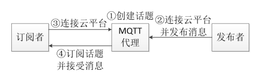
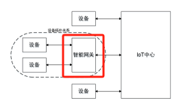
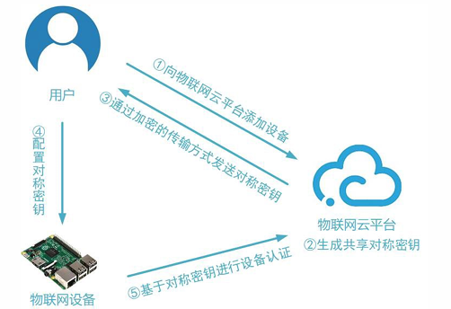
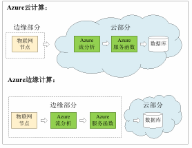

---

title: Chap 6 | 物联网云平台

hide:
  #  - navigation # 显示右
  #  - toc #显示左
  #  - footer
  #  - feedback  
comments: true  #默认不开启评论

---

<h1 id="欢迎">Chap 6 | 物联网云平台</h1>
!!! note "章节启示录"
    <!-- === "Tab 1" -->
        <!-- Markdown **content**. -->
    <!-- === "Tab 2"
        More Markdown **content**. -->
    本章节是物联网基础的第六章。复习的时候应该会标注哪些是非重点。

## 1.概述

* 物联网云平台与传统云平台的区别：
    1. 设备的连接：需要以轻量级的方式，支持多种异构物联网设备的连接
    2. 设备的管理：需要管理大量且处于各种不同状态的物联网设备
    3. 数据的存储：需要存储、管理大量时序数据
    4. 安全认证：物联网设备更容易被攻击，需要更好的安全认证机制
    5. 支持高并发的计算模式：物联网设备数量巨大，处理同时产生的海量流式数据需要高并发的计算模式。

## 2.物联网云平台主要功能
### 2.1 设备连接
* 常见数据传输协议
    1. HTTP
    2. HTTPS
    3. MQTT
    4. CoAP

#### HTTP
* 无状态：HTTP请求是无状态的，每次请求都相互独立，请求之前需要建立TCP连接
* 主动请求：HTTP都是客户端主动发起，服务端被动接收并处理请求，对于设备下行控制场景需要设备端搭建Web Server才能实现
* 协议包头较长：HTTP请求返回协议携带很多首部行，会增加整个报文长度，对于物联网设备短消息、低频率场景而言是一个重量级数据传输协议
  
#### CoAP
CoAP是一种M2M（machine-to-machine）数据传输协议，主
要用于物联网中资源受限的节点和网络应用。

* 非确认式请求-响应消息传输模型
    1. Request和Response只发送一次，没有ACK确认
    2. Request和Response中任何一个丢失都会导致数据传输失败
* 确认式请求-响应消息传输模型
    1. Request和Response任何一个丢失都会导致重传
    2. ACK和数据作为Response同时到达请求端

* 特点
    1. 轻量级：数据包头部长度短，相比于HTTP消息长度减少很多
    2. 没有中间代理：节点之间可以直接通信，无需通过中间服务器进行消息转发
    3. 类似HTTP：具有类似HTTP Header的控制字段，可实现GET、POST、DELETE等方法
    4. 灵活：消息传输方式（GET、POST，Confirmable、Non-confirmable）多，每种传输方式代价不同，可基于不同的应用场景灵活选择
    5. 主动请求：数据从A传输到B，则B必须先主动发送Request请求到A
#### MQTT
一种M2M（machine-to-machine）数据传输协议，它被设计为极其轻
量的发布/订阅消息传送模型

{width="240"}

* 特点：
    1. 轻量级：数据包头短
    2. 支持广播：基于发布-订阅模式，可实现一对多通信
    3. 支持双向通信
        1. 通过两个话题可建立两个Client之间的双向通信
        2. 一个话题中，Client A publish、Client B subscribe，另一个话题中，Client A subscribe、Client B publish 
    4. 灵活：可选QoS有三种，可基于不同的应用场景灵活选择

!!! question "对比MQTT，HTTP，CoAP"
    | | **MQTT** | **CoAP** |**HTTP**|
    | ----------- | ----------- | ---------- | ---------- |
    | OSI模型所处层次   |    应用层 | 应用层   | 应用层  |
    | 传输层协议   | TCP  |UDP |TCP|
    | 可靠   |    可靠  | optional| 可靠|
    | 传输代价   | 大       | 小| 最大 |
    | 多播   | 不支持       | 支持| 不支持 |
    | 双向通信（资源受限的设备）| 可以       | 可以| 不可以 |
    | 中间代理转发   | 可以       | 可以| 不可以 |
    | 温度上传示例报文长度（单位：字节）   | 几个或几十个       | 几个或几十个| 上百个 |
    
### 2.2 设备管理
* 管理对象
    1. 物联网设备
    2. 智能网关
* 管理方式
    1. 直接管理：用户通过云直接向设备发送指令
    2. 设备影子：利用设备的持久虚拟版（包含设备的最新状态）管理设备
* 管理服务
    1. OTA升级：在线检测设备是否需要升级并管理升级过程

#### 管理对象
* 智能网关
    1. 定义
        1. 网关是IoT平台中一种特殊的设备
        2. 具有聚合应用和设备的能力
    2. 特点：管理模式变为多层
    3. 任务 
        1. 收集传感器节点的信息
        2. 执行数据协议转换（例：Zigbee-Wifi）
        3. 将协议转换后的数据快速地发送
        4. 管理和控制能力（本地&远程）：直接对单一设备进行控制

#### 管理方式
* 直接管理 
    1. 用户通过云直接向设备发送指令 
    2. 特点
        1. 遵循请求-响应模式
        2. 用于需要得到立即确认结果的场景 
        3. 设备离线状态，可能造成管理失效 
* 设备影子 ：利用设备的持久虚拟版（包含设备的最新状态）管理设备
    1. 特点• IoT云平台将主动比较用户设置的设备期望状态和设备最近报告状态之间的差异并进行相应设置
    2. 即便离线，也可设置设备未来的期望状态，并在设备在线时实时生效

#### 管理服务

* OTA升级：空中(Over the Air)升级技术，在线检测设备是否需要升级并管理升级过程

* OTA升级中的差分计算
    1. 差分文件格式 
        1. 拷贝命令 (cost = β = 5)  
        COPY1 <n>2 <old_addr>2  
        2. 添加命令 (cost = α+n =3+n)   
        ADD1 <n>2 <BYTE1 ... BYTEn>n
    2. 差分算法
        1. 问题：要实现增量最小化需要拷贝或添加多少个字节？
        2. R3diff: 此算法的最差时间复杂度为 $𝑂(𝑛^3)$ , 平均时间复杂度为 $𝑂(𝑛^2)$ . 空间复杂度为 $𝑂(𝑛)$ .

### 2.3 IFTTT与规则引擎

* IFTTT: If This Then That:一种简单的基于条件语句的程序逻辑
* Ex1:  
    IF soil_moisture <= threshold
    THEN start irrigation
* Ex2:  
    IF temp >= threshold1 && humidity <= threshold2
    THEN start alert
* IFTTT特点
    1. 可以通过简单的条件语句表达多种应用逻辑
    2. 一般在云端执行，可以解耦设备端代码和应用逻辑
    3. 支持多设备联动

### 2.4 时序数据库与流计算

#### 时序数据库
* 时序数据（Time Series Data）: 带有timestamp的数据
  
    >例：某工厂温度传感器每秒采集的室内温度

* 时序数据库（Time Series Database）:高效存取时序数据的数据管理系统
* 传统关系型数据库管理时序数据的问题
    1. 写入吞吐低：对频繁插入数据的效率不高
    2. 存储成本大：对于时序数据压缩不佳
    3. 维护成本高
    4. 查询性能差

* 特点：
    1. 没有更新操作：一般只支持插入查询删除操作
    2. 支持高并发写入
        1. 时序数据库大部分时间都在写入
        2. 借助LSM树，先写内存再顺序写入磁盘
    3. 低查询延时，高查询并发
        1. 分布式查询
        2. 数据预处理：预先计算，查询时直接返回少量运算结果
    4. 存储成本低
        1. 分级存储：内存，固态硬盘，机械硬盘
        2. 合理选择编码压缩算法，提高数据压缩比

#### 流计算
* 流计算：
    1. 严格的定义：对数据流进行一次扫描，并对其特征进行计算
    2. 一般的定义：流算法只对每个数据在短时间内做数次简单计算，流算法使用的内存空间通常较少

* 是否存在高效的流算法？
    1. 计算数据流的平均数？
    2. 计算数据流的中位数？
    3. 1 – 100 （无重复）缺了2个数，如何快速找出两个数？

### 2.5 安全认证

#### 设备认证
* 基于对称密钥的设备认证
    1. 云平台和设备共享对称密钥
    2. 物联网云平台在添加设备时，生成密钥，用户在编写设备端代码时，将密钥配置在设备上
    3. 在实际使用中，设备端通过令牌与云平台连接，令牌由设备密钥对设备标识、随机数或时间戳等加密生成

    {width="350"}

* 基于非对称密钥的设备认证
    1. 设备使用私钥进行签名，云平台获取公钥用于认证
    2. 为了管理公钥，使用基于X.509证书的PKI机制

### 2.6 无服务器计算
无服务器计算(Serverless Computing) 是一种全托管计算服务，免去人工管理、运维，例如管理服务器等基础设施的麻烦，用户唯一需要做的只是编写代码上传

它和传统PaaS模式构建应用有何区别？
我们用一个例子来看：    
1. 物联网场景中经常产生许多图像数据上传至云服务器进行分析。但是直接存储原分辨率图片既占用存储资源又降低了智能分析的响应速度
2. 因此，我们要设计一个图片压缩应用，它接受用户上传的图片，生成其缩略图并存入云数据库

#### 无服务器计算的下沉-边缘计算
* 下沉方法
    1. RPC：轻量，但是RPC服务代码需要预置
    2. 容器
        1. 依赖底层宿主机的内核。
        2. 轻量级。AzureIoT Edge 、AWS Greengrass、阿里云Link Edge均采用此方式
    3. 虚拟机
        1. 相较于容器技术，需要网络分发的数据量更大
        2. 更加灵活，屏蔽宿主机操作系统的异构性
    4. OTA：整机的整体软件更新，开销大

在边缘计算模式下，数据的初步分析可以下发到边缘侧的路由器或是设备进行计算。  
{width="200"}

* 边缘计算的优势
    1. 实时：降低时延，达到高响应的云服务；
    2. 节省：将物联网数据在边缘端即时处理，节省骨干网带宽；
    3. 安全：数据分析不出户，边缘端处理数据，保证物联网数据的安全与隐私性；
    4. 稳定：主干网断网仍可分析，具有较高的可用性。