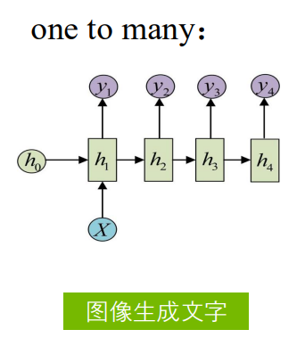

---

title: Note 
hide:
  #  - navigation # 显示右
  #  - toc #显示左
  #  - footer
  #  - feedback  
comments: true  #默认不开启评论

---

<h1 id="欢迎">Note</h1>

!!! note "启示录"
    短学期的深度学习课程

* 数据集该怎么运用  
{width="500"}   

    训练完的模型直接去跑测试集并选取得分最高的，其实是不对的。这样相当于知道题目去高考，是为了结果而训练模型，不具备广泛的泛化性和可复现性，因此并没有真实的意义，也不符合科研的“求是”精神hhhhh

    因此将数据集划分成以下的集合：

    1. 训练集（作业）
    2. 验证集（模拟考）
    3. 测试集（高考）

    通过训练集训练出一个模型，用验证集验证，选取在验证集中得分最高的模型，再在测试集中进行预测使用。

## 1.卷积神经网络

### 1.1 卷积核
* 最初用于图像处理

* 内核与卷积   
    {width="400"}
    
    {width="400"}

    {width="400"}

* 步长（卷积核滑动的距离）   
    {width="400"}

如果有一个7×7的原始图像，用3×3的内核做卷积，若步长为3，则无法完全覆盖，造成信息丢失，因此需要对原始图像进行补充

* 填充（padding）：可以选择补零/一填充，也可以选择相同填充，根据具体情况选择   
    {width="400"}

    {width="400"}

!!! tip "练习：参数个数计算"
    * 卷积核隐含了深度  
  
    === "题面："
        Inputvolum: 32 × 32 × 3  
        10 个 5 × 5 filters with stride 1， pad 2  
    === "题解："
          
         
        $(5+2*2-5)/1 + 1 = 5$   
        (这是得到的一个图像的大小，也就是5*5)

        然后计算所有的参数  

        $5*5*3 + 1 =76\;\; params => 76 * 10$

        其中3为隐含的参数，还要加上一个偏置量（76就是一个卷积核得到结果中包含的参数，最后乘以10）
    
  

 * 流程：
      

    

    1. （3，3，1，2）代表3×3的内核，输入通道为1，输出通道为2  
    2. （3，3，2，2）代表3×3的内核，输入通道为2，输出通道为2（两幅图像乘以两个卷积核，再将两个数据相加，因此两幅图像与四个内核最后依旧得到的是两幅图像）

* 最大池化层：不存在需要训练的参数    
    * 作用：可以扩大感受野

    {width="400"}

    * 最大池化法为什么优于均值池化法：  
        这组卷积核在图像任意区域的受激程度的表示，所以如果需要做检测、识别之类的人物，最大池化法是最直观的，不管在图像的什么区域，都用一个显著的最大值来激活它

* DropOut层：  
    {width="500"}

只与图像的局部发生关联，而不是像全连接一样与每一个点都发生关联。  
卷积层->最大池化层->卷积层->最大池化层->数据展平->全连接

* 完整架构：  
    {width="600"}
 

!!! example "一个例子🌰"
    {width="600"}  

    * 流程：
        1. 第一步输入通道1个，输出通道25个   （3，3，1，25）
        2. 经过最大池化层，4个格子变1个，26×26变成13×13
        3. 输入通道25个，输出通道50个       （3，3，25，50）
        4. 经过最大池化层，4个格子变1个，同时丢弃最后的格子，11×11变成5×5
    
    * 参数个数   
        参数个数：3×3×输入通道数

## 2.提高CNN准确性
### 2.1 数据增强
初始的数据集的数量可能太少，不足以我们进行训练（当然如果有足够的时间、资源、金钱，应该也是能获取到理想的数据集的）。因此我们需要对样本数据进行增强，来训练我们的模型，提高泛化性。

* 有监督的样本数据增强  
    1. 几何变换类
        * 包括旋转，翻转，裁剪，变形，缩放等各类操作。裁剪输入的多个版本，然后将结果进行融合，对预测的改进效果非常明显。
        * 几何变换没有改变图像本身的内容，可能是选择了图像的一部分或者像素进行了重分布。
    2. 颜色变换类
        * 如果要改变图像本身的内容，那就属于颜色变换类的数据增强了，常见的包括噪声、模糊、颜色变换、擦除、填充等。
        * 基于噪声的数据增强就是在原来图片的基础上，随机叠加一些噪声，最常见的就是高斯噪声，更复杂一点的就是在面积大下可选定、位置随机的矩形区域上丢弃相似产生黑色矩形块，从而产生一些彩色噪声。
        * 颜色变换的另一个重要变换是颜色扰动，就是在某一个颜色空间通过增加或减少某些颜色分量，或者改变颜色通道的顺序。  
  
    {width="300"}
    {width="300"}
    {width="300"}
    {width="300"}  

* 无监督的样本数据增强    
    通过模型学习数据的分布，随机生成与训练集分布一致的图片，代表方法GAN、DCGAN等。

    

    * G是一个生成图片的网络，它接收随机的噪声z，通过噪声生成图片，记做G(z)。
    * D是一个判别网络，判别一张图片是不是“真实的”，即是真实的图片，还是由G生成的图片。

### 2.2 归一化（Normalization）
Normalization的目的是使得数据和特征准确表达和便于处理，归一化操作在输入、输出、中间结果处都有分布。

{width="500"}

* 批量归一化（Batch normalization）    
    训练深度神经网络的复杂性在于，因为前面的层的参数会发生变化导致每层输入的分布在训练过程中会发生变化。这又导致模型需要需要较低的学习率和非常谨慎的参数初始化策略，从而减慢了训练速度，并且具有饱和非线性的模型训练起来也非常困难。网络层输入数据分布发生变化的这种现象称为内部协变量转移（Internal Covariate Shift），BN 就是来解决这个问题。

    {width="500"}

    引入Batch Normalization，作为深度网络模型的一个层，每次先对input数据进行归一化，再送入神经网络输入层。神经网络的训练过程中，更新了某一层的权重参数，后续每一层网络的输出都可能发生变化，最终引起loss值的变化。所以当没有BN层时，loss的收敛就需要我们精心设计权重的初始化方法和超参数的调节方法以及等待漫长的训练时间；但当我们在各层之间加入了BN层后，某层的输出仅由两个参数γ和β决定，使用梯度下降法优化参数时，优化方法只需要调节两个参数的值来控制各层的输出，而不需要调节各层的全部参数。这样极大地提高了收敛速度，避免了小心翼翼的参数初始化和超参数调节过程。先有数据 X, 再添加全连接层, 全连接层的计算结果会经过“激励函数”成为下一层的输入, 接着重复之前的操作. Batch Normalization (BN) 就被添加在每一个全连接和激励函数之间

    {width="600"}
    
    全连接层计算完成后，本来是直接进入激活函数，但此时先进行批量归一化，缩放和平移参数，再进入激活函数。

    {width="400"}

    {width="600"}

    * 作用：  
        1. 加快收敛速度：在深度神经网络中中，如果每层的数据分布都不一样的话，将会导致网络非常难收敛和训练，而如果把每层的数据都在转换在均值为零，方差为1的状态下，这样每层数据的分布都是一样的训练会比较容易收敛。
        2. BN算法防止过拟合：在网络的训练中，BN的使用使得一个minibatch中所有样本都被关联在了一起，因此网络不会从某一个训练样本中生成确定的结果，即同样一个样本的输出不再仅仅取决于样本的本身，也取决于跟这个样本同属一个batch的其他样本，而每次网络都是随机取batch，这样就会使得整个网络不会朝这一个方向使劲学习。一定程度上避免了过拟合。
        3. 防止梯度爆炸和梯度消失

    !!! tip "minibatch"
        小批量均值的计算，对每个输入的小批量都做这个操作，然后计算方差，通过均值和方差进行归一化。当然BN中还有额外的缩放和平移因子。  

        

    !!! tip "梯度消失和梯度爆炸"
        * 梯度消失：  
            在深度神经网络中，如果网络的激活输出很大，其对应的梯度就会很小，导致网络的学习速率就会很慢，假设网络中每层的学习梯度都小于最大值0.25，网络中有n层，因为链式求导的原因，第一层的梯度将会小于0.25的n次方，所以学习速率相对来说会变的很慢，而对于网络的最后一层只需要对自身求导一次，梯度就大，学习速率就会比较快，这就会造成在一个很深的网络中，浅层基本不学习，权值变化小，而后面几层网络一直学习，后面的网络基本可以表征整个网络，这样失去了深度的意义。（使用BN层归一化后，网络的输出就不会很大，梯度就不会很小）
        * 梯度爆炸：  
            第一层偏移量的梯度=激活层斜率1x权值1x激活层斜率2x…激活层斜率(n-1)x 权值(n-1)x激活层斜率n，假如激活层斜率均为最大值0.25，所有层的权值为100，这样梯度就会指数增加。（使用bn层后权值的更新也不会很大） 

### 2.3 正则化（Regularization）

Regularization的目的是使模型性能更趋于稳定可靠

{width="400"}

正则化定义：对学习算法的修改——旨在减少泛化误差而不是训练误差。最好的拟合模型（从最小化泛化误差的意义上）是一个适当正则化的大型模型。    

让模型不要太复杂，从而减少过度拟合的风险。通过在模型训练过程中引入一些“惩罚”项(penalty)，让模型的参数不至于变得过于极端。

1. L1正则化（Lasso）
      
    它通过在模型的损失函数中增加权重的 L1 范数（权重向量的绝对值之和）来实现正则化。L1 正则化倾向于产生稀疏权重矩阵，即将一些权重推向零，也就是让模型更简单，特征更少。

2. L2 正则化（Ridge）
      

    它通过在模型的损失函数中增加权重的 L2 范数（权重向量的平方和）来实现正则化。L2 正则化会使权重值变得较小，但不会直接导致权重稀疏（不会让参数直接变为零），因此不具有特征选择的作用，但可以有效地控制模型的复杂度。它有助于平滑模型，避免某些参数值过大。 

{width="500"}     

### 2.4 学习率调度(Leaning Rate Scheduling)

{width="400"}

学习率太大会达不到最低点，太小则会太慢，效率不高。

#### 常见的学习率调度策略:
1. 固定步长衰减（Step Decay）
    在训练过程中，学习率在特定的训练轮次（epoch）后减少。

    >例如，每过10个epoch，学习率减半。

    这种方法简单易行，但需要手动设置衰减的时机和比例。   
    {width="300"}

2. 指数衰减（Exponential Decay）  
    学习率按指数函数逐步减小，公式为:    
       
    这种方式可以让学习率以平滑的方式减小。

    {width="300"}

3. 余弦退火（Cosine Annealing）
    这种方法使用余弦函数来调整学习率，让学习率先逐渐减小，再在训练结束时迅速减小到非常低的值。  
    {width="400"}

### 2.5 优化器调整

1. 随机梯度下降（SGD）
      * 学习率 𝜶 ：选择合适的学习率非常重要。学习率过大，可能会导致不稳定；学习率过小，收敛速度慢。
      * 批量大小𝚫𝑻 （Batch Size）：调整批量大小会影响
      梯度的噪声水平和模型的收敛速度。小批量通常带来
      更快的训练，但可能更不稳定。

      {width="300"}

2. SGDM(SGD with momentum)  
    在SGD的基础上加入动量项，利用之前梯度的累积信
    息来加速收敛，并减少震荡。动量系数 𝜼 ：通常设置为0.9或类似值，这决定了动量在多大程度上影响当前的参数更新。  
    {width="300"}
    {width="300"}

3. RMSprop    
    对每个参数的梯度平方进行指数加权移动平均，以自适应地调整学习率，避免学习率过大或过小的问题。  

    * 衰减率：通常在0.9到0.99之间，用于控制梯度
    平方的移动平均。
    * 学习率：RMSprop常使用较小的学习率，如0.001。
    
    >RMSProp 的效果在很大程度上依赖于衰减因子等超参数的选择，而且不保证在所有问题上都是最优的。

4. Adam（Adaptive Moment Estimation）   
    结合了动量和RMSprop的思想，分别对梯度和梯度平方进行指数加权移动平均，并根据这两个平均值来调整学习率。  

    * β1和β2：这两个参数控制梯度和梯度平方的移
    动平均的衰减率，通常默认分别为0.9和0.999
    * 学习率：Adam默认学习率为0.001，可以根据需
    要调整。

### 2.6 标签平滑（Label Smoothing）
减少模型对于标签的绝对信心，从而减少模型可能过拟合风险。

{width="500"}

{width="400"}   

soft label拥有携带更多的信息，更好的描述数据的类别情况。
通过改变标签来调整损失函数的方法，使模型在学习时不至于
对某些样本的预测过于信心(over-confidence)，从而提高了模
型的泛化能力

### 2.7 焦点损失（Focal Loss）  
解决one-stage目标检测中正负样本数量极不平衡（Class imbalance）问题  

{width="200"}

{width="500"}

{width="500"}

* 当$p_t$趋向于1，即说明该样本是易区分样本，此时调制因子 $(1 − 𝑝_𝑡)^𝛾$ ，是趋向于0，说明对损失的贡献较小，即减低了易区分样本的损失比例。 

* 当$p_t$很小，也就是假如某个样本被分到正样本，但是该样本为前景的概率特别小，即被错分到正样本了，此时，调制因子 $(1 − 𝑝_𝑡)^𝛾$ 是趋向于1，对loss也没有太大的影响。

### 2.8 多尺度特征（Multi-scale Feature）
通过在不同的网络层次上提取特征，并将它们融合在一起，以捕捉不同尺度的信息。常用的多尺度特征融合方法包括金字塔池化（Pyramid Pooling）和金字塔卷积（Pyramid Convolution）等。  
{width="400"}

### 2.9 超参数优化
在深度学习中，超参数是指在训练模型时需要手动设置的参数，它们通常不能通过训练数据自动学习得到，必须在训练前或训练期间通过试验和调优来确定。超参数的选择对于模型的性能至关重要，因此在进行深度学习实验时，超参数调优通常是一个重要的步骤。    

1. 学习率  
    学习率是指在优化算法中更新网络权重的幅度大小。学习率可以是恒定的、逐渐降低的、基于动量的或者是自适应的，采用哪种学习率取决于所选择优化算法的类型，如SGD、Adam、Adagrad、AdaDelta或RMSProp等算法。
2. 迭代次数  
    迭代次数是指整个训练集输入到神经网络进行训练的次数。当测试错误率和训练错误率相差较小时，可认为当前的迭代次数是合适的，否则需继续增大迭代次数，或调整网络结构。
3. 批次大小  
    在卷积神经网络的学习过程中，小批次会表现得更好，选取范围一般位于区间[16,128]内。还需要注意的是，CNN网络对批次大小的调整十分敏感。
4. 激活函数  
    激活函数具有非线性，理论上可以使模型拟合出任何函数。通常情况下，rectifier函数在CNN网络中的效果较好。当然，可以根据实际任务，选择其他类型的激活函数，如Sigmoid和Tanh等等。
5. 隐含层的数目和单元数    
    增加隐含层数目以加深网络深度，会在一定程度上改善网络性能，但是当测试错误率不再下降时，就需要寻求其他的改良方法。增加隐含层数目也带来一个问题，即提高了训练该网络的计算成本。当网络的单元数设置过少时，可能会导致欠拟合，而单元数设置过多时，只要采取合适的正则化方式，就不会产生不良影响。
6. 权重初始化    
    在网络中，通常会使用小随机数来初始化各网络层的权重，以防止产生不活跃的神经元，但是设置过小的随机数可能生成零梯度网络。一般来说，均匀分布方法效果较好。
7. Dropout方法  
    作为一种常用的正则化方式，加入Dropout层可以减弱深层神经网络的过拟合效应。该方法会按照所设定的概率参数，在每次训练中随机地不激活一定比例的神经单元。该参数的默认值为0.5。

!!! info "优化的方法"
      1. 手动调优
      2. 网格搜索（Grid Search）  
           网格搜索是通过穷举法列出不同的参数组合，确定性能最优的结构。
      3. 随机搜索（Random Search）  
           随机搜索是从具有特定分布的参数空间中抽取出一定数量的候选组合。
      4. 贝叶斯优化（Bayesian Optimization）
      5. 进化算法（Evolutionary Algorithms）
      6. 超参数调度（Hyperband）

## 3.迁移学习
迁移学习包括获取从一个问题中学习到的特征，然后将这些特征用于新的类似问题。例如，来自已学会识别浣熊的模型的特征可能对建立
旨在识别狸猫的模型十分有用。

!!! question "为什么需要迁移学习？"
    1. 数据不足
    2. 训练成本高
    3. 提高模型性能
    4. 加速模型开发

!!! tip "常见的迁移学习"
    1. 基于实例的迁移   
        以某种形式扩充目标域训练实例   
        * 从源域中选择部分实例直接作为目标域训练集的补充
        * 从源域中选择部分实例与目标域实例进行混合生成新的训练数据
        * 使用源域上训练好的模型给目标域数据打伪标
    2. 基于特征的迁移   
        通过特征变换的方式互相迁移,来减少源域和目标域之间的差距。  
        {width="400"}
    3. 基于模型的迁移  
        找到源数据和目标数据的空间模型之间的共同参数或者先验分布，从而可以通过进一步处理，达到知识迁移的目的。  
        {width="400"}
    
    

* 模型微调的过程：
    1. 选择预训练模型
    2. 冻结部分层
    3. 调整最后几层
    4. 调整学习率
    5. 训练
    6. 评估和调优

## 4.循环神经网络
以上基本讨论的是图像方面的内容。   
那么，文字该如何输入呢？   

{width="300"}
{width="300"}
{width="300"}
{width="300"}

以上的一些方面没有涉及语义相关性。可以通过一个“浅层”神经网络，并利用较大的字典来补充语义相关性，虽然不一定准确。   
{width="500"}

* 利用CNN来实现一个语义分类（地点、时间、其他）   
    {width="500"}

### 4.1 RNN概述
将隐藏层的输出作为下一次的输入，类似于递归。   
具体来说，RNN基本上就是一个黑盒，当逐一处理一个输入的序列时，黑盒中的“内部状态”也会随之更新。在每个时间段，我们向RNN输入一个向量，RNN将这个内部状态（上一时间段的状态）和输入的向量一起作为接收到的输入。当我们调整RNN的权重时，RNN在接受同样的输入后，会对内部状态产生不一样的改变。同时，我们也需要模型基于这个内部状态产生一个输出。因此，我们可以在RNN的顶端产生这些输出。  
{width="400"}   

{width="400"}

!!! warning "RNN 训练的模型不一定会收敛    "
    {width="400"}

### 4.2 分类
{width="500"}  

* 一对一模型 one-to-one，最简单的模型。  
    {width="200"}   
* 一对多模型 one-to-many，看图写话。  
    {width="200"}    
* 多对一模型 many-to-one，动作分类。情感分类。输入是多个vector，输出则是一个vector。   
    {width="200"}         
* 多对多模型 many-tomany，看视频写话。输入输出均是多个vector，但输出较短。
    {width="200"}
    

### 4.3 LSTM(Long Short-term Memory)
{width="500"}

可以看作是一个小型的神经元，有4个输入，只有1个输出，是一个时序电路。

遗忘门：决定上一步迭代（来自上一个cell）的结果是否被“遗忘”。  
输入门：决定新的数据是否进入cell。  
输出门：决定是否输出结果。  

{width="500"}