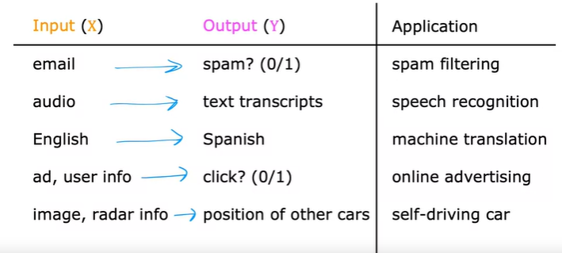
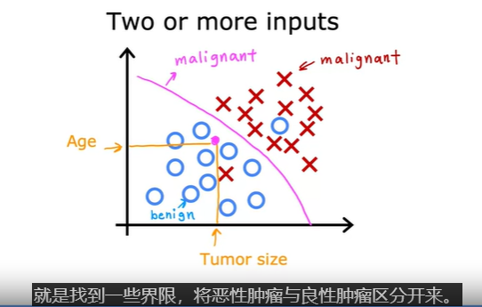
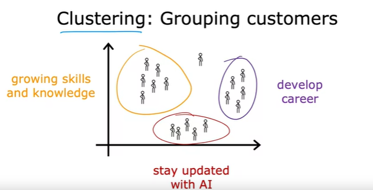

---

title: Chap 01 | 启示录

hide:
  #  - navigation # 显示右
  #  - toc #显示左
  #  - footer
  #  - feedback  
comments: true  #默认不开启评论

---

!!! note "章节启示录"
    准备开始学习一点机器学习辣

* 机器学习的算法
    * 有监督学习（supervised）
    * 无监督学习（unsupervised）
    * 推荐系统

## 1.监督学习
* 回归：从无限多的可能数字中预测数字

学习x到y或输入到输出映射的算法。

* 分类：与回归不同，可能性的数字只有有限个（0/1或多个），这有限个东西被称为categories。
  
  
只有一个输入值肿瘤大小，如果加上年龄，会形成二维直角坐标系，每一个点的坐标代表年龄和肿瘤大小，用圈代表良性，用叉代表恶性。   

classification和predict categories是同一个概念，他们预测的类别不一定是数字，可以是一些非数字的东西（比如一张照片是猫还是狗）

## 2.无监督学习
只有输入x，没有输出y。

* 聚类（clustering）：  

* 异常检测（Anomaly detection）：

* 降维（Dimensionality reduction）：