---

title: Chap 02 | 监督学习

hide:
  #  - navigation # 显示右
  #  - toc #显示左
  #  - footer
  #  - feedback  
comments: true  #默认不开启评论

---
!!! note "章节启示录"
    本章节主要介绍了线性回归模型和成本函数

## 1.线性回归模型
将数据拟合成一条直线。每一个数据集有数个（m个）输入（x）以及与之对应的数个（m个）输出（y）。

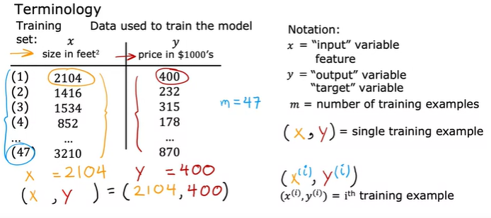

## 2.成本函数
成本代表了一个模型的好坏程度。

预测值: $\large \hat{y}$
真实值: $\large y$
误差：$\large J(w,b) = \frac{1}{2m}\sum_{i=1}^m(\hat{y}^{(i)}-y^{(i)})^2$ 用除以 $2m$ 来计算平均误差是为了简化后续的运算。

若只考虑 $w$ ，我们可以计算出关于 $w$ 的成本函数，是一条类似于抛物线的曲线，显然最低点就是成本最小的点，也就是拟合的最好的值。

而对于每一个 $w$ 和 $b$ 我们也可以计算出他们的成本函数，最后绘成一个类似于等高线的三维图。


## 3.梯度下降
梯度下降可以用来计算**任何**成本函数的最小值。

$\large w=w-\alpha \frac{\partial}{\partial w}J(w,b)$  

$\large b=b-\alpha \frac{\partial}{\partial b}J(w,b)$

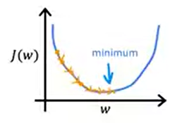

如果学习率 $\alpha$ 太小，下降的太慢。

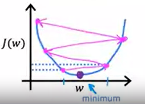

如果学习率 $\alpha$ 太大，会出现交替的情况（我感觉与微观经济学中的发散型蛛网模型很相似）。

### 线性回归中的梯度下降
* $\large \frac{\partial}{\partial w}J(w,b)=\frac{\partial}{\partial w}\frac{1}{2m}\sum_{i=1}^m(f_{w,b}(x^{(i)})-y^{(i)})^2=\frac{\partial}{\partial w}\frac{1}{2m}\sum_{i=1}^m(wx^{(i)}+b-y^{(i)})^2=\frac{1}{2m}\sum_{i=1}^m(wx^{(i)}+b-y^{(i)})2x^{(i)}$    

    $\large =\frac{1}{m}\sum_{i=1}^m(f_{w,b}(x^{(i)})-y^{(i)})x^{(i)}$

* $\large \frac{\partial}{\partial b}J(w,b)=\frac{\partial}{\partial b}\frac{1}{2m}\sum_{i=1}^m(f_{w,b}(x^{(i)})-y^{(i)})^2=\frac{\partial}{\partial b}\frac{1}{2m}\sum_{i=1}^m(wx^{(i)}+b-y^{(i)})^2=\frac{1}{2m}\sum_{i=1}^m(wx^{(i)}+b-y^{(i)})2$    

    $\large =\frac{1}{m}\sum_{i=1}^m(f_{w,b}(x^{(i)})-y^{(i)})$

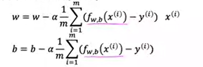


## 4.多元线性回归
用行向量代表多个变量，在python中可以用数组表示，用numpy库来实现相关的计算。

$\large f_{w,b}=\sum_{j=1}^nw_jx_j+b$

```python
f = 0
for j in range(0,n):
        f = f + w[j] * x[j]
f = f + b
```


```python
f = np.dot(w,x) + b //这个 numpy 函数使用并行硬件来高效计算点乘。（已知所有值，offline，用sum的并行方法进行计算）
```

将学习率也变成一个行向量，进行向量的加减法来进行梯度下降。


## 5.函数缩放（特征缩放）
面对多维特征问题时，我们需要尽可能保证特征（变量）具有相近的尺度，也就是尽可能形成一个圆形（而不是椭圆）。

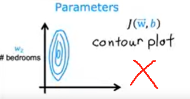

类似于放射变换，其中涉及了几种规则和方式。

* Mean normalization   
    利用平均值进行缩放。

    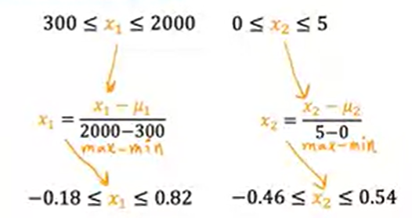

* Z-score normalization  
    利用标准差进行缩放。   
    $\mu$ 代表平均值， $\sigma$ 代表标准差。

    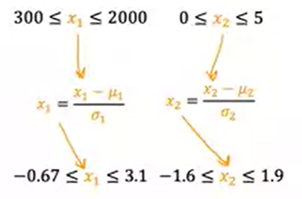

使用归一化特征进行**预测**，使用原始特征值进行**绘图**。

### 5.1 检查梯度下降是否收敛

* 学习曲线：绘制一个坐标轴，横轴是迭代的次数，纵轴是 $f(w,b)$ 的值。  
    如果 $J$ 每次递减（趋于平稳，即收敛），则说明学习率选择合适，算法没错。

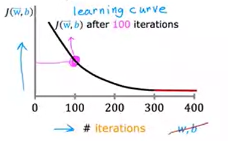


### 5.2 选择学习率
* 如果学习曲线存在波动或者递增，则说明代码可能有问题或者学习率太大。

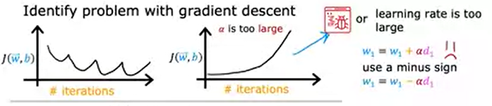

* 调试：设置学习率为很小的值，观察成本函数 $J$ 是否递减。若学习率很小时，成本函数仍然有时会增加，那么大概率代码中存在问题。


### 5.3 功能工程
定义一些新特征，来完善成本函数。   
  
例如：定义 $x_3=x_1*x_2$ 为房屋的面积，来更好地刻画房屋的价格走势
   
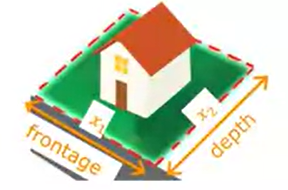

## 6.多项式回归

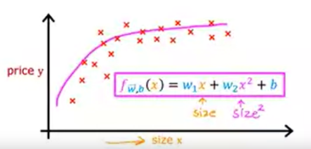


## 7.逻辑回归
逻辑回归适用于分类算法，即返回的值是一些离散的值（是或否，1或0等等）

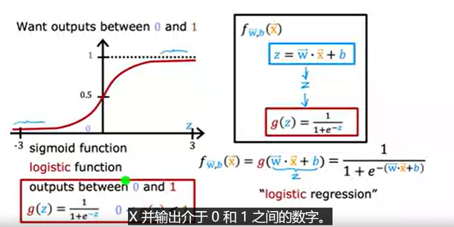


  
