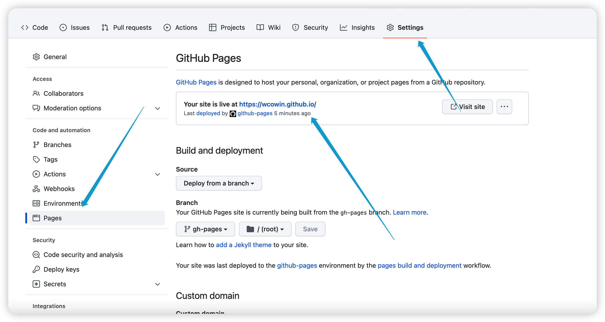
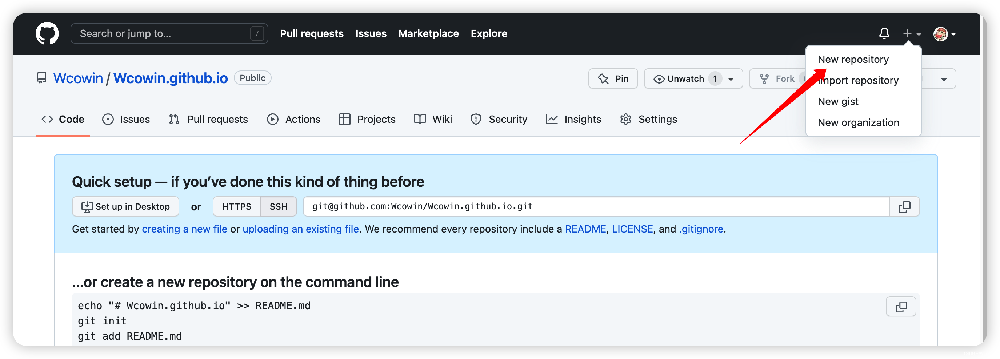
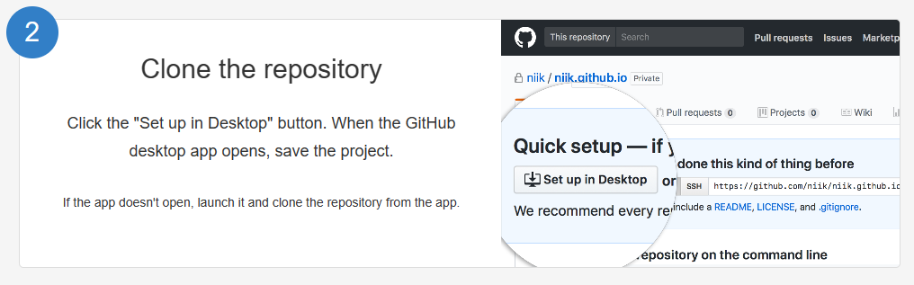
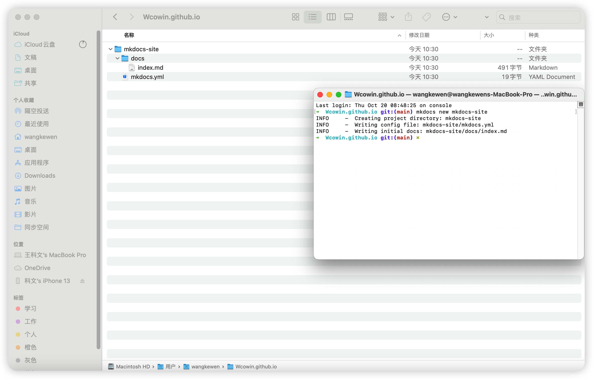
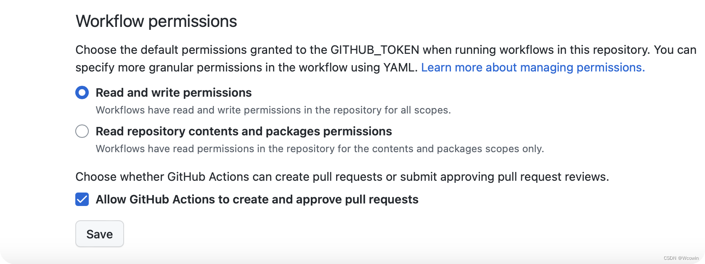
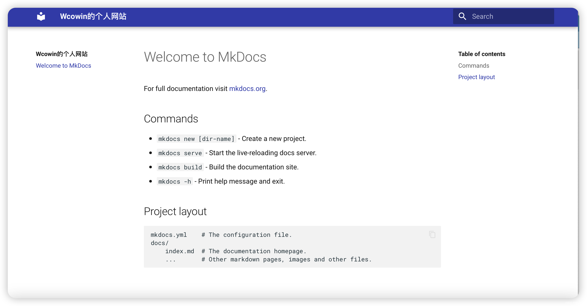
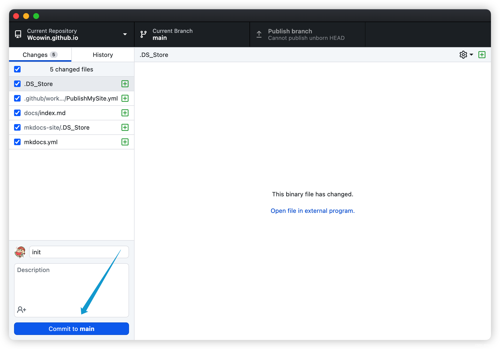
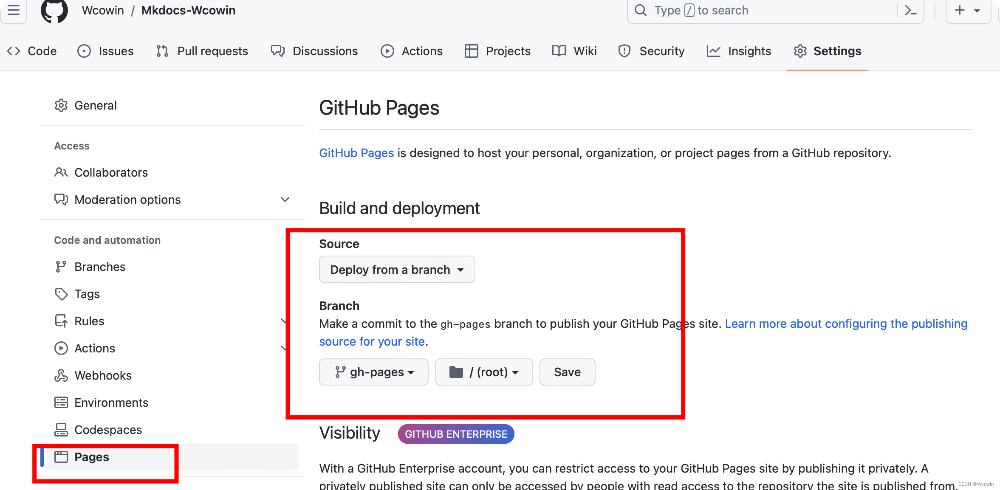
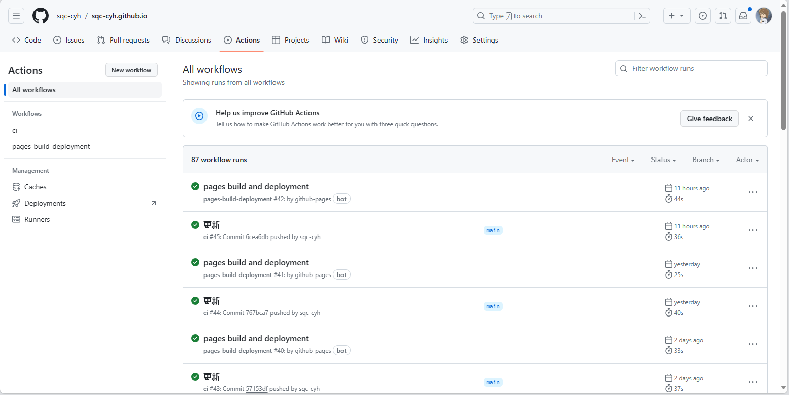

---

title: 如何搭建属于你的个人网页
hide:
  #  - navigation # 显示右
  #  - toc #显示左
  #  - footer
#    - feedback  
comments: true  #默认不开启评论
statistics: true

---

# 欢迎！

!!! note "tips"
    * 写本文的目的是作者水平有限，在创建个人网页的过程中遇到了诸多问题，搜索了许多的教程，有各种版本，于是想做一个整合，可以算是一个集合，里面也包含了我踩过的坑，希望能让一个完全的小白实现搭建个人网页的愿望，如果中间哪几步仍然有表意不明或者坑，请大家在评论区提出或者私信联系我！希望对大家搭建网页有所帮助！引文链接如下：
    * [利用mkdocs部署静态网页至GitHubpages（更新版)](https://blog.csdn.net/m0_63203517/article/details/129755527?ops_request_misc=%257B%2522request%255Fid%2522%253A%2522170895956216777224426415%2522%252C%2522scm%2522%253A%252220140713.130102334.pc%255Fall.%2522%257D&request_id=170895956216777224426415&biz_id=0&utm_medium=distribute.pc_search_result.none-task-blog-2~all~first_rank_ecpm_v1~rank_v31_ecpm-2-129755527-null-null.142^v99^pc_search_result_base4&utm_term=%E5%88%A9%E7%94%A8mkdocs%E5%9C%A8github%E4%B8%8A%E9%83%A8%E7%BD%B2%E4%B8%AA%E4%BA%BA%E7%BD%91%E9%A1%B5&spm=1018.2226.3001.4187)
    * [尝试更改和调整 mkdocs-material 页面的颜色的过程记录](https://ronaldln.github.io/MyPamphlet-Blog/2023/09/16/mkdocs-material/)
    * [GitHub Pages 文档自动化部署 - MkDocs](https://blog.arisa.moe/blog/2022/220407-github-pages/#github-actions)

## 1.部署网页（利用github）
首先你必须有一个github账号 [github官网](https://github.com/)  

之后如果有能力就可以按照官方给的教程进行搭建啦！ [github_page](https://pages.github.com/)

***当然下文会提供更加详细的做法***

下载github Desktop客户端（可以理解为github的桌面版，方便之后对仓库的管理）[下载链接](https://desktop.github.com/)  
在Github创建一个名为你的名字+github.io的仓库


然后打开github Desktop 克隆到本地

这时候如果你在仓库里新建一个文件index.html并输入以下代码：
```html title="index.html"
<!DOCTYPE html>
<html>
<body>
<h1>Hello World</h1>
<p>I'm hosted with GitHub Pages.</p>
</body>
</html>
```
然后在github Desktop上对仓库进行同步。**commit to main （左下角）$\implies$ Fetch origin（右上角）**  
你就可以输入网址：$https://[username].github.io/$ 进行查看了。当然，现在只是一个简单的页面。
想要实现较为复杂的个人主页，你当然可以选择从零开始，但是这里更推荐利用已有的框架。下面我将利用mkdocs并以$material$主题为例进行介绍。

在你本地保存仓库的文件夹下启动终端并运行：
```
mkdocs new mkdocs-site
```
之后你的终端应该会出现如下三行，并在文件夹中出现如下的目录结构：

docs文件下是你以后个人网站的内容，mkdocs.yml是配置文件。
之后我们的更新都需要部署到github上，这样才能正常更新网页内容。我推荐使用自动部署的方式，这样你每次更新后只需要重复同步的操作，打开github Desktop 点击 **commit to main （左下角）$\implies$ Fetch origin（右上角）** 就可以实现更新了。
## 2.自动部署
!!! note "配置自动部署"
    以下你可能会碰到一些没见过的名词，但没关系，按步骤做就可以啦，后面自然会明白每一步的意义！  
    先在终端执行下面的代码添加一个GitHub Workflow:
    ```
    mkdir .github  
    cd .github  
    mkdir workflows  
    cd workflows
    vim PublishMySite.yml #该操作是创建一个yml文件并进入vim编辑页面（你可以直接新建一个yml文件，再用vscode等编辑器打开进行编辑）
    ```
    在PublishMySite.yml里面输入以下内容（这里我们采用 [Material for MkDocs](https://squidfunk.github.io/mkdocs-material/publishing-your-site/#with-github-actions) 的模板）:
    在2024年2月29日的时候我从这里找到的模板是这样的，随着时间的推移可能会有变更，建议从原文档去复制。
    ```
    name: ci 
    on:
      push:
        branches:
          - master 
          - main
    permissions:
      contents: write
    jobs:
      deploy:
        runs-on: ubuntu-latest
        steps:
          - uses: actions/checkout@v4
          - name: Configure Git Credentials
            run: |
              git config user.name github-actions[bot]
              git config user.email 41898282+github-actions[bot]@users.noreply.github.com
          - uses: actions/setup-python@v5
            with:
              python-version: 3.x
          - run: echo "cache_id=$(date --utc '+%V')" >> $GITHUB_ENV 
          - uses: actions/cache@v4
            with:
              key: mkdocs-material-${{ env.cache_id }}
              path: .cache
              restore-keys: |
                mkdocs-material-
          - run: pip install mkdocs-material 
          - run: mkdocs gh-deploy --force    
    ```
!!! danger "注意有坑"
    首先他这个流程，很明显只用`pip` 安装了 `mkdocs-material`，但是它并没有安装 `mkdocs`。其实这无所谓，因为 `mkdocs-material` 的 `requirements.txt` 中已经包含了 `mkdocs`，会一并安装。但如果你之后使用了一些其他依赖的库，比如：`mkdocs-blogging-plugin`那么你需要在yml文件中添加  
    `- run: pip install mkdocs-blogging-plugin `  

    * 我的配置文件你可以在我的仓库中找到，如有需要请自行寻找。

然后要注意，我们需要调整我们的目录结构。将mkdocs-site文件夹中的docs文件夹和mkdocs.yml移出来，移到你的仓库目录下，然后删去mkdocs-site文件夹（此时已经是一个空文件夹了）  

目录树状图:  
```
├── .github    
│   └── workflows  
│       └── PublishMySite.yml  
├── docs  
│   └── index.md  
└── mkdocs.yml
```

然后是重点！！在仓库setings/Actions/General 勾选这两项。  



之后打开mkdocs.yml，输入以下内容（最简单的配置）:
```
site_name: #网站名字
site_url: #你的网址
site_author: #你的名字
theme:
 name: material #主题
```
然后在mkdocs.yml所在的目录终端下运行:
```
mkdocs serve
```
它会给你一个本地的网址类似于：$http://127.0.0.1:8000/$
你可以复制它并在浏览器中打开，**注意这只是一个本地预览的页面，并未真正上传上去**。这一步的目的是方便你在本地进行页面效果的预览，因为部署页面需要时间。在本地查看没有问题后，如出现下图：

然后你就可以去github Desktop上传到github了

**最后的最后！！你需要去仓库的setings/pages 选择下图示意的路径：**  



至此你已经完成了全部内容！可以去你的网址$https://[username].github.io/$ 上查看你的网页啦！

!!! tips "结束之前"
    我想做一点小小的科普。在仓库的Actions部分，你可以查看你每次更新的进度以及是否成功。  

      
    如果失败，你可以点击具体的项目查看是哪一步出现了问题，最容易出现问题的一步是  
    `- run: mkdocs gh-deploy --force`  

    这时候你需要检查你所用的库是否在PublishMysite.yml文件中进行了配置,或者检查你的mkdocs.yml的语法是否出现了问题。

下一篇我将具体讲讲网站的mkdocs.yml具体配置以及如何自定义你页面的颜色图标等等。